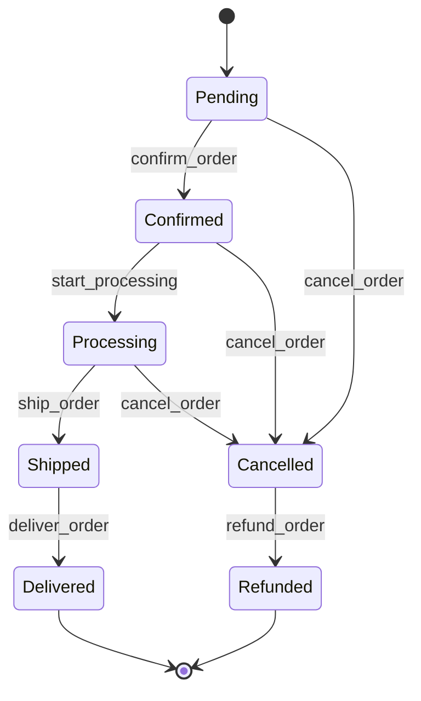
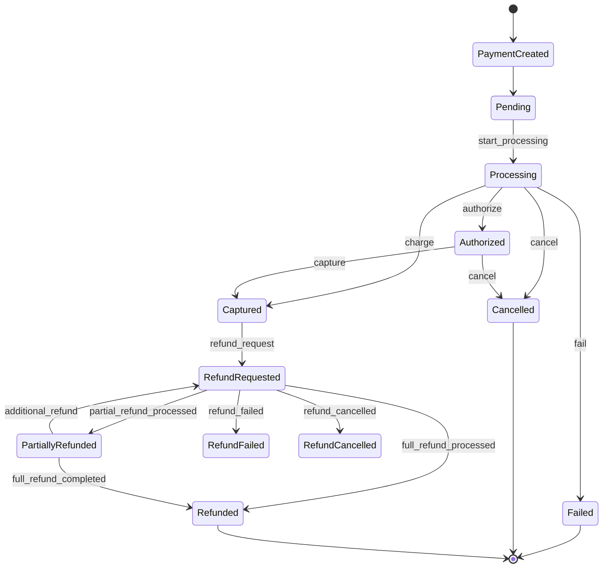
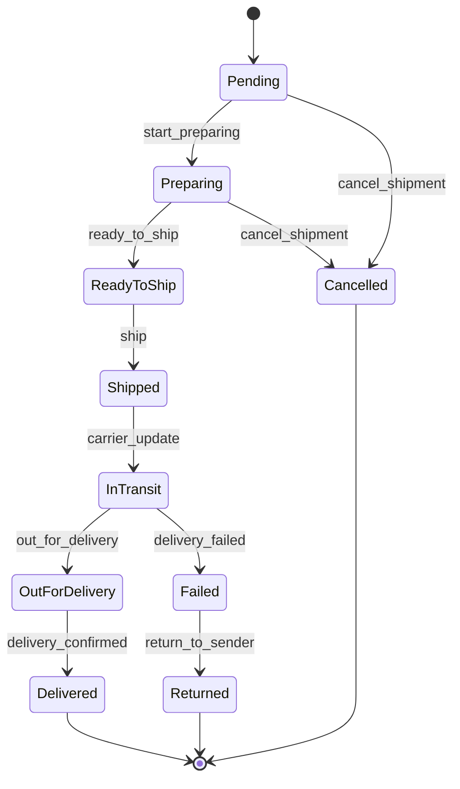
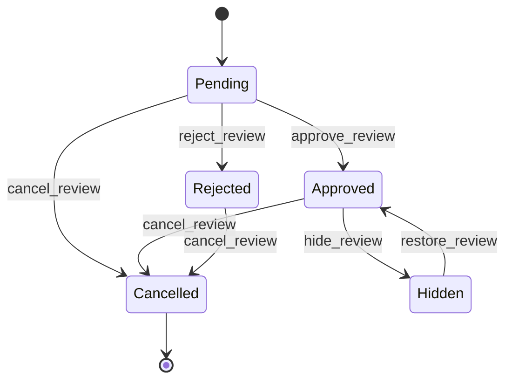

# ECH (E-commerce Hub)

### Project Language: EN-US


> **Note:** The name used is fictional and intended only for demonstration purposes.

**This project is currently under active development.**

ECH (E-commerce Hub) is a backend-focused fullstack e-commerce system built using **Python, Django, and Django REST Framework**, designed with an **API-First architecture**.

The project focuses on demonstrating **backend engineering best practices**, including authentication, modular architecture, service-layer business logic, REST API design, and automated testing.

---

# Tech Stack

* Python 3.13
* Django 6.0
* Django REST Framework (DRF) 3.16
* Django-filter
* MySQL
* HTML5 + CSS3
* JWT Authentication (SimpleJWT)
* Pytest for automated testing

---

# Key Backend Concepts Demonstrated

This project demonstrates several backend engineering concepts used in production systems:

* API-first architecture
* Service-layer business logic
* Domain-driven design principles
* Transactional consistency using `transaction.atomic`
* Concurrency protection using `select_for_update`
* Idempotent operations for order creation
* Inventory consistency in concurrent environments
* Audit event logging for operational monitoring
* Modular Django architecture
* Automated testing with pytest

---

# Architecture Overview

The backend follows a modular and layered architecture designed to improve **maintainability, scalability, and testability**.

Core architectural layers include:

### API Layer

Handles HTTP communication using Django REST Framework.

* Views
* Serializers
* Permissions
* Throttling

### Service Layer

Responsible for implementing business logic and orchestrating operations.

Examples:

* user registration
* email confirmation
* password reset flow

### Selector Layer

Handles optimized database queries and data retrieval.

### Models Layer

Defines database schema and relationships using Django ORM.

### Constants Layer

Centralizes system messages and configuration values.

---

# Architecture Diagram

```text
                          Client (Web / Mobile)
                                  |
                                  v
                         Django REST API (DRF)
                                  |
                                  v
                             API Layer
              (views • serializers • permissions)
                                  |
                                  v
                             Service Layer
                  (business rules / orchestration)
                                  |
                 +------------------------------------+
                 |                                    |
                 v                                    v
             Selectors                           Domain Events
        (query optimization)                (event dispatcher)
                 |                                    |
                 v                                    v
             Django ORM                         Event Handlers
                 |
                 v
              Database
                 |
                 v
               Cache
        (Django Cache / Redis)
```
> Note: Domain events are used selectively in modules with more complex lifecycle flows such as orders, payments, shipping, reviews, notifications system and analytics system. Simpler modules such as users, products and admin dashboard follow a service-oriented architecture without a dedicated domain event layer.

---

# Development Roadmap

Planned modules:

* Users module ✔
* Products module ✔
* Orders module ✔
* Payment module ✔
* Shipping module ✔
* Reviews module (**Current step**)
* Notifications module
* Analytics module
* Admin dashboard

---

# Project Structure

The backend is organized using a **modular architecture**, where each domain (users, products, orders, payments, shipping, reviews, notifications, and analytics) is implemented as an independent Django app.

<details>
<summary><strong>Structure</strong></summary>

```text
ecommerce_hub/
│
├── core/
│   ├── exceptions/
│   │   └── handlers.py
│   ├── settings.py
│   └── urls.py
│
├── ech/
│   ├── admin.py
│   ├── apps.py
│   ├── urls.py
│   │
│   ├── users/
│   │   ├── api/
│   │   │   ├── tests/
│   │   │   │   ├── test_login_api.py
│   │   │   │   ├── test_logout_invalid_refresh_token_api.py
│   │   │   │   ├── test_confirm_email_api.py
│   │   │   │   ├── test_email_protections_api.py
│   │   │   │   ├── test_password_reset_confirm_api.py
│   │   │   │   ├── test_password_reset_confirm_invalid_token_api.py
│   │   │   │   ├── test_password_reset_request_api.py
│   │   │   │   ├── test_register_api.py
│   │   │   │   └── test_token_refresh_api.py
│   │   │   │
│   │   │   ├── serializers.py
│   │   │   ├── throttles.py
│   │   │   ├── urls.py
│   │   │   └── views.py
│   │   │
│   │   ├── constants/
│   │   │   ├── constants.py
│   │   │   └── messages.py
│   │   │
│   │   ├── logs/
│   │   │   ├── logger.py
│   │   │   └── security_events.py
│   │   │
│   │   ├── services/
│   │   │   ├── registration_service.py
│   │   │   └── password_reset_service.py
│   │   │
│   │   ├── utils/
│   │   │   └── request_metadata.py
│   │   │
│   │   ├── tests/
│   │   │   ├── test_models.py
│   │   │   ├── test_exceptions.py
│   │   │   ├── test_selectors.py
│   │   │   ├── test_registration_service.py
│   │   │   ├── test_password_reset_service.py
│   │   │   └── test_security_events.py
│   │   │
│   │   ├── decorators.py
│   │   ├── models.py
│   │   ├── selectors.py
│   │   ├── exceptions.py
│   │   └── apps.py
│   │
│   ├── products/
│   │   ├── api/
│   │   │   ├── tests/
│   │   │   │   ├── test_product_create_api.py
│   │   │   │   ├── test_product_update_api.py
│   │   │   │   ├── test_product_delete_api.py
│   │   │   │   ├── test_product_list_api.py
│   │   │   │   ├── test_product_detail_api.py
│   │   │   │   └── test_product_images_api.py
│   │   │   │
│   │   │   ├── serializers.py
│   │   │   ├── permissions.py
│   │   │   ├── pagination.py
│   │   │   ├── urls.py
│   │   │   └── views.py
│   │   │
│   │   ├── services/
│   │   │   ├── product_creation_service.py
│   │   │   ├── product_delete_service.py
│   │   │   ├── product_event_service.py
│   │   │   ├── product_image_service.py
│   │   │   ├── product_inventory_service.py
│   │   │   ├── product_update_service.py
│   │   │   └── stock_service.py
│   │   │
│   │   ├── utils/
│   │   │   └── cache.py
│   │   │
│   │   ├── constants/
│   │   │   ├── cache.py
│   │   │   ├── constants.py
│   │   │   ├── inventory.py
│   │   │   ├── messages.py
│   │   │   ├── roles_management.py
│   │   │   ├── rules.py
│   │   │   └── storage.py
│   │   │
│   │   ├── tests/
│   │   │   ├── test_models.py
│   │   │   ├── test_selectors.py
│   │   │   ├── test_exceptions.py
│   │   │   ├── test_filters.py
│   │   │   ├── test_product_creation_service.py
│   │   │   ├── test_product_image_service.py
│   │   │   ├── test_product_update_service.py
│   │   │   ├── test_product_delete_service.py
│   │   │   └── test_product_inventory_service.py
│   │   │
│   │   ├── filters.py
│   │   ├── models.py
│   │   ├── exceptions.py
│   │   └── apps.py
│   │
│   ├── orders/
│   │   ├── api/
│   │   │   ├── tests/
│   │   │   │   ├── test_order_cache_api.py
│   │   │   │   ├── test_order_create_api.py
│   │   │   │   ├── test_order_list_api.py
│   │   │   │   ├── test_order_detail_api.py
│   │   │   │   ├── test_order_cancel_api.py
│   │   │   │   ├── test_order_management_list_api.py
│   │   │   │   ├── test_order_management_detail_api.py
│   │   │   │   ├── test_order_confirm_api.py
│   │   │   │   ├── test_order_processing_api.py
│   │   │   │   ├── test_order_shipping_api.py
│   │   │   │   └── test_order_delivery_api.py
│   │   │   │
│   │   │   ├── serializers.py
│   │   │   ├── permissions.py
│   │   │   ├── pagination.py
│   │   │   ├── urls.py
│   │   │   └── views.py
│   │   │
│   │   ├── services/
│   │   │   ├── cache_service.py
│   │   │   ├── order_create_service.py
│   │   │   ├── order_status_service.py
│   │   │   ├── order_cancel_service.py
│   │   │   └── order_totals_service.py
│   │   │ 
│   │   ├── utils/
│   │   │   └── cache_keys.py
│   │   │
│   │   ├── domain_events/
│   │   │   ├── dispatcher.py
│   │   │   ├── events.py
│   │   │   ├── handlers.py
│   │   │   └── registry.py
│   │   │
│   │   ├── constants/
│   │   │   ├── cache.py
│   │   │   ├── constants.py
│   │   │   ├── messages.py
│   │   │   └── roles_management.py
│   │   │
│   │   ├── tests/
│   │   │   ├── test_models.py
│   │   │   ├── test_exceptions.py
│   │   │   ├── test_selectors.py
│   │   │   ├── test_create_order_service.py
│   │   │   ├── test_order_status_service.py
│   │   │   ├── test_cancel_order_service.py
│   │   │   ├── test_order_totals_service.py
│   │   │   ├── test_domain_events.py
│   │   │   ├── test_cache_selectors.py
│   │   │   ├── test_cache_invalidation.py
│   │   │   └── test_filters.py
│   │   │
│   │   ├── filters.py
│   │   ├── models.py
│   │   ├── exceptions.py
│   │   └── apps.py
│   │
│   ├── payments/
│   │   ├── api/
│   │   │   ├── tests/
│   │   │   │   ├── test_payment_creation_api.py
│   │   │   │   ├── test_payment_list_api.py
│   │   │   │   ├── test_payment_detail_api.py
│   │   │   │   ├── test_payment_process_api.py
│   │   │   │   ├── test_payment_cancel_api.py
│   │   │   │   ├── test_payment_refund_api.py
│   │   │   │   ├── test_payment_transaction_list_api.py
│   │   │   │   └── test_payment_management_detail_api.py
│   │   │   │
│   │   │   ├── serializers.py
│   │   │   ├── permissions.py
│   │   │   ├── pagination.py
│   │   │   ├── urls.py
│   │   │   └── views.py
│   │   │
│   │   ├── services/
│   │   │   ├── cache_service.py
│   │   │   ├── payment_creation_service.py
│   │   │   ├── payment_processing_service.py
│   │   │   ├── payment_status_service.py
│   │   │   ├── payment_refund_service.py
│   │   │   └── payment_log_service.py
│   │   │ 
│   │   ├── utils/
│   │   │   └── cache_keys.py
│   │   │
│   │   ├── domain_events/
│   │   │   ├── dispatcher.py
│   │   │   ├── events.py
│   │   │   ├── handlers.py
│   │   │   └── registry.py
│   │   │
│   │   ├── constants/
│   │   │   ├── cache.py
│   │   │   ├── constants.py
│   │   │   ├── messages.py
│   │   │   └── roles_management.py
│   │   │
│   │   ├── tests/
│   │   │   ├── test_models.py
│   │   │   ├── test_exceptions.py
│   │   │   ├── test_selectors.py
│   │   │   ├── test_payment_create_service.py
│   │   │   ├── test_payment_status_service.py
│   │   │   ├── test_payment_processing_service.py
│   │   │   ├── test_payment_refund_service.py
│   │   │   ├── test_domain_events.py
│   │   │   ├── test_cache_selectors.py
│   │   │   ├── test_cache_invalidation.py
│   │   │   └── test_filters.py
│   │   │
│   │   ├── filters.py
│   │   ├── models.py
│   │   ├── exceptions.py
│   │   ├── selectors.py
│   │   └── apps.py
│   │
│   ├── shipping/
│   │   ├── api/
│   │   │   ├── tests/
│   │   │   │   ├── test_shipping_create_api.py
│   │   │   │   ├── test_shipping_list_api.py
│   │   │   │   ├── test_shipping_detail_api.py
│   │   │   │   ├── test_shipping_update_api.py
│   │   │   │   ├── test_shipping_process_api.py
│   │   │   │   ├── test_shipping_cancel_api.py
│   │   │   │   ├── test_shipping_tracking_api.py
│   │   │   │   ├── test_shipping_management_list_api.py
│   │   │   │   └── test_shipping_management_detail_api.py
│   │   │   │
│   │   │   ├── serializers.py
│   │   │   ├── permissions.py
│   │   │   ├── pagination.py
│   │   │   ├── urls.py
│   │   │   └── views.py
│   │   │
│   │   ├── services/
│   │   │   ├── cache_service.py
│   │   │   ├── shipping_creation_service.py
│   │   │   ├── shipping_update_service.py
│   │   │   ├── shipping_status_service.py
│   │   │   ├── shipping_cancellation_service.py
│   │   │   ├── shipping_tracking_service.py
│   │   │   └── shipping_log_service.py
│   │   │ 
│   │   ├── utils/
│   │   │   └── cache_keys.py
│   │   │
│   │   ├── domain_events/
│   │   │   ├── dispatcher.py
│   │   │   ├── events.py
│   │   │   ├── handlers.py
│   │   │   └── registry.py
│   │   │
│   │   ├── constants/
│   │   │   ├── cache.py
│   │   │   ├── constants.py
│   │   │   ├── messages.py
│   │   │   └── roles_management.py
│   │   │
│   │   ├── tests/
│   │   │   ├── test_models.py
│   │   │   ├── test_exceptions.py
│   │   │   ├── test_selectors.py
│   │   │   ├── test_shipping_create_service.py
│   │   │   ├── test_shipping_update_service.py
│   │   │   ├── test_shipping_status_service.py
│   │   │   ├── test_shipping_cancellation_service.py
│   │   │   ├── test_shipping_tracking_service.py
│   │   │   ├── test_logging_service.py
│   │   │   ├── test_domain_events.py
│   │   │   ├── test_cache_selectors.py
│   │   │   ├── test_cache_invalidation.py
│   │   │   └── test_filters.py
│   │   │
│   │   ├── filters.py
│   │   ├── models.py
│   │   ├── exceptions.py
│   │   └── apps.py
│   │
│   ├── reviews/
│   │   ├── api/
│   │   │   ├── tests/
│   │   │   │   ├── test_reviews_create_api.py
│   │   │   │   ├── test_reviews_list_api.py
│   │   │   │   ├── test_reviews_detail_api.py
│   │   │   │   ├── test_reviews_update_api.py
│   │   │   │   ├── test_reviews_cancel_api.py
│   │   │   │   ├── test_reviews_moderation_api.py
│   │   │   │   ├── test_product_reviews_public_api.py
│   │   │   │   ├── test_product_reviews_summary_api.py
│   │   │   │   ├── test_reviews_management_list_api.py
│   │   │   │   └── test_reviews_management_detail_api.py
│   │   │   │
│   │   │   ├── serializers.py
│   │   │   ├── permissions.py
│   │   │   ├── pagination.py
│   │   │   ├── urls.py
│   │   │   └── views.py
│   │   │
│   │   ├── services/
│   │   │   ├── cache_service.py
│   │   │   ├── reviews_creation_service.py
│   │   │   ├── reviews_update_service.py
│   │   │   ├── reviews_status_service.py
│   │   │   ├── reviews_cancellation_service.py
│   │   │   ├── reviews_moderation_service.py
│   │   │   └── reviews_log_service.py
│   │   │ 
│   │   ├── utils/
│   │   │   └── cache_keys.py
│   │   │
│   │   ├── domain_events/
│   │   │   ├── dispatcher.py
│   │   │   ├── events.py
│   │   │   ├── handlers.py
│   │   │   └── registry.py
│   │   │
│   │   ├── constants/
│   │   │   ├── cache.py
│   │   │   ├── constants.py
│   │   │   ├── messages.py
│   │   │   └── roles_management.py
│   │   │
│   │   ├── tests/
│   │   │   ├── test_models.py
│   │   │   ├── test_exceptions.py
│   │   │   ├── test_selectors.py
│   │   │   ├── test_reviews_create_service.py
│   │   │   ├── test_reviews_update_service.py
│   │   │   ├── test_reviews_status_service.py
│   │   │   ├── test_reviews_cancellation_service.py
│   │   │   ├── test_reviews_moderation_service.py
│   │   │   ├── test_logging_service.py
│   │   │   ├── test_domain_events.py
│   │   │   ├── test_cache_selectors.py
│   │   │   ├── test_cache_invalidation.py
│   │   │   └── test_filters.py
│   │   │
│   │   ├── filters.py
│   │   ├── models.py
│   │   ├── exceptions.py
│   │   └── apps.py
│   └── ...
│
├── ech_web/
│   └── ...
│
└── manage.py

```

</details>

---

# Implemented Features

## Users Module

### Authentication

* JWT login authentication
* Access and refresh token mechanism
* Token refresh endpoint
* Secure logout with refresh token invalidation

### User Management

* User registration
* Email confirmation system
* Password reset via email
* Protection against inactive accounts
* Role-based permission system

### Security Features

* Token expiration validation
* Invalid token protections
* Email verification requirement
* Security-focused API responses
* Security logging

---

## Products Module

### Product Management

* Product creation with validation rules
* Product update with partial updates
* Soft deletion for products
* Product image upload with ordering
* Separate inventory model for stock management

### Inventory Control

* Dedicated inventory table (`ProductInventory`)
* Atomic stock operations
* Database-level locking to prevent overselling

### Performance Optimization

* Product detail caching
* Smart caching for product list endpoints
* Optimized database queries using `select_related` and `prefetch_related`
* Indexed fields for faster filtering and sorting

### Audit Logging

* Event logging for product actions
* Logged events include:
  * product creation
  * product updates
  * product deletion
  * product image uploads

This provides a full audit trail for product management operations.

### Filtering and Search

* Product filtering by attributes
* Full-text search on product fields
* Ordering by price, creation date and name
* Paginated product listings

---

## Orders Module

### Order Creation

* Atomic order creation using a service layer
* Support for multiple order items
* Product snapshot storage for historical accuracy
* Idempotency key support to prevent duplicate orders
* Automatic calculation of order totals

### Order Components

Orders are composed of multiple related entities:

* **Order** – main aggregate root
* **OrderItem** – purchased products snapshot
* **OrderTotals** – calculated financial totals
* **OrderAddress** – shipping address snapshot
* **OrderLifecycle** – timestamps for order lifecycle events
* **OrderEvent** – operational event logging with event-driven architecture
* **OrderNote** – communication logs between staff and customer

### Inventory Safety

* Stock validation during order creation
* Database-level row locking using `select_for_update`
* Atomic stock updates to prevent overselling
* Automatic stock restoration when orders are cancelled

### Order Lifecycle Management

Orders follow a controlled lifecycle:

```text
PENDING
→ CONFIRMED
→ PROCESSING
→ SHIPPED
→ DELIVERED
```

Additional transitions:

```text
CANCELLED
REFUNDED
```

### Order Lifecycle Flow



Lifecycle timestamps are tracked in the `OrderLifecycle` model.

### Operational Event Logging

Every important order action creates an `OrderEvent`, including:

* order creation
* order confirmation
* processing start
* shipping
* delivery
* cancellation

This ensures a full operational audit trail.

### Concurrency Protection

To avoid race conditions in order processing:

* Row-level locking with `select_for_update`
* Transactional service layer (`transaction.atomic`)
* Safe inventory updates using database expressions (`F()`)

### Filtering and Management

Staff management endpoints support:

* filtering by order status
* filtering by payment status
* filtering by shipping status
* filtering by customer email
* paginated order listing

---

## Payments Module

### Payment Processing

* Payment creation through a dedicated service layer
* Support for multiple payment methods:
  * credit card
  * debit card
  * PIX
  * bank slip
  * digital wallet
* Unique payment reference generation
* Idempotency key protection to prevent duplicate payment requests
* Gateway integration-ready architecture (gateway identifiers supported)

### Payment Components

Payments are composed of multiple related entities:

* **Payment** – main aggregate root
* **PaymentTransaction** – records every financial operation attempt
* **PaymentRefund** – stores refund requests and outcomes
* **PaymentLifecycle** – timestamps for payment lifecycle events
* **PaymentEvent** – audit event log for payment operations

This structure ensures traceability of every financial operation.

### Payment Lifecycle Management

Payments follow a controlled lifecycle:

```text
PENDING
→ PROCESSING
→ AUTHORIZED
→ CAPTURED
```

Additional transitions:

```text
FAILED
CANCELLED
PARTIALLY_REFUNDED
REFUNDED
```

Lifecycle timestamps are tracked in the `PaymentLifecycle` model.

### Payment Lifecycle Flow



### Refund Management

The refund system supports:

* refund request creation
* partial refunds
* full refunds
* refund processing
* refund cancellation
* refund failure handling

Refund processing updates:

* payment refunded balance
* lifecycle timestamps
* transaction history
* operational events

### Transaction History

Every payment operation creates a `PaymentTransaction`, including:

* authorization attempts
* capture operations
* charges
* refunds
* cancellations
* failures

This guarantees a complete financial audit trail.

### Domain Event System

The payments module uses an event-driven architecture:

* domain events dispatched for payment lifecycle transitions
* in-memory event dispatcher
* structured event payloads
* event handler registry executed at application startup
* logging handlers for operational monitoring

Events include:

* payment created
* payment processing started
* payment authorized
* payment captured
* payment failed
* payment cancelled
* refund requested
* refund processed
* refund failed
* refund cancelled

### Caching Layer

A dedicated caching service provides performance optimization for payment operations:

* payment detail caching
* payment lookup by reference
* customer payment list caching
* management payment list caching
* filtered payment list caching (status and method)
* payment transactions caching
* payment refunds caching

All cache keys are **versioned**, allowing safe cache invalidation strategies.

### Cache Invalidation Strategy

The system ensures cache consistency through automatic invalidation when:

* a payment is created
* payment status changes
* payment is cancelled
* refunds are requested or processed
* refund states change

Cache invalidation is centralized in the `PaymentCacheService`.

### Filtering and Query Optimization

Payment listing endpoints support filtering by:

* payment status
* payment method
* customer ID
* order ID
* payment reference
* gateway payment ID
* amount range
* refunded amount range
* creation date range
* fully refunded payments
* partially refunded payments

Database queries are optimized using:

* `select_related`
* `prefetch_related`
* indexed fields
* paginated query patterns

---

## Shipping Module

### Shipment Management

* Shipment creation through a dedicated service layer
* Shipment updates with partial update support
* Shipment cancellation with rule validation
* Shipment tracking updates with event registration
* Prevention of duplicate shipments for the same order
* Idempotency key protection to prevent duplicate shipment creation

### Shipment Components

Shipments are composed of multiple related entities:

* **Shipment** – main aggregate root
* **ShipmentEvent** – operational event log for shipment lifecycle
* **ShipmentTrackingUpdate** – carrier tracking updates and external event synchronization

This structure ensures full traceability of shipping operations.

### Shipment Lifecycle Management

Shipments follow a controlled lifecycle:

```text
PENDING
→ PREPARING
→ READY_TO_SHIP
→ SHIPPED
→ IN_TRANSIT
→ OUT_FOR_DELIVERY
→ DELIVERED
```

Additional transitions:

```text
FAILED
RETURNED
CANCELLED
```

Lifecycle transitions are validated through the `ShippingStatusService`.

### Shipping Lifecycle Flow



### Shipment Cancellation Rules

Shipment cancellation is controlled by domain rules:

* prevention of cancelling already cancelled shipments
* prevention of cancelling delivered shipments
* prevention of cancelling returned shipments
* controlled transition to `CANCELLED` state
* operational cancellation logging

### Shipment Tracking System

The shipping module supports carrier tracking synchronization:

* tracking event registration
* shipment metadata updates (tracking code, carrier, external reference)
* validation of tracking payloads
* tracking location and timestamp handling
* automatic shipment status synchronization from carrier events
* audit trail through `ShipmentTrackingUpdate`

### Operational Event Logging

Shipping operations generate structured logs using the `ShippingLogService`, including:

* shipment creation
* shipment updates
* shipment status transitions
* shipment cancellation
* shipment tracking updates

Logs include structured metadata for operational observability.

### Domain Event System

The shipping module implements an event-driven architecture:

* lightweight domain events
* in-memory event dispatcher
* handler registry for event subscriptions
* structured event payload serialization

Current domain events include:

* shipment created
* shipment status changed

Handlers are designed to be easily extended for:

* cache invalidation
* analytics integrations
* external notification systems

### Caching Layer

A dedicated caching service improves performance for shipment queries:

* shipment detail caching
* shipment lookup by order ID caching
* customer shipment list caching
* filtered customer shipment lists (status)
* management shipment list caching
* filtered shipment lists (status, shipping method, carrier)
* delivery-due shipment caching
* tracking-enabled shipment list caching
* shipment search caching

All cache keys are **versioned**, enabling safe and deterministic cache invalidation.

### Cache Invalidation Strategy

Cache consistency is maintained through automatic invalidation when:

* a shipment is created
* shipment data is updated
* shipment status changes
* shipment is cancelled
* tracking updates are registered

Cache invalidation is centralized in the `ShippingCacheService`.

### Filtering and Query Optimization

Shipment listing and management operations support filtering by:

* shipment status
* shipping method
* carrier name
* tracking code
* customer ID
* order ID
* external reference
* creation date range
* estimated delivery date range

Database queries are optimized using:

* indexed fields
* efficient filtering patterns
* paginated query support
* optimized selectors for data retrieval

### Service Layer Architecture

The shipping module follows a service-oriented domain architecture:

* `ShippingCreationService`
* `ShippingUpdateService`
* `ShippingStatusService`
* `ShippingCancellationService`
* `ShippingTrackingService`
* `ShippingLogService`

This approach ensures:

* clear separation of concerns
* transactional consistency
* domain rule centralization
* easier testability and maintenance

---

## Reviews Module

### Review Creation

* Review creation through a dedicated service layer
* Validation of rating range (1–5)
* Prevention of duplicate reviews for the same customer and product
* Idempotency key protection to prevent duplicate review submissions
* Automatic initialization of review lifecycle tracking

### Review Components

Reviews are composed of multiple related entities:

* **Review** – main aggregate root representing the customer review
* **ReviewLifecycle** – timestamps for moderation and lifecycle events
* **ReviewEvent** – operational event log for review-related actions

This structure ensures traceability of all review operations.

### Review Lifecycle Management

Reviews follow a controlled moderation lifecycle:

```text
PENDING
→ APPROVED
→ HIDDEN
```

Alternative transitions:

```text
PENDING → REJECTED
PENDING → CANCELLED
APPROVED → HIDDEN
HIDDEN → APPROVED (restore)
```

Lifecycle timestamps are stored in the `ReviewLifecycle` model.

### Review Lifecycle Flow



### Moderation System

The moderation system allows staff to manage user reviews safely.

Supported moderation actions:

* approve review
* reject review
* hide review
* restore hidden review
* cancel review

Moderation operations include:

* staff user identification (`moderated_by`)
* moderation timestamp tracking (`moderated_at`)
* moderation reason storage
* operational event recording

Moderation logic is centralized in the ReviewsModerationService.

### Operational Event Logging

Every relevant review operation generates a `ReviewEvent`, including:

* review creation
* review updates
* moderation actions
* lifecycle status transitions
* review cancellation

This ensures a complete operational audit trail for review management.

### Structured Logging

The module includes a dedicated logging service:

* `ReviewsLogService`

Structured logs are generated for:

* review creation
* review updates
* moderation actions
* status transitions
* review cancellation

Logs include structured metadata such as:

* review ID
* product ID
* customer ID
* moderation context
* operational metadata

### Domain Event System

The reviews module implements an event-driven architecture.

Components include:

* domain event classes
* in-memory event dispatcher
* handler registry executed at application startup
* structured event handlers for observability

Current domain events include:

* review created
* review updated
* review approved
* review rejected
* review hidden
* review restored
* review cancelled

Handlers are designed to support future integrations such as:

* cache invalidation
* analytics processing
* notification services
* external moderation monitoring systems

### Reviews API

The module exposes a REST API for both customer and management operations.

Customer endpoints include:

* create review
* update review
* cancel review
* list customer reviews
* retrieve review detail

Public endpoints include:

* public product review listing
* product review summary

Management endpoints include:

* review moderation actions
* management review listing
* review detail for operational dashboards

API responses support:

* filtering
* pagination
* structured serialization
* permission-based access control

### Caching Layer

A dedicated caching service improves performance for review queries:

* review detail caching
* customer review list caching
* filtered customer review lists
* public product review list caching
* product review summary caching
* management review list caching

### Filtering and Query Optimization

Review queries support filtering by:

* review status
* rating value
* rating range
* product ID
* customer ID
* moderation user ID
* verified purchase flag
* creation date range

Database queries are optimized using:

* indexed fields
* efficient filtering strategies
* optimized selectors for data retrieval
* paginated query patterns

### Service Layer Architecture

The reviews module follows a service-oriented domain architecture:

* `ReviewsCreationService`
* `ReviewsUpdateService`
* `ReviewsStatusService`
* `ReviewsCancellationService`
* `ReviewsModerationService`
* `ReviewsLogService`
* `ReviewsCacheService`

This architecture ensures:

* clear separation of responsibilities
* centralized domain rule enforcement
* transactional consistency
* easier testing and maintenance
* extensibility for future features

---

# API Endpoints

## Users

| Method | Endpoint | Description |
|------|------|------|
| POST | `/api/v1/users/register/` | User registration |
| POST | `/api/v1/users/login/` | JWT authentication |
| POST | `/api/v1/users/token/refresh/` | Refresh access token |
| POST | `/api/v1/users/logout/` | Logout and invalidate refresh token |
| POST | `/api/v1/users/confirm-email/` | Email confirmation |
| POST | `/api/v1/users/password-reset/` | Request password reset |
| POST | `/api/v1/users/password-reset-confirm/` | Confirm password reset |

---

## Products

| Method | Endpoint | Description |
|------|------|------|
| POST | `/api/v1/products/` | Create product |
| GET | `/api/v1/products/list/` | List products (paginated) |
| GET | `/api/v1/products/{product_id}/` | Retrieve product details |
| POST | `/api/v1/products/{product_id}/images/` | Upload product images |
| PATCH | `/api/v1/products/{product_id}/` | Update product |
| DELETE | `/api/v1/products/{product_id}/` | Soft delete product |

---

## Orders (Customer)

| Method | Endpoint | Description |
|------|------|------|
| GET | `/api/v1/orders/` | List authenticated customer orders |
| POST | `/api/v1/orders/create/` | Create new order |
| GET | `/api/v1/orders/{order_id}/` | Retrieve order details |
| POST | `/api/v1/orders/{order_id}/cancel/` | Cancel order |

---

## Orders (Management)

| Method | Endpoint | Description |
|------|------|------|
| GET | `/api/v1/orders/management/` | List all orders (staff) |
| GET | `/api/v1/orders/management/{order_id}/` | Retrieve order details (staff) |
| POST | `/api/v1/orders/management/{order_id}/confirm/` | Confirm order |
| POST | `/api/v1/orders/management/{order_id}/start-processing/` | Start order processing |
| POST | `/api/v1/orders/management/{order_id}/ship/` | Ship order |
| POST | `/api/v1/orders/management/{order_id}/deliver/` | Mark order as delivered |
| POST | `/api/v1/orders/management/{order_id}/cancel/` | Cancel order (staff) |

---

## Payments (Customer)

| Method | Endpoint | Description |
|------|------|------|
| GET | `/api/v1/payments/` | List authenticated customer payments |
| POST | `/api/v1/payments/create/` | Create payment for an order |
| GET | `/api/v1/payments/{payment_id}/` | Retrieve payment details |
| GET | `/api/v1/payments/{payment_id}/transactions/` | List payment transactions |

---

## Payments (Management)

| Method | Endpoint | Description |
|------|------|------|
| GET | `/api/v1/payments/management/{payment_id}/` | Retrieve payment details (staff) |
| POST | `/api/v1/payments/{payment_id}/process/` | Execute payment processing action (authorize, capture, charge, fail) |
| POST | `/api/v1/payments/{payment_id}/cancel/` | Cancel payment |
| POST | `/api/v1/payments/{payment_id}/refund/` | Create refund request |
| POST | `/api/v1/payments/refund/{refund_id}/manage/` | Manage refund lifecycle (process, fail, cancel) |

---

## Shipping (Customer)

| Method | Endpoint | Description |
|------|------|------|
| GET | `/api/v1/shipping/` | List authenticated customer shipments |
| GET | `/api/v1/shipping/{shipment_id}/` | Retrieve shipment details |

---

## Shipping (Management)

| Method | Endpoint | Description |
|------|------|------|
| POST | `/api/v1/shipping/create/` | Create shipment for an order |
| PATCH | `/api/v1/shipping/{shipment_id}/` | Update shipment information |
| POST | `/api/v1/shipping/{shipment_id}/process/` | Perform shipment status transition |
| POST | `/api/v1/shipping/{shipment_id}/cancel/` | Cancel shipment |
| POST | `/api/v1/shipping/{shipment_id}/tracking/` | Register shipment tracking update |
| GET | `/api/v1/shipping/management/` | List all shipments (staff) |
| GET | `/api/v1/shipping/management/{shipment_id}/` | Retrieve shipment management details |

---

## Reviews (Customer)

| Method | Endpoint | Description |
|------|------|------|
| POST | `/api/v1/reviews/create/` | Create a new product review |
| GET | `/api/v1/reviews/` | List authenticated customer reviews |
| GET | `/api/v1/reviews/{review_id}/` | Retrieve review details |
| PATCH | `/api/v1/reviews/{review_id}/update/` | Update review content |
| POST | `/api/v1/reviews/{review_id}/cancel/` | Cancel review |

---

## Reviews (Public)

| Method | Endpoint | Description |
|------|------|------|
| GET | `/api/v1/reviews/product/{product_id}/` | List public reviews for a product |
| GET | `/api/v1/reviews/product/{product_id}/summary/` | Retrieve product review summary |

---

## Reviews (Management)

| Method | Endpoint | Description |
|------|------|------|
| POST | `/api/v1/reviews/{review_id}/moderate/` | Perform review moderation action |
| GET | `/api/v1/reviews/management/` | List all reviews (staff) |
| GET | `/api/v1/reviews/management/{review_id}/` | Retrieve review management details |

---

# Automated Tests

The project includes an extensive automated test suite covering domain logic and API endpoints, using **pytest** and **Django REST Framework testing tools**.

---

## Testing Strategy

The project follows a domain-first testing strategy.

1. Domain layer tests validate business rules and services
2. Selector tests validate database queries
3. API tests validate endpoint behavior and permissions

This ensures business logic remains stable independently from the API layer.

---

## Testing Suite

The testing approach follows a **Domain-First strategy**, ensuring that business rules are validated independently of the API layer.

| Module | Domain Tests | API Tests | Total Tests | Focus Area | Status |
| :--- | :---: | :---: | :---: | :--- | :--- |
| **Users** | 99 | 29 | 128 | Authentication, JWT, Permissions | ✔ Stable |
| **Products** | 114 | 24 | 138 | Inventory Management, Caching, Audit Logs | ✔ Stable |
| **Orders** | 230 | 87 | 317 | Order Lifecycle, Concurrency, Idempotency | ✔ Stable |
| **Payments** | 226 | 57 | 283 | Payment Lifecycle, Refund Logic, Transactions | ✔ Stable |
| **Shipping** | 219 | 69 | 288 | Logistics, Delivery Lifecycle, Tracking | ✔ Stable |
| **Reviews** | 157 | 88 | 245 | Review Moderation, Lifecycle, Domain Rules | ✔ Stable |
| **TOTAL (implemented modules)** | **1045** | **354** | **1399** | Core Business Logic | — |

> Tests are executed using **pytest**.  
> Domain tests validate business rules and services, while API tests ensure endpoint correctness, security permissions, and response contracts.

---

## Detailed Test Coverage

The sections below summarize the main areas validated by the automated test suite.

<details>
<summary><strong>Users Module Tests</strong></summary>

### Users Domain Tests

#### Domain Models

* custom user creation and manager behavior
* email normalization and uniqueness validation
* role-based behavior and permissions flags (`is_staff`, `is_superuser`)
* corporate email enforcement for staff roles
* age validation boundaries (min/max)
* default field values (`is_active`, `email_confirmed`)
* model properties (`is_superadmin`, `can_create_staff`)
* string representation consistency

#### User Token Model

* token creation and uniqueness
* expiration validation
* expired token rejection
* token usage tracking (`used` flag)
* token lifecycle methods (`is_expired`, `mark_as_used`)
* metadata field behavior

#### Domain Exceptions

* base domain exception behavior
* default vs custom message handling
* exception hierarchy validation
* authentication and token-related exceptions
* role and access-related exceptions

#### Query Selectors

Tests validate database query behavior and filtering logic:

* retrieving user by ID
* retrieving user by email (case-insensitive)
* listing users by role
* listing active users
* listing staff users
* retrieving email confirmation tokens
* retrieving valid tokens (non-expired, unused, correct type)
* handling of invalid or missing records

#### Registration Service

* user registration workflow
* default role assignment
* duplicate email protection (domain-level validation)
* inactive and unconfirmed user initialization
* email confirmation token generation
* replacement of existing confirmation tokens
* transaction-safe email scheduling (`on_commit`)
* email confirmation flow
* activation and confirmation state updates
* invalid and expired token handling

#### Password Reset Service

* password reset request workflow
* protection against user enumeration
* handling inactive or non-existent users
* reset token creation and replacement
* transaction-safe email scheduling
* password reset execution
* password update and hashing validation
* token invalidation and usage tracking
* invalid and expired token handling

#### Security Logging

Tests validate security event logging behavior:

* login success and failure events
* user registration logging
* email confirmation logging
* password change logging
* invalid token logging
* password reset request logging
* structured logging payload validation
* request metadata integration (IP, user agent, request ID)

---

### Users API Tests

#### Authentication & Access Control

* login with valid credentials
* authentication failure (invalid credentials)
* inactive account protection
* email confirmation requirement enforcement

#### Registration API

* successful user registration
* validation of required fields
* duplicate email protection
* response structure validation

#### Token Management

* JWT token refresh flow
* invalid and malformed token handling
* logout with invalid refresh token

#### Email Confirmation API

* successful email confirmation
* invalid token handling
* expired token handling

### Password Reset APIs

#### Request Password Reset

* valid email request handling
* non-existent email protection (no information leakage)
* inactive user handling

#### Confirm Password Reset

* successful password reset
* invalid token handling
* expired token handling
* payload validation

#### Email Protection Tests

* access restrictions for unconfirmed users
* validation of protected endpoints
* enforcement of authentication and confirmation rules

</details>

---

<details>
<summary><strong>Products Module Tests</strong></summary>

### Products Domain Tests

#### Domain Models

* product creation and core field validation
* UUID primary key generation
* product type choices validation
* price and discount field behavior
* active/inactive state handling
* discount logic validation (`has_discount`)
* main image resolution logic
* inventory shortcut property behavior
* model ordering by `created_at`
* string representations

#### Product Inventory Model

* one-to-one relationship with product
* default inventory value
* inventory updates and persistence
* uniqueness constraint enforcement
* string representation validation

#### Product Image Model

* image creation and relationship with product
* file upload path validation
* file extension validation (jpg, jpeg, png, webp)
* display order validation (`order >= 1`)
* unique constraint per product (`product + order`)
* ordering behavior by display order
* string representation validation

#### Product Event Log Model

* event creation and lifecycle tracking
* UUID primary key generation
* event type validation
* optional performer handling
* metadata storage behavior
* ordering by `created_at`
* string representation validation

#### Domain Exceptions

* validation error inheritance consistency
* permission error inheritance consistency
* default message validation
* formatted message validation (min/max images)
* exception hierarchy consistency

#### Query Selectors

Tests validate query behavior and filtering logic:

* retrieving product by ID
* retrieving active product by ID
* listing all active products
* filtering products by type
* retrieving products with discount
* search by name and brand (case-insensitive)
* retrieving products created by user
* retrieving available products (inventory > 0)
* handling of non-existent records

#### Product Creation Service

* product creation workflow
* permission validation for allowed roles
* product type validation
* price validation (null, zero, negative)
* discount validation (negative, >= price)
* inventory validation (negative values)
* creation of inventory record
* handling of optional discount
* transactional rollback on failure

#### Product Update Service

* updating single field
* updating multiple fields
* updating text fields
* persistence of updated data
* return of updated product instance
* handling non-existent product
* no-op update (no fields provided)

#### Product Delete Service

* soft delete behavior (`is_active=False`)
* persistence of state change
* record retention in database
* ensuring only active flag is modified
* handling non-existent product

#### Product Image Service

* adding single image
* adding multiple images
* empty upload handling
* maximum image limit enforcement
* sequential order assignment
* continuation of order after existing images
* bulk creation behavior
* handling non-existent product

#### Product Image Validation

* minimum image requirement enforcement
* validation failure below minimum threshold
* validation success at minimum threshold
* validation success above minimum threshold
* validation failure when no images exist

#### Product Inventory Service

* decreasing inventory successfully
* exact inventory depletion (to zero)
* insufficient inventory protection
* persistence of inventory updates
* return of updated inventory instance
* handling missing inventory record

#### Product Filters

Tests validate filtering behavior for product listing:

* filtering by minimum price (`price_min`)
* filtering by maximum price (`price_max`)
* filtering by price range
* filtering by brand (case-insensitive)
* filtering by product type
* combined filter queries
* empty result handling

---

### Products API Tests

#### Product Creation API

* successful product creation
* validation of required fields
* permission enforcement
* invalid payload handling

#### Product Listing API

* listing active products
* pagination behavior
* filtering integration
* response structure validation

#### Product Detail API

* retrieving product by ID
* nested related data (images, inventory)
* handling non-existent products
* response structure validation

#### Product Update API

* successful product update
* validation of invalid fields
* permission enforcement
* partial update behavior

#### Product Deletion API

* soft delete via API
* permission enforcement
* validation of non-existent product
* response structure validation

#### Product Image API

* image upload workflow
* multiple image upload handling
* maximum image limit enforcement
* response validation

</details>

---

<details>
<summary><strong>Orders Module Tests</strong></summary>

### Orders Domain Tests

#### Domain Models

* order creation and relationships
* order item associations
* order totals one-to-one integrity
* order lifecycle timestamps
* order events audit trail
* order notes relationships
* model ordering behavior
* string representations

#### Domain Exceptions

* order not found validation
* permission protection
* duplicate order protection
* invalid status transition handling
* cancellation rule validation
* inventory validation
* invalid payment and shipping state protections

#### Query Selectors

Tests validate query optimizations and retrieval logic:

* retrieving orders by ID
* retrieving orders with related entities
* listing orders by customer
* listing orders by status
* listing orders by payment status
* listing orders by shipping status
* listing recent orders
* management dashboard queries
* database locking for updates (`select_for_update`)

#### Order Creation Service

* order creation workflow
* product availability validation
* inventory validation
* snapshot product data creation
* totals calculation
* lifecycle initialization
* address snapshot creation
* order event registration
* idempotency key protection
* transactional rollback validation

#### Order Status Service

* order confirmation
* processing transition
* shipping transition
* delivery transition
* lifecycle timestamp updates
* audit event registration
* invalid status transition protection

#### Order Cancellation Service

* order cancellation workflow
* cancellation rule validation
* prevention of cancelling shipped/delivered orders
* prevention of cancelling already cancelled orders
* lifecycle cancellation timestamp update
* inventory restoration after cancellation
* cancellation event audit log

#### Order Totals Service

* totals recalculation from order items
* discount calculation
* subtotal and grand total consistency
* updating existing totals
* creating totals when missing
* recalculation after item changes
* zero totals when order has no items

#### Operational Filters

Tests validate filtering behavior for operational endpoints:

* filtering by order status
* filtering by payment status
* filtering by shipping status
* filtering by customer email
* filtering by customer name
* filtering by creation date range
* case-insensitive filtering behavior
* combined filter queries

#### Order Events Domains

* dispatch call registered
* dispatch for cancelled events

#### Order Caching

Tests validate caching behavior and consistency for order retrieval:

* caching of order detail by ID
* caching of management order detail
* cache hit returns consistent data
* caching of non-existent orders (None responses)
* stale data behavior before cache invalidation
* fresh data retrieval after cache invalidation
* cache isolation between tests (`cache.clear()` usage)

#### Cache Invalidation

Tests validate that domain services correctly invalidate cache:

* cache invalidation after order creation
* cache invalidation after order cancellation
* cache invalidation after order confirmation
* cache invalidation after processing transition
* cache invalidation after shipping transition
* cache invalidation after delivery transition
* fresh data retrieval after each mutation
* validation that cached data is replaced after state changes

---

### Orders API Tests

#### Authentication & Access Control

* JWT authentication enforcement
* unauthorized access protection (401)
* permission-based access control (403)
* customer vs staff access boundaries
* resource ownership validation (customers can only access their own orders)

#### Order Detail API

* retrieving order details by ID
* nested related data serialization (items, totals, lifecycle, address)
* UUID serialization consistency
* access restriction for non-owners
* handling non-existent orders (404)
* response structure validation

#### Customer Orders List API

* listing orders for authenticated customer
* ensuring only customer-owned orders are returned
* ordering by `created_at` (descending)
* pagination behavior
* empty state handling

#### Order Management List API (Staff)

* access restricted to staff roles
* listing all orders for management dashboard
* ordering by `created_at` (descending)
* pagination validation
* filtering integration with:
  * order status
  * payment status
  * shipping status
  * customer email
  * customer name
  * date range (created_after / created_before)
* combined filters behavior

#### Order Management Detail API (Staff)

* retrieving full order detail for staff
* nested entities validation (items, events, notes, lifecycle)
* timestamp fields validation (confirmed, shipped, delivered, etc.)
* handling non-existent orders
* permission enforcement

#### Order Creation API

* successful order creation
* validation of empty items payload
* product availability validation
* inventory validation
* address validation
* idempotency key behavior
* transactional consistency on failure
* response payload validation

### Order Status APIs

#### Confirm Order

* successful confirmation flow
* validation of invalid transitions
* lifecycle timestamp update (`confirmed_at`)
* response payload validation

#### Start Processing

* successful processing transition
* validation of invalid transitions
* lifecycle timestamp update (`processing_at`)
* response payload validation

#### Ship Order

* successful shipping transition
* validation of invalid transitions
* shipping status update
* lifecycle timestamp update (`shipped_at`)
* response payload validation

#### Deliver Order

* successful delivery transition
* validation of invalid transitions
* shipping status update
* lifecycle timestamp update (`delivered_at`)
* response payload validation

#### Order Cancellation API

* successful cancellation flow
* validation of cancellation rules
* prevention of invalid cancellations
* inventory restoration behavior
* lifecycle timestamp update (`cancelled_at`)
* cancellation event registration
* response payload validation
* handling service-level exceptions (400 responses)

#### Caching Behavior (API Layer)

* cache consistency after order mutations
* cache invalidation after:
  * order creation
  * order status transitions
  * order cancellation
* ensuring fresh data is returned after updates
* preventing stale responses in detail endpoints

#### Order Caching (API Layer)

Tests validate caching behavior through API endpoints:

* fresh data returned after order cancellation via API
* fresh data returned after order confirmation via API
* fresh data returned after processing transition via API
* fresh data returned after shipping transition via API
* fresh data returned after delivery transition via API
* repeated requests return consistent data (cache stability)
* prevention of stale data in order detail endpoints

</details>

---

<details>
<summary><strong>Payments Module Tests</strong></summary>

### Payments Domain Tests

#### Domain Models

* payment creation and core field validation
* UUID primary key generation
* payment status choices validation
* payment method choices validation
* payment reference uniqueness
* gateway identifiers handling
* refunded amount default behavior
* currency default value
* metadata storage behavior
* model ordering by `created_at`
* string representations

#### Payment Transaction Model

* transaction creation and relationships
* transaction type validation
* transaction status validation
* gateway transaction identifiers
* optional performer handling
* metadata storage behavior
* ordering by `created_at`
* string representation validation

#### Payment Refund Model

* refund creation and payment association
* refund status validation
* gateway refund identifiers
* requested_by and processed_by behavior
* refund processing timestamps
* metadata storage behavior
* ordering by `created_at`
* string representation validation

#### Payment Lifecycle Model

* lifecycle relationship integrity
* lifecycle timestamps handling
* timestamp persistence behavior
* string representation validation

#### Payment Event Model

* event creation and lifecycle tracking
* UUID primary key generation
* event type validation
* optional performer handling
* metadata storage behavior
* ordering by `created_at`
* string representation validation

#### Domain Exceptions

* base payment exception behavior
* default vs custom message handling
* exception inheritance hierarchy validation
* payment not found handling
* permission protection exceptions
* duplicate reference protection
* idempotency key reuse protection
* invalid payment status transition validation
* cancellation rule validation
* refund eligibility validation
* refund amount validation
* transaction-related exceptions
* refund lifecycle exceptions

#### Query Selectors

Tests validate query behavior and data retrieval logic:

* retrieving payment by ID
* retrieving payment by reference
* retrieving payment with full related entities
* retrieving payment restricted to customer ownership
* retrieving payment by order ID
* retrieving payment lifecycle object
* retrieving refund by ID
* listing payments for customer
* listing payments for management dashboards
* listing payments by status
* listing payments by method
* listing payment transactions
* listing payment refunds
* listing payment events
* listing pending payment refunds
* handling non-existent records

#### Payment Creation Service

* payment creation workflow
* validation of order eligibility
* prevention of payments for cancelled/refunded orders
* prevention of duplicate payments for same order
* idempotency key validation
* duplicate payment reference protection
* automatic payment reference generation
* creation of lifecycle record
* creation of initial payment event
* transactional rollback validation

#### Payment Status Service

* payment processing start transition
* payment authorization transition
* payment capture transition
* payment failure transition
* lifecycle timestamp updates
* creation of transaction records
* event dispatch for each transition
* validation of invalid state transitions
* protection against invalid payment states

#### Payment Processing Service

* payment cancellation workflow
* cancellation state validation
* prevention of invalid cancellation states
* lifecycle timestamp updates
* transaction record creation
* event dispatch after cancellation
* consistent payment state updates

#### Payment Refund Service

* refund request workflow
* refund amount validation
* prevention of refunds above available balance
* validation of refundable payment states
* partial refund handling
* full refund handling
* refund processing workflow
* refund failure handling
* refund cancellation workflow
* payment refunded amount updates
* lifecycle timestamp updates
* transaction record creation
* event dispatch for refund lifecycle

#### Domain Events

Tests validate domain event infrastructure:

* domain event base class behavior
* event payload integrity validation
* event metadata defaults
* dispatcher handler registration
* prevention of duplicate handler registration
* event dispatch execution
* multiple handlers execution
* event type isolation
* dispatcher clearing behavior
* handler execution with structured logging
* registry handler registration
* registry idempotency protection

#### Payment Caching

Tests validate caching behavior and consistency:

* versioned cache key generation
* storing values in cache
* retrieving cached values
* deleting cached entries
* `get_or_set` cache pattern behavior
* payment detail caching
* payment lookup by reference caching
* customer payment list caching
* management payment list caching
* filtered payment list caching
* payment transactions caching
* payment refunds caching
* cache hit vs cache miss behavior

#### Cache Invalidation

Tests validate that payment services invalidate cache correctly:

* invalidation of payment detail cache
* invalidation of reference lookup cache
* invalidation of payment transaction cache
* invalidation of payment refund cache
* invalidation of customer payment lists
* invalidation of management payment lists
* invalidation of filtered payment caches (status)
* invalidation of filtered payment caches (method)
* aggregated payment cache invalidation
* partial invalidation behavior when optional fields are absent

#### Payment Filters

Tests validate filtering behavior for payment listings:

* filtering by payment status
* filtering by payment method
* filtering by customer ID
* filtering by order ID
* filtering by payment reference (case-insensitive)
* filtering by gateway payment ID
* filtering by minimum amount
* filtering by maximum amount
* filtering by refunded amount range
* filtering by creation date range
* filtering fully refunded payments
* filtering partially refunded payments
* combined filter queries
* empty result handling

---

### Payments API Tests

#### Authentication & Access Control

* JWT authentication enforcement
* unauthorized access protection (401)
* permission-based access control (403)
* customer vs staff access boundaries
* resource ownership validation for customer-facing endpoints

#### Payment Creation API

* successful payment creation
* validation of required fields
* order existence validation
* duplicate payment prevention for same order
* idempotency key behavior
* duplicate payment reference protection
* gateway fields payload handling
* metadata payload handling
* response persistence validation

#### Payment List API

* listing payments for authenticated customer
* ensuring only customer-owned payments are returned
* staff visibility across all payments
* pagination behavior
* filtering integration with:
  * payment method
  * payment status
  * fully refunded payments
  * partially refunded payments
* response structure validation

#### Payment Detail API

* retrieving payment details for owner
* access restriction for non-owners
* handling non-existent payments (404)
* response payload validation

#### Payment Management Detail API (Staff)

* access restricted to payment management roles
* retrieving full payment detail for staff
* handling non-existent payments
* permission enforcement
* response structure validation

#### Payment Transaction List API

* retrieving payment transactions for owner
* staff access to any payment transactions
* access restriction for non-owners
* handling non-existent payments
* ensuring only transactions for the requested payment are returned
* paginated response validation

#### Payment Processing API

* successful processing start flow
* successful authorization flow
* successful capture flow
* successful direct charge flow
* successful failure flow
* creation of corresponding transaction records
* payment status transition validation
* invalid action handling
* handling non-existent payments
* permission enforcement for staff-only actions

#### Payment Cancellation API

* successful payment cancellation flow
* cancellation transaction creation
* prevention of invalid cancellation states
* prevention of cancelling already cancelled payments
* handling non-existent payments
* permission enforcement for staff-only actions

### Payment Refund APIs

#### Refund Request API

* successful refund request creation
* validation of refundable payment states
* rejection of non-refundable payments
* handling non-existent payments
* permission enforcement for staff-only actions

#### Refund Management API

* successful refund processing flow
* successful refund failure flow
* successful refund cancellation flow
* partial refund payment updates
* transaction creation during refund processing
* payment refunded amount updates
* payment status updates after refund processing
* invalid refund action handling
* handling non-existent refunds
* permission enforcement for staff-only actions

</details>

---

<details>
<summary><strong>Shipping Module Tests</strong></summary>

### Shipping Domain Tests

#### Domain Models

* shipment creation and core field validation
* UUID primary key generation
* shipment status choices validation
* shipping method choices validation
* tracking code uniqueness enforcement
* external reference behavior
* shipment cost and currency field handling
* estimated delivery date behavior
* return-to-sender flag behavior
* model ordering by `created_at`
* string representations

#### Shipment Event Model

* shipment event creation and relationships
* event type validation
* optional performer handling
* metadata storage behavior
* ordering by `created_at`
* string representation validation

#### Shipment Tracking Update Model

* tracking update creation and shipment association
* tracking status validation
* optional location handling
* raw payload storage behavior
* event timestamp handling
* ordering by `event_at`
* string representation validation

#### Domain Exceptions

* base shipping exception behavior
* default vs custom message handling
* exception hierarchy validation
* shipment not found handling
* access control exceptions
* duplicate shipment protection
* invalid shipment status transition validation
* shipment cancellation rule validation
* invalid shipping address validation
* tracking event validation

#### Query Selectors

Tests validate query behavior and retrieval logic:

* retrieving shipment by ID
* retrieving shipment with related entities
* retrieving shipment restricted to customer ownership
* retrieving shipment by order ID
* listing shipments for customer
* listing shipments by status
* listing shipments by shipping method
* listing shipments by carrier name
* listing recent shipments
* handling non-existent records

#### Shipping Creation Service

* shipment creation workflow
* validation of order eligibility
* prevention of duplicate shipments for same order
* shipment status initialization
* optional metadata handling
* event dispatch after creation
* shipment creation logging
* transactional rollback validation
* idempotency key validation
* repeated request replay protection
* idempotency conflict validation for mismatched payloads
* concurrency-safe shipment creation behavior

#### Shipping Update Service

* shipment field updates
* partial update handling
* validation of restricted fields
* address update validation
* prevention of invalid updates after shipment processing
* validation of required address fields
* shipment update logging
* transactional rollback validation

#### Shipping Status Service

* shipment preparing transition
* ready-to-ship transition
* shipped transition
* in-transit transition
* out-for-delivery transition
* delivered transition
* failed transition
* returned transition
* status transition validation
* prevention of invalid transitions
* shipment lifecycle event creation
* shipment status logging

#### Shipping Cancellation Service

* shipment cancellation workflow
* cancellation rule validation
* prevention of cancelling delivered shipments
* prevention of cancelling already cancelled shipments
* prevention of cancelling returned shipments
* status transition to cancelled
* cancellation logging
* transactional rollback validation

#### Shipping Tracking Service

* tracking update registration workflow
* tracking event validation
* tracking description validation
* tracking timestamp validation
* invalid tracking status protection
* shipment tracking metadata updates
* prevention of unnecessary shipment saves
* shipment event creation for tracking updates
* optional shipment status synchronization
* tracking update logging

#### Domain Events

Tests validate domain event infrastructure:

* base domain event behavior
* event payload serialization
* shipment created event payload validation
* shipment status changed event payload validation
* handler registration in registry
* dispatcher handler execution
* multiple handler dispatch execution
* safe dispatch when no handlers are registered
* handler structured logging behavior

#### Operational Filters

Tests validate filtering behavior for shipment listings:

* filtering by shipment status
* filtering by shipping method
* filtering by carrier name (case-insensitive)
* filtering by tracking code
* filtering by creation date range
* filtering by estimated delivery date range
* management filters by customer ID
* management filters by order ID
* management filters by external reference
* combined filter queries
* empty result handling

#### Shipping Logging

Tests validate structured logging behavior for shipment operations:

* shipment creation logging
* shipment update logging
* shipment status transition logging
* shipment cancellation logging
* shipment tracking update logging
* performer identification logging
* structured payload validation
* consistent field serialization for identifiers

#### Shipping Caching

Tests validate caching behavior and consistency:

* versioned cache key generation
* storing values in cache
* retrieving cached values
* `get_or_set` cache pattern behavior
* shipment detail caching
* shipment lookup by order ID caching
* customer shipment list caching
* customer filtered shipment list caching
* management shipment list caching
* filtered shipment list caching (status, shipping method, carrier)
* delivery-due shipment caching
* tracking-enabled shipment list caching
* shipment search caching
* cache hit vs cache miss behavior

#### Cache Invalidation

Tests validate that shipment services invalidate cache correctly:

* invalidation of shipment detail cache
* invalidation of shipment lookup by order ID cache
* invalidation of customer shipment lists
* invalidation of customer filtered shipment lists
* invalidation of management shipment lists
* invalidation of filtered shipment caches
* invalidation after shipment creation
* invalidation after shipment update
* invalidation after shipment status transition
* invalidation after shipment cancellation
* invalidation after tracking update
* fresh data returned after post-mutation reads

---

### Shipping API Tests

#### Authentication & Access Control

* JWT authentication enforcement
* unauthorized access protection (401)
* permission-based access control (403)
* customer vs staff access boundaries
* role-based restrictions for operational endpoints
* validation of authenticated request context

#### Shipment Creation API

* successful shipment creation by authorized staff
* rejection of shipment creation for customer users
* validation of required payload fields
* order existence validation
* prevention of duplicate shipments for same order
* idempotent shipment creation behavior
* handling non-existent orders
* response payload validation
* transactional consistency on failure

#### Shipment List API (Customer)

* listing shipments for authenticated customer
* ensuring only customer-owned shipments are returned
* ordering by `created_at`
* pagination behavior
* filtering integration with:
  * shipment status
  * shipping method
  * carrier name
  * tracking code
* empty state handling
* response structure validation

#### Shipment Detail API (Customer)

* retrieving shipment details by ID
* nested related data serialization (address, lifecycle)
* UUID serialization consistency
* access restriction for non-owners
* handling non-existent shipments (404)
* response payload validation

#### Shipment Update API

* successful shipment update by authorized staff
* partial update behavior
* address snapshot update validation
* rejection of invalid payload fields
* prevention of updates when shipment status is locked
* handling non-existent shipments
* response payload validation

#### Shipment Processing API

* successful shipment status transition by staff
* validation of required `new_status` parameter
* validation of invalid status transitions
* prevention of transitions from terminal states
* lifecycle timestamp updates
* event dispatch after status transition
* response payload validation
* handling non-existent shipments

#### Shipment Cancellation API

* successful shipment cancellation by staff
* prevention of cancelling delivered shipments
* prevention of cancelling already cancelled shipments
* prevention of cancelling returned shipments
* status transition to cancelled
* response payload validation
* handling non-existent shipments

#### Shipment Tracking API

* successful tracking update registration
* shipment status synchronization through tracking updates
* tracking event creation validation
* validation of required tracking fields
* rejection of invalid tracking statuses
* response payload validation
* handling non-existent shipments
* permission enforcement for operational roles

#### Shipment Management List API (Staff)

* access restricted to operational staff roles
* listing all shipments for management dashboards
* pagination validation
* filtering integration with:
  * shipment status
  * shipping method
  * carrier name
  * tracking code
  * external reference
  * customer ID
  * order ID
* combined filter queries
* response structure validation

#### Shipment Management Detail API (Staff)

* retrieving full shipment detail for staff
* nested entities validation (address, lifecycle, tracking updates)
* timestamp field validation
* handling non-existent shipments
* permission enforcement
* response payload validation

</details>

---

<details>
<summary><strong>Reviews Module Tests</strong></summary>

### Reviews Domain Tests

#### Domain Models

* review creation and core field validation
* UUID primary key generation
* review status choices validation
* unique review constraint per customer and product
* idempotency key uniqueness enforcement
* verified purchase flag behavior
* moderation fields handling
* model ordering by `created_at`
* string representations

#### Review Lifecycle Model

* lifecycle relationship integrity
* moderation and cancellation timestamp handling
* timestamp persistence behavior
* string representation validation

#### Review Event Model

* event creation and review association
* event type persistence
* optional performer handling
* metadata storage behavior
* ordering by `created_at`
* string representation validation

#### Domain Exceptions

* base review exception behavior
* default vs custom message handling
* exception inheritance hierarchy validation
* review not found handling
* permission protection exceptions
* duplicate review protection
* invalid review rating validation
* invalid review status transition validation
* review cancellation rule validation
* invalid moderation action handling

#### Query Selectors

Tests validate query behavior and retrieval logic:

* retrieving review by ID
* retrieving review restricted to customer ownership
* retrieving review by idempotency key
* retrieving review by customer and product
* retrieving review lifecycle object
* listing reviews for customer
* listing reviews for management dashboards
* listing reviews by product
* listing public reviews by product
* listing reviews by status
* listing reviews by rating
* listing verified purchase reviews
* listing review events
* product review summary aggregation
* handling non-existent records

#### Review Filters

Tests validate filtering behavior for review listings:

* filtering by review status
* filtering by exact rating
* filtering by minimum rating
* filtering by maximum rating
* filtering by product ID
* filtering by customer ID
* filtering by verified purchase flag
* filtering by moderator ID
* filtering by creation date range
* ordering by newest
* ordering by oldest
* ordering by highest rating
* ordering by lowest rating
* invalid ordering fallback behavior
* combined filter queries
* empty result handling

#### Review Creation Service

* review creation workflow
* validation of rating boundaries
* prevention of duplicate reviews for same customer and product
* idempotency key replay protection
* creation of lifecycle record
* creation of initial review event
* structured logging on creation
* default optional field handling

#### Review Update Service

* review update workflow
* partial update handling
* validation of editable fields only
* invalid rating protection
* no-op update behavior when no valid fields are provided
* no-op update behavior when submitted values do not change
* review event creation on update
* structured logging on update

#### Review Status Service

* valid review status transitions
* invalid status transition protection
* lifecycle timestamp updates for approved, rejected, hidden and cancelled states
* moderation metadata updates
* review event creation for status changes
* structured logging on status transitions

#### Review Cancellation Service

* review cancellation workflow
* cancellation rule validation
* prevention of cancelling already cancelled reviews
* cancellation from allowed non-terminal states
* lifecycle timestamp update (`cancelled_at`)
* cancelled event registration

#### Review Moderation Service

* approve review workflow
* reject review workflow
* hide review workflow
* restore review workflow
* invalid moderation action protection
* moderation rule validation by current review status
* event creation through moderation status transitions
* structured logging through moderation flows

#### Domain Events

Tests validate review domain event infrastructure:

* base domain event behavior
* event metadata defaults
* event dispatcher handler registration
* prevention of duplicate handler registration
* event dispatch execution
* multiple handler execution
* dispatcher clearing behavior
* registry handler registration
* registry idempotency protection
* structured handler logging for all supported review events

#### Reviews Logging

Tests validate structured logging behavior for review operations:

* safe serialization of UUID values
* safe serialization of datetime values
* metadata serialization behavior
* structured payload generation
* review creation logging
* review update logging
* review status transition logging
* review cancellation logging
* review moderation logging

#### Reviews Caching

Tests validate caching behavior and consistency:

* versioned cache key generation
* storing values in cache
* retrieving cached values
* `get_or_set` cache pattern behavior
* review detail caching
* customer review list caching
* filtered customer review list caching
* public product review list caching
* product review summary caching
* management review list caching
* cache hit vs cache miss behavior

#### Cache Invalidation

Tests validate that review services invalidate cache correctly:

* invalidation of review detail cache
* invalidation of customer review lists
* invalidation of filtered customer review lists
* invalidation of management review lists
* invalidation of public product review lists
* invalidation of product review summary cache
* invalidation after review creation
* invalidation after review update
* invalidation after review status transition
* invalidation after review cancellation
* invalidation after moderation actions
* fresh data returned after post-mutation reads

---

### Reviews API Tests

#### Authentication & Access Control

* JWT authentication enforcement
* unauthorized access protection (401)
* permission-based access control (403)
* customer vs staff access boundaries
* owner-only access for customer review endpoints
* staff-only access for moderation and management endpoints

#### Review Creation API

* successful review creation
* validation of required payload fields
* product existence validation
* duplicate review protection for same customer and product
* idempotent review creation behavior
* invalid rating rejection
* response payload validation

#### Review List API (Customer)

* listing reviews for authenticated customer
* ensuring only customer-owned reviews are returned
* pagination behavior
* empty state handling
* response structure validation

#### Review Detail API (Customer)

* retrieving review details by ID
* access restriction for non-owners
* rejection of staff access on customer-only detail endpoint
* handling non-existent reviews (404)
* nested serializer response validation

#### Review Update API

* successful review update by owner
* partial update support
* invalid rating rejection
* no-op update behavior for unchanged values
* rejection of update by non-owners
* rejection of staff access on customer-only update endpoint
* handling non-existent reviews
* response payload validation

#### Review Cancellation API

* successful review cancellation by owner
* cancellation with optional reason
* prevention of cancelling already cancelled reviews
* rejection of cancellation by non-owners
* rejection of staff access on customer-only cancellation endpoint
* handling non-existent reviews
* response payload validation

#### Review Moderation API

* successful review approval by authorized staff
* successful review rejection by authorized staff
* successful review hiding by authorized staff
* successful hidden review restoration by authorized staff
* rejection of invalid moderation actions
* rejection of invalid moderation transitions
* rejection of moderation attempts by customer users
* handling non-existent reviews
* response payload validation

#### Public Product Reviews API

* public access without authentication
* listing only approved reviews for a product
* exclusion of pending reviews from public listing
* exclusion of hidden reviews from public listing
* pagination behavior
* empty state handling when no approved reviews exist
* handling non-existent products
* response payload validation

#### Product Review Summary API

* public access without authentication
* aggregation based only on approved reviews
* average rating calculation
* total reviews calculation
* verified reviews calculation
* rating distribution calculation
* zeroed summary behavior when no approved reviews exist
* handling non-existent products
* response payload validation

#### Review Management List API (Staff)

* access restricted to authorized review staff roles
* listing all reviews for management dashboards
* pagination validation
* filtering integration with:
  * review status
  * rating
  * product ID
  * customer ID
  * verified purchase flag
  * moderator ID
* combined filter queries
* response structure validation

#### Review Management Detail API (Staff)

* retrieving full review detail for staff
* nested entities validation (customer, product, lifecycle, events)
* timestamp field validation
* handling non-existent reviews
* permission enforcement
* response payload validation

</details>

---

Example test execution:

```bash
pytest ech/users/tests/
pytest ech/users/api/tests/

pytest ech/products/tests/
pytest ech/products/api/tests/

pytest ech/orders/tests/
pytest ech/orders/api/tests/

pytest ech/payments/tests/
pytest ech/payments/api/tests/

pytest ech/shipping/tests/
pytest ech/shipping/api/tests/

pytest ech/reviews/tests/
pytest ech/reviews/api/tests/

```

---

# Running the Project

Clone the repository:

```bash
git clone https://github.com/RaphaelReggiani/ecommerce_hub
cd ecommerce_hub
```

Create a virtual environment:

```bash
python -m venv venv
```

Activate the environment:

Windows:

```bash
venv\Scripts\activate
```

Linux / Mac:

```bash
source venv/bin/activate
```

Install dependencies:

```bash
pip install -r requirements.txt
```

Run migrations:

```bash
python manage.py migrate
```

Start the development server:

```bash
python manage.py runserver
```

# Purpose of the Project

This project is part of my backend development portfolio and aims to demonstrate:

* REST API design
* authentication and security practices
* scalable Django architecture
* separation of concerns
* service-layer design
* automated testing
* production-oriented backend development

---

# Author

Raphael Regiani Silva

- LinkedIn: [Raphael Regiani Silva](https://www.linkedin.com/in/raphael-regiani-b1ba73a5/)
- GitHub: [RaphaelReggiani](https://github.com/RaphaelReggiani)
- Portfolio: [Raphael Regiani Portfolio](https://raphaelreggiani.github.io/portfolio/)
