# ECH (E-commerce Hub)

### Project Language: EN-US


> **Note:** The name used is fictional and intended only for demonstration purposes.  
> This project contains **2485+ automated tests** covering domain logic, services, selectors, and API endpoints.

**This project is under active development.**

ECH (E-commerce Hub) is a backend-focused fullstack e-commerce system built using **Python, Django, and Django REST Framework**, designed with an **API-First architecture**.

The project focuses on demonstrating **backend engineering best practices**, including authentication, modular architecture, service-layer business logic, REST API design, and automated testing.

---

## Platform Preview

### Home Page

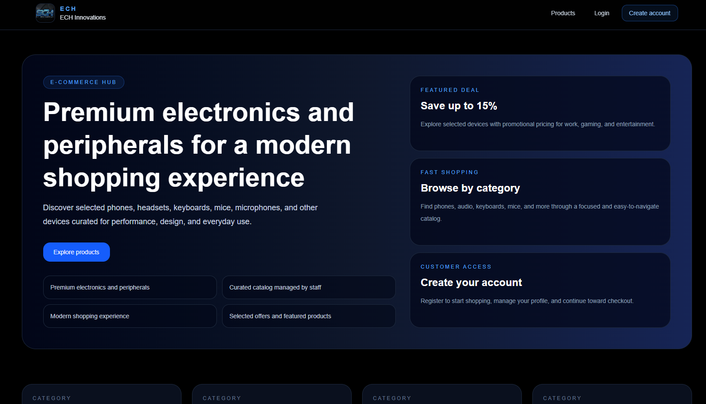

### Products Catalog

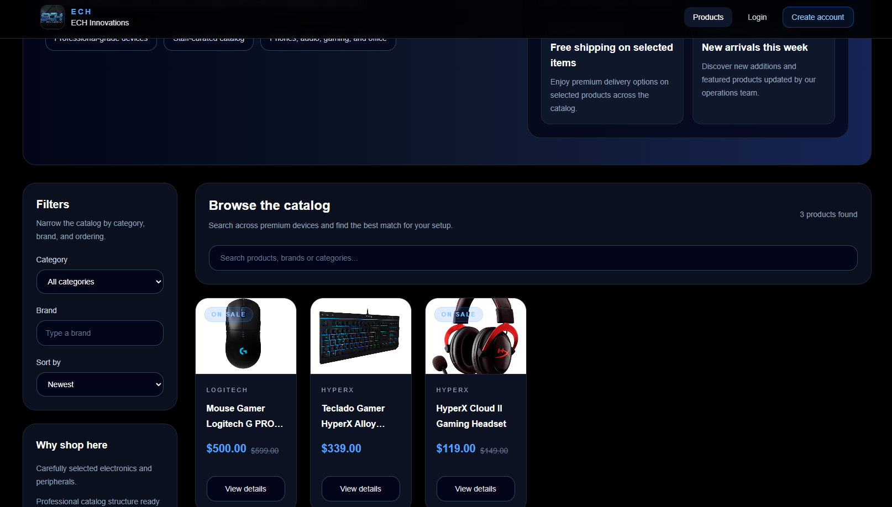

### Product Details


### Authentication

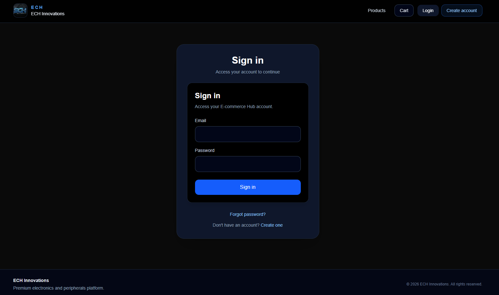

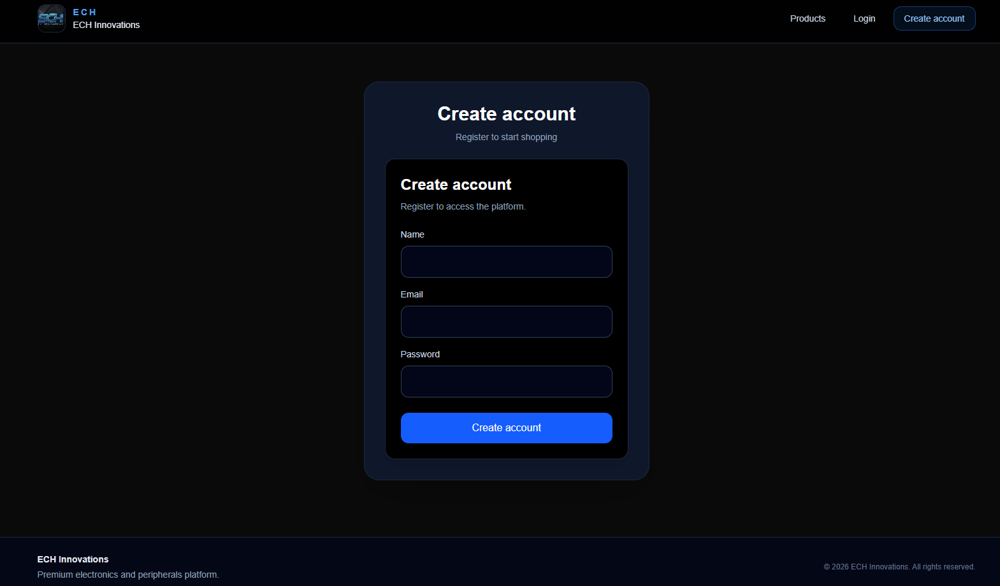

---

## Architecture Overview

The platform follows a modular architecture with a clear separation between API, service, and domain layers.

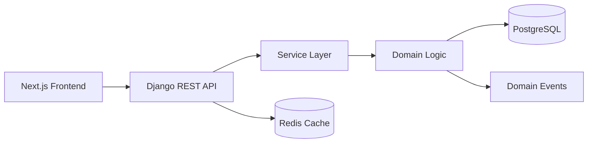

---

# Tech Stack

* Python 3.13
* Django 6.0
* Django REST Framework (DRF) 3.16
* Django-filter
* MySQL
* HTML5 + CSS3
* JWT Authentication (SimpleJWT)
* Pytest for automated testing

---

# Key Backend Concepts Demonstrated

This project demonstrates several backend engineering concepts used in production systems:

* API-first architecture
* Service-layer business logic
* Domain-driven design principles
* Transactional consistency using `transaction.atomic`
* Concurrency protection using `select_for_update`
* Idempotent API operations with request replay protection
* Inventory consistency in concurrent environments
* Audit event logging for operational monitoring
* Modular Django architecture
* Automated testing with pytest

---

# Platform Scope

The E-Commerce Hub simulates a production-grade backend platform composed of multiple interconnected domains.

The system currently includes:

* **9 independent modules**
* **2488 automated tests**
* **Domain-driven service architecture**
* **Event-driven cross-module communication**
* **Versioned cache invalidation strategies**
* **Idempotent API operations**
* **Role-based permission system**
* **Operational admin dashboard**
* **Analytical reporting module**

Each module follows the same layered architecture:

Domain → Services → Selectors → API → Tests

This structure allows the platform to scale while keeping business logic isolated, testable, and maintainable.

---

# Architectural Patterns Used

The system applies several architectural patterns commonly used in production-grade backend systems.

### Service Layer Pattern

Business logic is implemented in dedicated domain services instead of being embedded in views or models.

Examples:

* `UserRegistrationService`
* `ProductCreationService`
* `OrderCreateService`
* `PaymentProcessingService`
* `ShippingCreationService`
* `ReviewsModerationService`
* `NotificationCreationService`
* `AnalyticsSnapshotGenerationService`
* `AnalyticsSnapshotRefreshService`
* `AnalyticsDashboardSummaryService`
* `AdminDashboardSummaryService`
* `AdminDashboardOperationalMetricsService`
* `AdminDashboardRecentActivityService`
* `AdminDashboardAlertsService`
* `AdminDashboardBulkOrderActionsService`
* `AdminDashboardBulkReviewModerationService`
* `AdminDashboardBulkNotificationRetryService`

This approach ensures:

* separation between HTTP layer and domain logic
* easier testing of domain rules
* transactional orchestration inside services
* maintainable and extensible domain workflows

---

### Domain Events Pattern

The system implements lightweight domain events to decouple domain operations from secondary side effects.

Each module includes:

* domain event classes
* an in-memory event dispatcher
* a handler registry executed at application startup

Domain events are used for:

* audit logging
* cache invalidation
* lifecycle tracking
* integrations
* administrative observability

---

### Event Logging Pattern

Important domain operations are persisted as operational events.

Examples include:

* `UserEvent`
* `ProductEventLog`
* `OrderEvent`
* `PaymentEvent`
* `ShipmentEvent`
* `ReviewEvent`
* `NotificationEvent`
* `AnalyticsEvent`
* `AdminDashboardEvent`
* `AdminDashboardLog`

These event logs provide a complete operational audit trail and support future observability and analytics integrations.

Structured application logging is handled separately through dedicated logging services.

---

### Cache Versioning Pattern

The system implements versioned cache keys to allow deterministic cache invalidation across list endpoints.

Examples:

* product list caching
* order detail caching
* payment list caching
* shipment list caching
* review summary caching
* notifications delivery caching
* analytics dashboard caching
* analytics snapshot caching
* analytics sales overview caching
* analytics operational metrics caching
* admin dashboard summary caching
* admin dashboard operational metrics caching
* admin dashboard recent activity caching
* admin dashboard alerts caching

Cache versioning allows safe invalidation without requiring wildcard cache deletion.

---

### Idempotent API Design

Several write operations in the system support **idempotent execution** using the `Idempotency-Key` request header.

Idempotency is used to ensure safe retries in distributed environments where network failures, timeouts, or client retries may cause the same request to be executed multiple times.

The implementation includes:

* unique `Idempotency-Key` per request
* request fingerprint hashing for payload verification
* safe replay of previously completed operations
* conflict detection for mismatched payload reuse
* persistence of idempotency metadata in the database

When a request with the same `Idempotency-Key` is received:

* if the payload matches the original request, the previous result is safely replayed
* if the payload differs, the system returns a `409 Conflict` response

This strategy prevents duplicate resource creation in scenarios such as:

* repeated user creation requests
* repeated product creation requests
* repeated order submissions
* repeated payment attempts
* repeated shipment creation requests
* repeated review creation requests
* repeated notification creation requests
* repeated analytics snapshot generation
* client retries after network failures

Idempotency is implemented across multiple modules including:

* user registration
* product creation
* order creation
* payment creation
* shipment creation
* review creation
* notification creation
* analytics snapshot generation

---

# Architecture Overview

The backend follows a modular and layered architecture designed to improve **maintainability, scalability, and testability**.

Core architectural layers include:

### API Layer

Handles HTTP communication using Django REST Framework.

* Views
* Serializers
* Permissions
* Pagination
* Throttling

### Service Layer

Responsible for implementing business logic and orchestrating operations.

Examples:

* user registration
* email confirmation
* password reset flow

### Selector Layer

Handles optimized database queries and data retrieval.

### Models Layer

Defines database schema and relationships using Django ORM.

### Constants Layer

Centralizes system messages and configuration values.

---

# Architecture Diagram

```text
                                  Client (Web / Mobile)
                                            |
                                            v
                                  Django REST API (DRF)
                                            |
                                            v
                                      API Layer
                        (views • serializers • permissions)
                                            |
                                            v
                                      Service Layer
                            (business rules • orchestration)
                                            |
                  +-------------------------+--------------------------+
                  |                         |                          |
                  v                         v                          v
          Operational Services      Admin Dashboard Services    Analytics Services
        (users • products • orders • (summary • operational     (snapshots • dashboards •
        payments • shipping •        metrics • activity feed •   business intelligence metrics)
        reviews • notifications)     alerts • bulk actions)
                  |                         |                          |
                  v                         v                          v
              Selectors              Dashboard Selectors        Analytics Selectors
        (query optimization)      (cross-module aggregation) (aggregated analytical queries)
                  |                         |                          |
                  +-------------------------+------------+-------------+
                                            |
                                            v
                                        Django ORM
                                            |
                                            v
                                         Database
                                            |
                                            v
                                          Cache
                                 (Django Cache / Redis)

          +---------------------------------------------------------------+
          |
          v
                              Domain Events System
             (dispatcher • handlers • lifecycle observability • auditability)
```
> Domain events are used selectively in modules that benefit from lifecycle-based orchestration, auditability, and operational decoupling, including users, products, orders, payments, shipping, reviews, notifications, analytics, and the admin dashboard.

---

## Cross-Module Event Flow

The platform uses domain events to propagate important state transitions between modules in a decoupled way.

When key business operations occur, domain events allow other modules to react without introducing direct dependencies between domain services.

This mechanism supports:

- operational observability
- lifecycle tracking
- cache invalidation
- future integrations
- analytics pipelines

### Example Event Flow

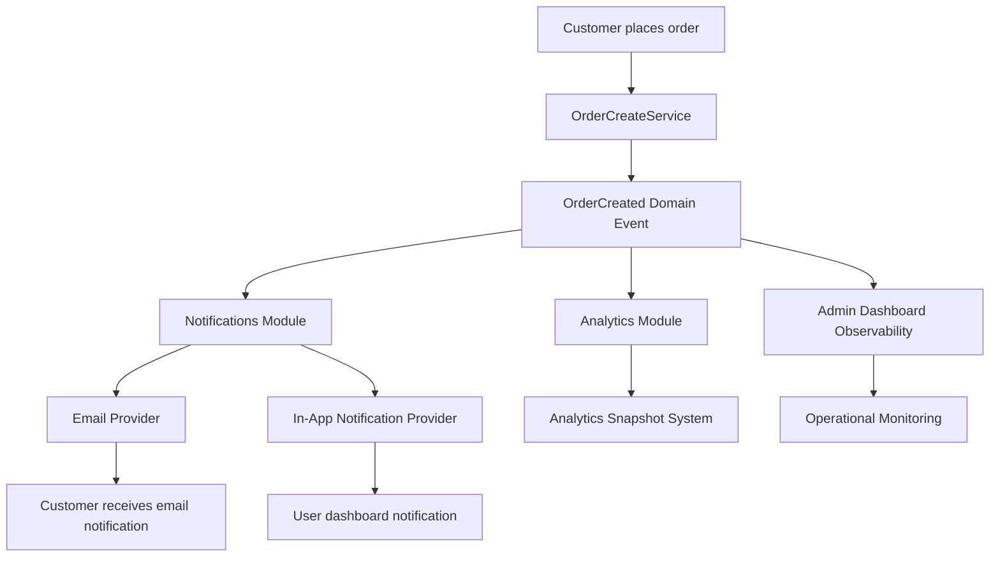

### Event-Driven Architecture

The system uses domain events to decouple modules and allow asynchronous or cross-module reactions to important business operations.

Examples include:

* order creation triggering customer notifications
* payment state transitions triggering shipping preparation
* review moderation generating operational logs
* notification lifecycle events enabling delivery observability
* analytics snapshot generation enabling business intelligence dashboards
* administrative monitoring reacting to operational anomalies

Domain events are implemented through a lightweight in-memory dispatcher and a registry-based handler system.

This architecture allows the platform to evolve toward more advanced event-driven or message-based systems in the future, including integration with message brokers or distributed event pipelines.

---

# Frontend Architecture

Although the primary focus of this project is the backend platform, the repository also includes a **modern frontend application** built with **Next.js and TypeScript**.

The frontend is designed to interact with the backend through the REST API and follows a **feature-driven architecture** aligned with the backend modular structure.

Key frontend principles include:

* Feature-based module organization
* Separation between shared UI components and domain features
* Dedicated API integration layer
* Typed data models aligned with backend serializers
* React Query for server-state management
* Modular component composition
* Reusable UI primitives
* Scalable folder organization

The frontend structure mirrors the backend domains, allowing consistent development across:

* users
* products
* orders
* payments
* shipping
* reviews
* notifications
* analytics
* admin dashboard

This alignment simplifies development, improves maintainability, and makes the system easier to scale as additional features are introduced.
 
---

# Development Roadmap

## Backend

Planned modules:

* Users module ✔
* Products module ✔
* Orders module ✔
* Payments module ✔
* Shipping module ✔
* Reviews module ✔
* Notifications module ✔
* Analytics module ✔
* Admin dashboard ✔

## Frontend

Planned modules:

* Users module ✔
* Products module ✔
* Orders module ✔
* Payments module ✔
* Shipping module ✔
* Reviews module ✔
* Notifications module ✔
* Analytics module ✔
* Admin dashboard ✔

---

# Project Structure

The backend is organized using a **modular architecture**, where each domain (users, products, orders, payments, shipping, reviews, notifications, and analytics) is implemented as an independent Django app.

The frontend is built with **Next.js and TypeScript**, using a feature-driven architecture that mirrors the backend domains, enabling consistent development across the platform.

<details>
<summary><strong>Backend Structure</strong></summary>

```text
ecommerce_hub/
│
├── core/
│   ├── exceptions/
│   │   └── handlers.py
│   ├── settings.py
│   └── urls.py
│
├── ech/
│   ├── admin.py
│   ├── apps.py
│   ├── urls.py
│   │
│   ├── users/
│   │   ├── api/
│   │   │   ├── tests/
│   │   │   │   ├── test_user_login_api.py
│   │   │   │   ├── test_user_logout_invalid_refresh_token_api.py
│   │   │   │   ├── test_user_confirm_email_api.py
│   │   │   │   ├── test_user_email_protections_api.py
│   │   │   │   ├── test_user_password_reset_confirm_api.py
│   │   │   │   ├── test_user_password_reset_request_api.py
│   │   │   │   ├── test_user_register_api.py
│   │   │   │   ├── test_user_profile_update_api.py
│   │   │   │   ├── test_user_me_api.py
│   │   │   │   └── test_user_token_refresh_api.py
│   │   │   │
│   │   │   ├── serializers.py
│   │   │   ├── permissions.py
│   │   │   ├── throttles.py
│   │   │   ├── urls.py
│   │   │   └── views.py
│   │   │
│   │   ├── constants/
│   │   │   ├── constants.py
│   │   │   └── messages.py
│   │   │
│   │   ├── services/
│   │   │   ├── user_registration_service.py
│   │   │   ├── user_password_reset_service.py
│   │   │   ├── user_update_service.py
│   │   │   ├── user_email_confirmation_service.py
│   │   │   └── user_log_service.py
│   │   │
│   │   ├── utils/
│   │   │   ├── urls.py
│   │   │   └── request_metadata.py
│   │   │
│   │   ├── domain_events/
│   │   │   ├── dispatcher.py
│   │   │   ├── events.py
│   │   │   ├── handlers.py
│   │   │   └── registry.py
│   │   │
│   │   ├── tests/
│   │   │   ├── test_models.py
│   │   │   ├── test_exceptions.py
│   │   │   ├── test_selectors.py
│   │   │   ├── test_user_registration_service.py
│   │   │   ├── test_user_password_reset_service.py
│   │   │   ├── test_user_update_service.py
│   │   │   ├── test_user_email_confirmation_service.py
│   │   │   ├── test_user_log_service.py
│   │   │   └── test_domain_events.py
│   │   │
│   │   ├── admin.py
│   │   ├── models.py
│   │   ├── selectors.py
│   │   ├── exceptions.py
│   │   └── apps.py
│   │
│   ├── products/
│   │   ├── api/
│   │   │   ├── tests/
│   │   │   │   ├── test_product_create_api.py
│   │   │   │   ├── test_product_update_api.py
│   │   │   │   ├── test_product_delete_api.py
│   │   │   │   ├── test_product_list_api.py
│   │   │   │   ├── test_product_detail_api.py
│   │   │   │   └── test_product_images_api.py
│   │   │   │
│   │   │   ├── serializers.py
│   │   │   ├── permissions.py
│   │   │   ├── pagination.py
│   │   │   ├── urls.py
│   │   │   └── views.py
│   │   │
│   │   ├── services/
│   │   │   ├── product_creation_service.py
│   │   │   ├── product_delete_service.py
│   │   │   ├── product_image_service.py
│   │   │   ├── product_inventory_service.py
│   │   │   ├── product_update_service.py
│   │   │   ├── product_log_service.py
│   │   │   └── product_stock_service.py
│   │   │
│   │   ├── utils/
│   │   │   └── cache_keys.py
│   │   │
│   │   ├── domain_events/
│   │   │   ├── dispatcher.py
│   │   │   ├── events.py
│   │   │   ├── handlers.py
│   │   │   └── registry.py
│   │   │
│   │   ├── constants/
│   │   │   ├── cache.py
│   │   │   ├── constants.py
│   │   │   ├── inventory.py
│   │   │   ├── messages.py
│   │   │   ├── roles_management.py
│   │   │   ├── rules.py
│   │   │   └── storage.py
│   │   │
│   │   ├── tests/
│   │   │   ├── test_models.py
│   │   │   ├── test_selectors.py
│   │   │   ├── test_exceptions.py
│   │   │   ├── test_filters.py
│   │   │   ├── test_product_creation_service.py
│   │   │   ├── test_product_image_service.py
│   │   │   ├── test_product_update_service.py
│   │   │   ├── test_product_delete_service.py
│   │   │   ├── test_product_inventory_service.py
│   │   │   ├── test_product_log_service.py
│   │   │   ├── test_product_stock_service.py
│   │   │   └── test_domain_events.py
│   │   │
│   │   ├── admin.py
│   │   ├── filters.py
│   │   ├── models.py
│   │   ├── selectors.py
│   │   ├── exceptions.py
│   │   └── apps.py
│   │
│   ├── orders/
│   │   ├── api/
│   │   │   ├── tests/
│   │   │   │   ├── test_order_cache_api.py
│   │   │   │   ├── test_order_create_api.py
│   │   │   │   ├── test_order_list_api.py
│   │   │   │   ├── test_order_detail_api.py
│   │   │   │   ├── test_order_cancel_api.py
│   │   │   │   ├── test_order_management_list_api.py
│   │   │   │   ├── test_order_management_detail_api.py
│   │   │   │   ├── test_order_confirm_api.py
│   │   │   │   ├── test_order_processing_api.py
│   │   │   │   ├── test_order_shipping_api.py
│   │   │   │   └── test_order_delivery_api.py
│   │   │   │
│   │   │   ├── serializers.py
│   │   │   ├── permissions.py
│   │   │   ├── pagination.py
│   │   │   ├── urls.py
│   │   │   └── views.py
│   │   │
│   │   ├── services/
│   │   │   ├── cache_service.py
│   │   │   ├── order_create_service.py
│   │   │   ├── order_status_service.py
│   │   │   ├── order_cancel_service.py
│   │   │   ├── order_totals_service.py
│   │   │   └── order_log_service.py
│   │   │ 
│   │   ├── utils/
│   │   │   └── cache_keys.py
│   │   │
│   │   ├── domain_events/
│   │   │   ├── dispatcher.py
│   │   │   ├── events.py
│   │   │   ├── handlers.py
│   │   │   └── registry.py
│   │   │
│   │   ├── constants/
│   │   │   ├── cache.py
│   │   │   ├── constants.py
│   │   │   ├── messages.py
│   │   │   └── roles_management.py
│   │   │
│   │   ├── tests/
│   │   │   ├── test_models.py
│   │   │   ├── test_exceptions.py
│   │   │   ├── test_selectors.py
│   │   │   ├── test_order_create_service.py
│   │   │   ├── test_order_status_service.py
│   │   │   ├── test_order_cancel_service.py
│   │   │   ├── test_order_totals_service.py
│   │   │   ├── test_order_log_service.py
│   │   │   ├── test_domain_events.py
│   │   │   ├── test_cache_selectors.py
│   │   │   ├── test_cache_invalidation.py
│   │   │   └── test_filters.py
│   │   │
│   │   ├── admin.py
│   │   ├── filters.py
│   │   ├── models.py
│   │   ├── selectors.py
│   │   ├── exceptions.py
│   │   └── apps.py
│   │
│   ├── payments/
│   │   ├── api/
│   │   │   ├── tests/
│   │   │   │   ├── test_payment_creation_api.py
│   │   │   │   ├── test_payment_list_api.py
│   │   │   │   ├── test_payment_detail_api.py
│   │   │   │   ├── test_payment_process_api.py
│   │   │   │   ├── test_payment_cancel_api.py
│   │   │   │   ├── test_payment_refund_api.py
│   │   │   │   ├── test_payment_transaction_list_api.py
│   │   │   │   └── test_payment_management_detail_api.py
│   │   │   │
│   │   │   ├── serializers.py
│   │   │   ├── permissions.py
│   │   │   ├── pagination.py
│   │   │   ├── urls.py
│   │   │   └── views.py
│   │   │
│   │   ├── services/
│   │   │   ├── cache_service.py
│   │   │   ├── payment_creation_service.py
│   │   │   ├── payment_processing_service.py
│   │   │   ├── payment_status_service.py
│   │   │   ├── payment_refund_service.py
│   │   │   └── payment_log_service.py
│   │   │ 
│   │   ├── utils/
│   │   │   └── cache_keys.py
│   │   │
│   │   ├── domain_events/
│   │   │   ├── dispatcher.py
│   │   │   ├── events.py
│   │   │   ├── handlers.py
│   │   │   └── registry.py
│   │   │
│   │   ├── constants/
│   │   │   ├── cache.py
│   │   │   ├── constants.py
│   │   │   ├── messages.py
│   │   │   └── roles_management.py
│   │   │
│   │   ├── tests/
│   │   │   ├── test_models.py
│   │   │   ├── test_exceptions.py
│   │   │   ├── test_selectors.py
│   │   │   ├── test_payment_create_service.py
│   │   │   ├── test_payment_status_service.py
│   │   │   ├── test_payment_processing_service.py
│   │   │   ├── test_payment_refund_service.py
│   │   │   ├── test_payment_log_service.py
│   │   │   ├── test_domain_events.py
│   │   │   ├── test_cache_selectors.py
│   │   │   ├── test_cache_invalidation.py
│   │   │   └── test_filters.py
│   │   │
│   │   ├── admin.py
│   │   ├── filters.py
│   │   ├── models.py
│   │   ├── exceptions.py
│   │   ├── selectors.py
│   │   └── apps.py
│   │
│   ├── shipping/
│   │   ├── api/
│   │   │   ├── tests/
│   │   │   │   ├── test_shipping_create_api.py
│   │   │   │   ├── test_shipping_list_api.py
│   │   │   │   ├── test_shipping_detail_api.py
│   │   │   │   ├── test_shipping_update_api.py
│   │   │   │   ├── test_shipping_process_api.py
│   │   │   │   ├── test_shipping_cancel_api.py
│   │   │   │   ├── test_shipping_tracking_api.py
│   │   │   │   ├── test_shipping_management_list_api.py
│   │   │   │   └── test_shipping_management_detail_api.py
│   │   │   │
│   │   │   ├── serializers.py
│   │   │   ├── permissions.py
│   │   │   ├── pagination.py
│   │   │   ├── urls.py
│   │   │   └── views.py
│   │   │
│   │   ├── services/
│   │   │   ├── cache_service.py
│   │   │   ├── shipping_creation_service.py
│   │   │   ├── shipping_update_service.py
│   │   │   ├── shipping_status_service.py
│   │   │   ├── shipping_cancellation_service.py
│   │   │   ├── shipping_tracking_service.py
│   │   │   └── shipping_log_service.py
│   │   │ 
│   │   ├── utils/
│   │   │   └── cache_keys.py
│   │   │
│   │   ├── domain_events/
│   │   │   ├── dispatcher.py
│   │   │   ├── events.py
│   │   │   ├── handlers.py
│   │   │   └── registry.py
│   │   │
│   │   ├── constants/
│   │   │   ├── cache.py
│   │   │   ├── constants.py
│   │   │   ├── messages.py
│   │   │   └── roles_management.py
│   │   │
│   │   ├── tests/
│   │   │   ├── test_models.py
│   │   │   ├── test_exceptions.py
│   │   │   ├── test_selectors.py
│   │   │   ├── test_shipping_create_service.py
│   │   │   ├── test_shipping_update_service.py
│   │   │   ├── test_shipping_status_service.py
│   │   │   ├── test_shipping_cancellation_service.py
│   │   │   ├── test_shipping_tracking_service.py
│   │   │   ├── test_shipping_log_service.py
│   │   │   ├── test_domain_events.py
│   │   │   ├── test_cache_selectors.py
│   │   │   ├── test_cache_invalidation.py
│   │   │   └── test_filters.py
│   │   │
│   │   ├── admin.py
│   │   ├── filters.py
│   │   ├── models.py
│   │   ├── selectors.py
│   │   ├── exceptions.py
│   │   └── apps.py
│   │
│   ├── reviews/
│   │   ├── api/
│   │   │   ├── tests/
│   │   │   │   ├── test_review_create_api.py
│   │   │   │   ├── test_review_list_api.py
│   │   │   │   ├── test_review_detail_api.py
│   │   │   │   ├── test_review_update_api.py
│   │   │   │   ├── test_review_cancel_api.py
│   │   │   │   ├── test_review_moderation_api.py
│   │   │   │   ├── test_product_review_public_api.py
│   │   │   │   ├── test_product_review_summary_api.py
│   │   │   │   ├── test_review_management_list_api.py
│   │   │   │   └── test_review_management_detail_api.py
│   │   │   │
│   │   │   ├── serializers.py
│   │   │   ├── permissions.py
│   │   │   ├── pagination.py
│   │   │   ├── urls.py
│   │   │   └── views.py
│   │   │
│   │   ├── services/
│   │   │   ├── cache_service.py
│   │   │   ├── review_creation_service.py
│   │   │   ├── review_update_service.py
│   │   │   ├── review_status_service.py
│   │   │   ├── review_cancellation_service.py
│   │   │   ├── review_moderation_service.py
│   │   │   └── review_log_service.py
│   │   │ 
│   │   ├── utils/
│   │   │   └── cache_keys.py
│   │   │
│   │   ├── domain_events/
│   │   │   ├── dispatcher.py
│   │   │   ├── events.py
│   │   │   ├── handlers.py
│   │   │   └── registry.py
│   │   │
│   │   ├── constants/
│   │   │   ├── cache.py
│   │   │   ├── constants.py
│   │   │   ├── messages.py
│   │   │   └── roles_management.py
│   │   │
│   │   ├── tests/
│   │   │   ├── test_models.py
│   │   │   ├── test_exceptions.py
│   │   │   ├── test_selectors.py
│   │   │   ├── test_review_create_service.py
│   │   │   ├── test_review_update_service.py
│   │   │   ├── test_review_status_service.py
│   │   │   ├── test_review_cancellation_service.py
│   │   │   ├── test_review_moderation_service.py
│   │   │   ├── test_review_log_service.py
│   │   │   ├── test_domain_events.py
│   │   │   ├── test_cache_selectors.py
│   │   │   ├── test_cache_invalidation.py
│   │   │   └── test_filters.py
│   │   │
│   │   ├── admin.py
│   │   ├── filters.py
│   │   ├── models.py
│   │   ├── selectors.py
│   │   ├── exceptions.py
│   │   └── apps.py
│   │
│   ├── notifications/
│   │   ├── api/
│   │   │   ├── tests/
│   │   │   │   ├── test_notification_create_api.py
│   │   │   │   ├── test_notification_list_api.py
│   │   │   │   ├── test_notification_detail_api.py
│   │   │   │   ├── test_notification_mark_read_api.py
│   │   │   │   ├── test_notification_archive_api.py
│   │   │   │   ├── test_notification_cancel_api.py
│   │   │   │   ├── test_notification_dispatch_api.py
│   │   │   │   ├── test_notification_management_list_api.py
│   │   │   │   └── test_notification_management_detail_api.py
│   │   │   │
│   │   │   ├── serializers.py
│   │   │   ├── permissions.py
│   │   │   ├── pagination.py
│   │   │   ├── urls.py
│   │   │   └── views.py
│   │   │
│   │   ├── services/
│   │   │   ├── cache_service.py
│   │   │   ├── notification_creation_service.py
│   │   │   ├── notification_status_service.py
│   │   │   ├── notification_cancellation_service.py
│   │   │   ├── notification_delivery_service.py
│   │   │   └── notification_log_service.py
│   │   │ 
│   │   ├── utils/
│   │   │   └── cache_keys.py
│   │   │
│   │   ├── domain_events/
│   │   │   ├── dispatcher.py
│   │   │   ├── events.py
│   │   │   ├── handlers.py
│   │   │   └── registry.py
│   │   │
│   │   ├── providers/
│   │   │   ├── email_provider.py
│   │   │   └── in_app_provider.py
│   │   │
│   │   ├── constants/
│   │   │   ├── cache.py
│   │   │   ├── constants.py
│   │   │   ├── messages.py
│   │   │   └── roles_management.py
│   │   │
│   │   ├── tests/
│   │   │   ├── test_models.py
│   │   │   ├── test_exceptions.py
│   │   │   ├── test_selectors.py
│   │   │   ├── test_notification_create_service.py
│   │   │   ├── test_notification_status_service.py
│   │   │   ├── test_notification_cancellation_service.py
│   │   │   ├── test_notification_delivery_service.py
│   │   │   ├── test_notification_log_service.py
│   │   │   ├── test_email_provider.py
│   │   │   ├── test_in_app_provider.py
│   │   │   ├── test_domain_events.py
│   │   │   ├── test_cache_selectors.py
│   │   │   ├── test_cache_invalidation.py
│   │   │   └── test_filters.py
│   │   │
│   │   ├── admin.py
│   │   ├── filters.py
│   │   ├── models.py
│   │   ├── selectors.py
│   │   ├── exceptions.py
│   │   └── apps.py
│   │
│   ├── analytics/
│   │   ├── api/
│   │   │   ├── tests/
│   │   │   │   ├── test_analytic_dashboard_summary_api.py
│   │   │   │   ├── test_analytic_sales_overview_api.py
│   │   │   │   ├── test_analytic_user_overview_api.py
│   │   │   │   ├── test_analytic_order_funnel_api.py
│   │   │   │   ├── test_analytic_payment_overview_api.py
│   │   │   │   ├── test_analytic_shipping_overview_api.py
│   │   │   │   ├── test_analytic_review_overview_api.py
│   │   │   │   ├── test_analytic_product_performance_api.py
│   │   │   │   ├── test_analytic_customer_summary_api.py
│   │   │   │   ├── test_analytic_snapshot_list_api.py
│   │   │   │   ├── test_analytic_snapshot_detail_api.py
│   │   │   │   └── test_analytic_snapshot_refresh_api.py
│   │   │   │
│   │   │   ├── serializers.py
│   │   │   ├── permissions.py
│   │   │   ├── pagination.py
│   │   │   ├── urls.py
│   │   │   └── views.py
│   │   │
│   │   ├── services/
│   │   │   ├── cache_service.py
│   │   │   ├── analytic_dashboard_summary_service.py
│   │   │   ├── analytic_sales_overview_service.py
│   │   │   ├── analytic_user_overview_service.py
│   │   │   ├── analytic_order_funnel_service.py
│   │   │   ├── analytic_payment_overview_service.py
│   │   │   ├── analytic_shipping_overview_service.py
│   │   │   ├── analytic_review_overview_service.py
│   │   │   ├── analytic_product_performance_service.py
│   │   │   ├── analytic_customer_summary_service.py
│   │   │   ├── analytic_snapshot_generation_service.py
│   │   │   ├── analytic_snapshot_refresh_service.py
│   │   │   └── analytic_log_service.py
│   │   │ 
│   │   ├── utils/
│   │   │   ├── date_ranges.py
│   │   │   ├── metric_builders.py
│   │   │   └── cache_keys.py
│   │   │
│   │   ├── domain_events/
│   │   │   ├── dispatcher.py
│   │   │   ├── events.py
│   │   │   ├── handlers.py
│   │   │   └── registry.py
│   │   │
│   │   ├── constants/
│   │   │   ├── cache.py
│   │   │   ├── constants.py
│   │   │   ├── messages.py
│   │   │   └── roles_management.py
│   │   │
│   │   ├── tests/
│   │   │   ├── test_models.py
│   │   │   ├── test_exceptions.py
│   │   │   ├── test_selectors.py
│   │   │   ├── test_analytic_dashboard_summary_service.py
│   │   │   ├── test_analytic_sales_overview_service.py
│   │   │   ├── test_analytic_user_overview_service.py
│   │   │   ├── test_analytic_order_funnel_service.py
│   │   │   ├── test_analytic_payment_overview_service.py
│   │   │   ├── test_analytic_shipping_overview_service.py
│   │   │   ├── test_analytic_review_overview_service.py
│   │   │   ├── test_analytic_product_performance_service.py
│   │   │   ├── test_analytic_customer_summary_service.py
│   │   │   ├── test_analytic_snapshot_generation_service.py
│   │   │   ├── test_analytic_snapshot_refresh_service.py
│   │   │   ├── test_analytic_log_service.py
│   │   │   ├── test_domain_events.py
│   │   │   ├── test_cache_selectors.py
│   │   │   ├── test_cache_invalidation.py
│   │   │   └── test_filters.py
│   │   │
│   │   ├── admin.py
│   │   ├── filters.py
│   │   ├── models.py
│   │   ├── selectors.py
│   │   ├── exceptions.py
│   │   └── apps.py
│   │
│   ├── admin_dashboard/
│   │   ├── api/
│   │   │   ├── tests/
│   │   │   │   ├── test_admin_dashboard_summary_api.py
│   │   │   │   ├── test_admin_dashboard_operational_metrics_api.py
│   │   │   │   ├── test_admin_dashboard_recent_activity_api.py
│   │   │   │   ├── test_admin_dashboard_alerts_api.py
│   │   │   │   ├── test_admin_dashboard_bulk_order_actions_api.py
│   │   │   │   ├── test_admin_dashboard_bulk_review_moderation_api.py
│   │   │   │   ├── test_admin_dashboard_bulk_notification_retry_api.py
│   │   │   │   ├── test_analytic_product_performance_api.py
│   │   │   │   └── test_admin_dashboard_permissions_api.py
│   │   │   │
│   │   │   ├── serializers.py
│   │   │   ├── permissions.py
│   │   │   ├── pagination.py
│   │   │   ├── urls.py
│   │   │   └── views.py
│   │   │
│   │   ├── services/
│   │   │   ├── cache_service.py
│   │   │   ├── admin_dashboard_summary_service.py
│   │   │   ├── admin_dashboard_operational_metrics_service.py
│   │   │   ├── admin_dashboard_recent_activity_service.py
│   │   │   ├── admin_dashboard_alerts_service.py
│   │   │   ├── admin_dashboard_bulk_order_actions_service.py
│   │   │   ├── admin_dashboard_bulk_review_moderation_service.py
│   │   │   ├── admin_dashboard_bulk_notification_retry_service.py
│   │   │   └── admin_dashboard_log_service.py
│   │   │ 
│   │   ├── utils/
│   │   │   ├── metric_builders.py
│   │   │   └── cache_keys.py
│   │   │
│   │   ├── domain_events/
│   │   │   ├── dispatcher.py
│   │   │   ├── events.py
│   │   │   ├── handlers.py
│   │   │   └── registry.py
│   │   │
│   │   ├── constants/
│   │   │   ├── cache.py
│   │   │   ├── constants.py
│   │   │   ├── messages.py
│   │   │   └── roles_management.py
│   │   │
│   │   ├── tests/
│   │   │   ├── test_models.py
│   │   │   ├── test_exceptions.py
│   │   │   ├── test_selectors.py
│   │   │   ├── test_admin_dashboard_summary_service.py
│   │   │   ├── test_admin_dashboard_operational_metrics_service.py
│   │   │   ├── test_admin_dashboard_recent_activity_service.py
│   │   │   ├── test_admin_dashboard_alerts_service.py
│   │   │   ├── test_admin_dashboard_bulk_order_actions_service.py
│   │   │   ├── test_admin_dashboard_bulk_review_moderation_service.py
│   │   │   ├── test_admin_dashboard_bulk_notification_retry_service.py
│   │   │   ├── test_admin_dashboard_log_service.py
│   │   │   ├── test_domain_events.py
│   │   │   ├── test_cache_selectors.py
│   │   │   ├── test_cache_invalidation.py
│   │   │   └── test_filters.py
│   │   │
│   │   ├── admin.py
│   │   ├── filters.py
│   │   ├── models.py
│   │   ├── selectors.py
│   │   ├── exceptions.py
│   │   └── apps.py
│
├── ech_web/
│   └── ...
│
└── manage.py
```

</details>

---

<details>
<summary><strong>Frontend Structure</strong></summary>

```text
ecommerce_hub/
│
├── core/
│   ├── exceptions/
│   │   └── handlers.py
│   └── settings.py
│
├── ech/
│   ├── users/
│   ├── products/
│   ├── orders/
│   ├── payments/
│   ├── shipping/
│   ├── reviews/
│   ├── notifications/
│   ├── analytics/
│   └── admin_dashboard/
│
├── ech_web/
│   │
│   ├── public/
│   │   ├── images/
│   │   └── icons/
│   │
│   ├── src/
│   │   │
│   │   ├── app/
│   │   │   ├── (public)/
│   │   │   ├── (protected)/
│   │   │   └── (dashboard)/
│   │   │
│   │   ├── features/
│   │   │   ├── users/
│   │   │   ├── products/
│   │   │   ├── orders/
│   │   │   ├── payments/
│   │   │   ├── shipping/
│   │   │   ├── reviews/
│   │   │   ├── notifications/
│   │   │   ├── analytics/
│   │   │   └── admin-dashboard/
│   │   │
│   │   ├── components/
│   │   │   ├── ui/
│   │   │   ├── layout/
│   │   │   ├── feedback/
│   │   │   └── shared/
│   │   │
│   │   ├── config/
│   │   ├── lib/
│   │   ├── providers/
│   │   ├── hooks/
│   │   ├── types/
│   │   └── styles/
│   │
│   ├── middleware.ts
│   ├── next.config.ts
│   ├── tailwind.config.ts
│   ├── tsconfig.json
│   └── package.json
│
└── manage.py
```

</details>

---

# Implemented Features

## Users Module

### Authentication

* JWT login authentication
* Access and refresh token mechanism
* Token refresh endpoint
* Secure logout with refresh token invalidation

### User Management

* User registration
* Idempotent user registration with `Idempotency-Key` support
* Request fingerprint validation for idempotent replay protection
* Conflict detection for reused idempotency keys with mismatched payloads
* Email confirmation system
* Password reset via email
* Protection against inactive accounts
* Role-based permission system
* Authenticated user profile retrieval
* Partial user profile update
* Confirmed-email protection for profile access

### Registration Idempotency

* Support for `Idempotency-Key` header in the registration endpoint
* Request fingerprint hashing for replay validation
* Safe replay of repeated registration requests with the same payload
* `409 Conflict` response for reused idempotency keys with different payloads

### Profile Management

* Authenticated profile retrieval endpoint
* Partial profile update support via `PATCH`
* Controlled update of editable profile fields
* Protection of non-editable fields such as email and role
* Domain service for user profile updates

### Security Features

* Token expiration validation
* Invalid token protections
* Email verification requirement for protected profile endpoints
* Brute-force mitigation through login throttling
* Security-focused API responses
* Global conflict handling for idempotency violations (`409 Conflict`)
* Structured security and authentication logging

### Domain Event System

The users module now includes a lightweight domain event architecture.

Components include:

* domain event classes
* in-memory event dispatcher
* handler registry executed at application startup
* structured event handlers for observability

Current domain events include:

* user registered
* user email confirmed
* password reset requested
* password changed
* login succeeded
* login failed
* invalid token detected

### Service Layer Architecture

The users module follows a service-oriented domain architecture.

Core domain operations are executed through dedicated services, including:

* `UserRegistrationService`
* `EmailConfirmationService`
* `PasswordResetRequestService`
* `PasswordResetService`
* `UserProfileUpdateService`
* `UserAuthenticationService`
* `UserLogService`

These services are responsible for orchestrating domain operations such as:

* user account creation
* email confirmation workflow
* password reset request generation
* password change operations
* profile update validation
* authentication lifecycle events
* structured security logging

This architecture ensures:

* clear separation between API, domain logic, and persistence layers
* centralized enforcement of authentication and security rules
* transactional consistency for sensitive account operations
* improved maintainability and extensibility of the authentication system
* easier testing of isolated domain behaviors

### User Lifecycle Management

The users module implements a controlled lifecycle that governs the state transitions of user accounts throughout their existence in the system.

User accounts transition through several operational states including:

* registration and account creation
* email confirmation
* account activation
* authentication and session lifecycle
* password recovery and credential updates
* account deactivation or reactivation

These lifecycle transitions ensure proper validation, security enforcement, and account integrity across the authentication system.

### User Lifecycle Flow

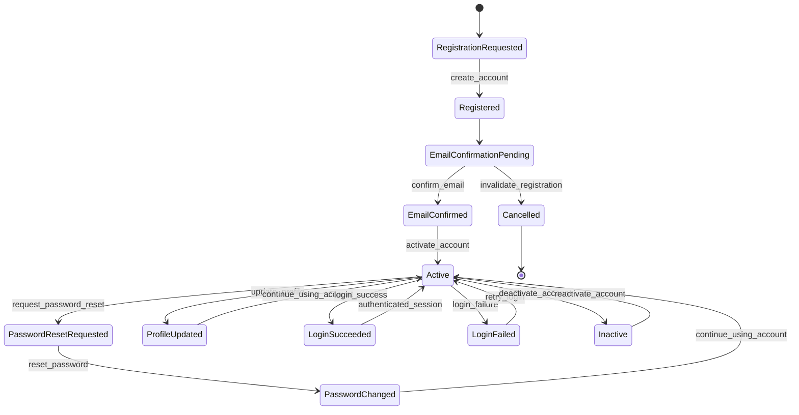

### Structured Logging

The users module includes a dedicated logging service:

* `UserLogService`

Structured logs are generated for:

* user registration
* email confirmation
* profile updates
* password changes
* successful login attempts
* failed login attempts

---

## Products Module

### Product Management

* Product creation with validation rules
* Idempotent product creation with `Idempotency-Key` support
* Request fingerprint validation for idempotent replay protection
* Conflict detection for reused idempotency keys with mismatched payloads
* Product update with partial updates
* Soft deletion for products
* Product image upload with automatic ordering
* Separate inventory model for stock management

### Product Idempotency

* Support for `Idempotency-Key` header in the product creation endpoint
* Request fingerprint hashing for replay validation
* Safe replay of repeated product creation requests with the same payload
* `409 Conflict` response for reused idempotency keys with different payloads

### Product Components

Products are composed of multiple related entities:

* **Product** – main aggregate root
* **ProductInventory** – dedicated stock record
* **ProductImage** – product media with sequential display ordering
* **ProductEventLog** – audit trail for product lifecycle operations

### Inventory Control

* Dedicated inventory table (`ProductInventory`)
* Atomic stock operations
* Database-level locking to prevent overselling
* Reserved stock and released stock workflows
* Cache invalidation after inventory mutations

### Domain Event System

The products module implements a lightweight event-driven architecture.

Components include:

* domain event classes
* in-memory event dispatcher
* handler registry executed at application startup
* structured event handlers for observability and cache consistency

Current domain events include:

* product created
* product updated
* product deleted
* product image uploaded

Handlers are responsible for:

* audit event registration
* cache invalidation
* product detail cache refresh when applicable

### Caching Layer

A dedicated caching utility improves performance for product retrieval operations:

* product detail caching
* paginated product list caching
* filtered list cache key generation
* backend-agnostic cache versioning for list invalidation

### Cache Invalidation Strategy

Cache consistency is maintained through automatic invalidation when:

* a product is created
* a product is updated
* a product is soft deleted
* product images are uploaded
* inventory is decreased
* stock is reserved
* stock is released

### Audit Logging

* Dedicated product logging service
* Event logging for product actions
* Logged events include:
  * product creation
  * product updates
  * product deletion
  * product image uploads

This provides a full audit trail for product management operations.

### Filtering and Search

* Product filtering by attributes
* Full-text search on product fields
* Ordering by price, creation date and name
* Paginated product listings

### Query Optimization

Database queries are optimized using:

* `select_related`
* `prefetch_related`
* indexed fields for faster filtering and sorting
* cached read patterns for list and detail endpoints

### Service Layer Architecture

The products module follows a service-oriented domain architecture:

* `create_product`
* `update_product`
* `delete_product`
* `add_product_image`
* `decrease_inventory`
* `reserve_stock`
* `release_stock`
* `log_product_event`

This architecture ensures:

* clear separation of concerns
* transactional consistency
* centralized domain rule enforcement
* easier testing and maintenance
* extensibility for future integrations

### Product Lifecycle Management

Products follow a controlled lifecycle that governs their availability and operational state within the catalog.

Product lifecycle states include:

* product creation and draft state
* product activation and publication
* inventory adjustments and stock state transitions
* product updates and media synchronization
* inventory depletion and out-of-stock handling
* product soft deletion

These lifecycle transitions ensure catalog integrity, inventory consistency, and controlled product availability across the platform.

### Product Lifecycle Flow

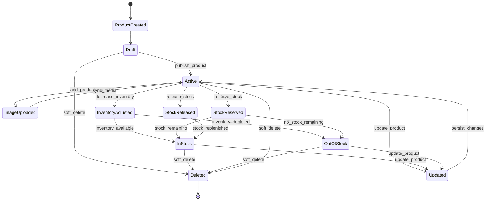

---

## Orders Module

### Order Creation

* Atomic order creation using a service layer
* Support for multiple order items
* Product snapshot storage for historical accuracy
* Idempotency key support to prevent duplicate orders
* Request fingerprint validation for safe idempotent replay
* Conflict detection for mismatched idempotency key reuse
* Automatic calculation of order totals

### Order Components

Orders are composed of multiple related entities:

* **Order** – main aggregate root
* **OrderItem** – purchased products snapshot
* **OrderTotals** – calculated financial totals
* **OrderAddress** – shipping address snapshot
* **OrderLifecycle** – timestamps for order lifecycle events
* **OrderEvent** – operational event logging with event-driven architecture
* **OrderNote** – communication logs between staff and customer

### Inventory Safety

* Stock validation during order creation
* Database-level row locking using `select_for_update`
* Atomic stock updates to prevent overselling
* Automatic stock restoration when orders are cancelled

### Order Lifecycle Management

Orders follow a controlled lifecycle:

```text
PENDING
→ CONFIRMED
→ PROCESSING
→ SHIPPED
→ DELIVERED
```

Additional transitions:

```text
CANCELLED
REFUNDED
```

### Order Lifecycle Flow

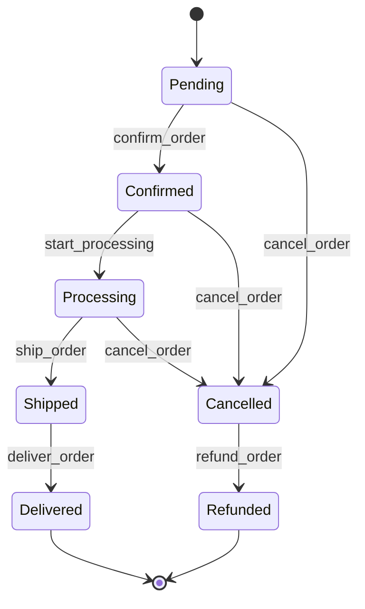

### Operational Event Logging

Every important order action creates an `OrderEvent`, including:

* order creation
* order confirmation
* processing start
* shipping
* delivery
* cancellation

This ensures a full persistent operational audit trail for order lifecycle actions.

Structured application logging is handled separately through the `OrderLogService`, allowing observability without coupling runtime logs to database event persistence.

### Structured Logging

The orders module includes a dedicated structured logging service:

* `OrderLogService`

Structured logs are generated for:

* order creation
* order creation failures
* idempotent replay detection
* order confirmation
* processing start
* shipping transition
* delivery transition
* invalid status transition attempts
* order cancellation
* cancellation rejection
* payment status updates

Logs include operational context such as:

* order ID
* customer ID
* performer ID
* order status
* payment status
* shipping status
* idempotency key
* rejection reason
* structured metadata

### Concurrency Protection

To avoid race conditions in order processing:

* Row-level locking with `select_for_update`
* Transactional service layer (`transaction.atomic`)
* Safe inventory updates using database expressions (`F()`)

### Filtering and Management

Staff management endpoints support:

* filtering by order status
* filtering by payment status
* filtering by shipping status
* filtering by customer email
* paginated order listing

---

## Payments Module

### Payment Processing

* Payment creation through a dedicated service layer
* Support for multiple payment methods:
  * credit card
  * debit card
  * PIX
  * bank slip
  * digital wallet
* Unique payment reference generation
* Idempotency key protection to prevent duplicate payment requests
* Gateway integration-ready architecture (gateway identifiers supported)

### Payment Components

Payments are composed of multiple related entities:

* **Payment** – main aggregate root
* **PaymentTransaction** – records every financial operation attempt
* **PaymentRefund** – stores refund requests and outcomes
* **PaymentLifecycle** – timestamps for payment lifecycle events
* **PaymentEvent** – audit event log for payment operations

This structure ensures traceability of every financial operation.

### Payment Lifecycle Management

Payments follow a controlled lifecycle:

```text
PENDING
→ PROCESSING
→ AUTHORIZED
→ CAPTURED
```

Additional transitions:

```text
FAILED
CANCELLED
PARTIALLY_REFUNDED
REFUNDED
```

Lifecycle timestamps are tracked in the `PaymentLifecycle` model.

### Payment Lifecycle Flow

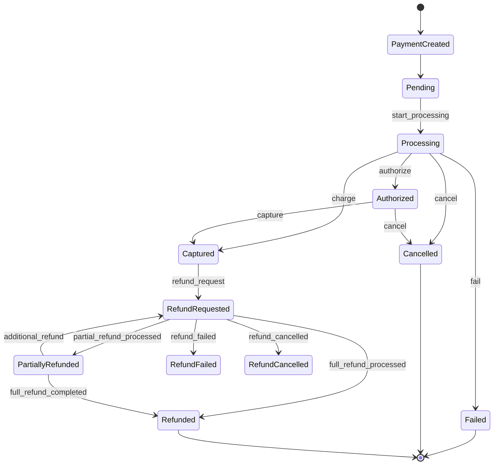

### Refund Management

The refund system supports:

* refund request creation
* partial refunds
* full refunds
* refund processing
* refund cancellation
* refund failure handling

Refund processing updates:

* payment refunded balance
* lifecycle timestamps
* transaction history
* operational events

### Transaction History

Every payment operation creates a `PaymentTransaction`, including:

* authorization attempts
* capture operations
* charges
* refunds
* cancellations
* failures

This guarantees a complete financial audit trail.

### Structured Logging

The payments module includes a dedicated structured logging service:

* `PaymentLogService`

Structured logs are generated for:

* payment creation
* processing start
* authorization
* capture
* failure events
* cancellation
* refund request creation
* partial refund processing
* full refund processing
* refund failure
* refund cancellation

Logs include structured metadata for operational observability and payment lifecycle traceability.

### Domain Event System

The payments module uses an event-driven architecture:

* domain events dispatched for payment lifecycle transitions
* in-memory event dispatcher
* structured event payloads
* event handler registry executed at application startup
* logging handlers for operational monitoring

Events include:

* payment created
* payment processing started
* payment authorized
* payment captured
* payment failed
* payment cancelled
* refund requested
* refund processed
* refund failed
* refund cancelled

### Caching Layer

A dedicated caching service provides performance optimization for payment operations:

* payment detail caching
* payment lookup by reference
* customer payment list caching
* management payment list caching
* filtered payment list caching (status and method)
* payment transactions caching
* payment refunds caching

All cache keys are **versioned**, allowing safe cache invalidation strategies.

### Cache Invalidation Strategy

The system ensures cache consistency through automatic invalidation when:

* a payment is created
* payment status changes
* payment is cancelled
* refunds are requested or processed
* refund states change

Cache invalidation is centralized in the `PaymentCacheService`.

### Filtering and Query Optimization

Payment listing endpoints support filtering by:

* payment status
* payment method
* customer ID
* order ID
* payment reference
* gateway payment ID
* amount range
* refunded amount range
* creation date range
* fully refunded payments
* partially refunded payments

Database queries are optimized using:

* `select_related`
* `prefetch_related`
* indexed fields
* paginated query patterns

### Service Layer Architecture

The payments module follows a service-oriented domain architecture:

* `PaymentCreationService`
* `PaymentProcessingService`
* `PaymentStatusService`
* `PaymentRefundService`
* `PaymentLogService`

This architecture ensures:

* clear separation of concerns
* transactional consistency
* centralized payment lifecycle rules
* easier testing and maintenance
* extensibility for future gateway integrations

---

## Shipping Module

### Shipment Management

* Shipment creation through a dedicated service layer
* Shipment updates with partial update support
* Shipment cancellation with rule validation
* Shipment tracking updates with event registration
* Prevention of duplicate shipments for the same order
* Idempotency key protection to prevent duplicate shipment creation

### Shipment Components

Shipments are composed of multiple related entities:

* **Shipment** – main aggregate root
* **ShipmentEvent** – operational event log for shipment lifecycle
* **ShipmentTrackingUpdate** – carrier tracking updates and external event synchronization

This structure ensures full traceability of shipping operations.

### Shipment Lifecycle Management

Shipments follow a controlled lifecycle:

```text
PENDING
→ PREPARING
→ READY_TO_SHIP
→ SHIPPED
→ IN_TRANSIT
→ OUT_FOR_DELIVERY
→ DELIVERED
```

Additional transitions:

```text
FAILED
RETURNED
CANCELLED
```

Lifecycle transitions are validated through the `ShippingStatusService`.

### Shipping Lifecycle Flow

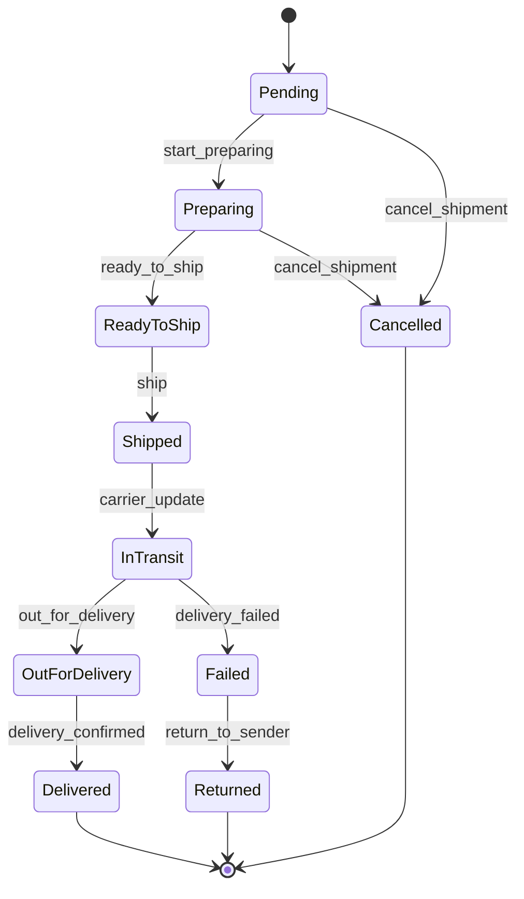

### Shipment Cancellation Rules

Shipment cancellation is controlled by domain rules:

* prevention of cancelling already cancelled shipments
* prevention of cancelling delivered shipments
* prevention of cancelling returned shipments
* controlled transition to `CANCELLED` state
* operational cancellation logging

### Shipment Tracking System

The shipping module supports carrier tracking synchronization:

* tracking event registration
* shipment metadata updates (tracking code, carrier, external reference)
* validation of tracking payloads
* tracking location and timestamp handling
* automatic shipment status synchronization from carrier events
* audit trail through `ShipmentTrackingUpdate`

### Operational Event Logging

Shipping operations generate structured logs using the `ShippingLogService`, including:

* shipment creation
* shipment updates
* shipment status transitions
* shipment cancellation
* shipment tracking updates

Logs include structured metadata for operational observability.

### Domain Event System

The shipping module implements an event-driven architecture:

* lightweight domain events
* in-memory event dispatcher
* handler registry for event subscriptions
* structured event payload serialization

Current domain events include:

* shipment created
* shipment status changed

Handlers are designed to be easily extended for:

* cache invalidation
* analytics integrations
* external notification systems

### Caching Layer

A dedicated caching service improves performance for shipment queries:

* shipment detail caching
* shipment lookup by order ID caching
* customer shipment list caching
* filtered customer shipment lists (status)
* management shipment list caching
* filtered shipment lists (status, shipping method, carrier)
* delivery-due shipment caching
* tracking-enabled shipment list caching
* shipment search caching

All cache keys are **versioned**, enabling safe and deterministic cache invalidation.

### Cache Invalidation Strategy

Cache consistency is maintained through automatic invalidation when:

* a shipment is created
* shipment data is updated
* shipment status changes
* shipment is cancelled
* tracking updates are registered

Cache invalidation is centralized in the `ShippingCacheService`.

### Filtering and Query Optimization

Shipment listing and management operations support filtering by:

* shipment status
* shipping method
* carrier name
* tracking code
* customer ID
* order ID
* external reference
* creation date range
* estimated delivery date range

Database queries are optimized using:

* indexed fields
* efficient filtering patterns
* paginated query support
* optimized selectors for data retrieval

### Service Layer Architecture

The shipping module follows a service-oriented domain architecture:

* `ShippingCreationService`
* `ShippingUpdateService`
* `ShippingStatusService`
* `ShippingCancellationService`
* `ShippingTrackingService`
* `ShippingLogService`

This approach ensures:

* clear separation of concerns
* transactional consistency
* domain rule centralization
* easier testability and maintenance

---

## Reviews Module

### Review Creation

* Review creation through a dedicated service layer
* Validation of rating range (1–5)
* Prevention of duplicate reviews for the same customer and product
* Idempotency key protection to prevent duplicate review submissions
* Automatic initialization of review lifecycle tracking

### Review Components

Reviews are composed of multiple related entities:

* **Review** – main aggregate root representing the customer review
* **ReviewLifecycle** – timestamps for moderation and lifecycle events
* **ReviewEvent** – operational event log for review-related actions

This structure ensures traceability of all review operations.

### Review Lifecycle Management

Reviews follow a controlled moderation lifecycle:

```text
PENDING
→ APPROVED
→ HIDDEN
```

Alternative transitions:

```text
PENDING → REJECTED
PENDING → CANCELLED
APPROVED → HIDDEN
HIDDEN → APPROVED (restore)
```

Lifecycle timestamps are stored in the `ReviewLifecycle` model.

### Review Lifecycle Flow

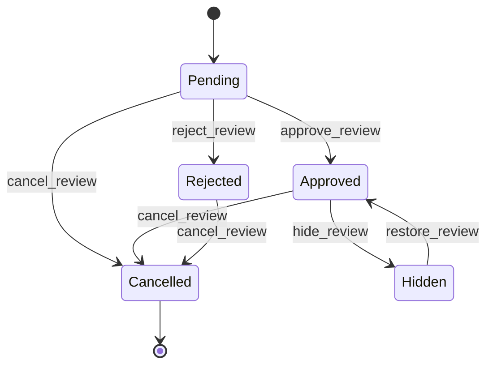

### Moderation System

The moderation system allows staff to manage user reviews safely.

Supported moderation actions:

* approve review
* reject review
* hide review
* restore hidden review
* cancel review

Moderation operations include:

* staff user identification (`moderated_by`)
* moderation timestamp tracking (`moderated_at`)
* moderation reason storage
* operational event recording

Moderation logic is centralized in the ReviewsModerationService.

### Operational Event Logging

Every relevant review operation generates a `ReviewEvent`, including:

* review creation
* review updates
* moderation actions
* lifecycle status transitions
* review cancellation

This ensures a complete operational audit trail for review management.

### Structured Logging

The module includes a dedicated logging service:

* `ReviewsLogService`

Structured logs are generated for:

* review creation
* review updates
* moderation actions
* status transitions
* review cancellation

Logs include structured metadata such as:

* review ID
* product ID
* customer ID
* moderation context
* operational metadata

### Domain Event System

The reviews module implements an event-driven architecture.

Components include:

* domain event classes
* in-memory event dispatcher
* handler registry executed at application startup
* structured event handlers for observability

Current domain events include:

* review created
* review updated
* review approved
* review rejected
* review hidden
* review restored
* review cancelled

Handlers are designed to support future integrations such as:

* cache invalidation
* analytics processing
* notification services
* external moderation monitoring systems

### Caching Layer

A dedicated caching service improves performance for review queries:

* review detail caching
* customer review list caching
* filtered customer review lists
* public product review list caching
* product review summary caching
* management review list caching

### Filtering and Query Optimization

Review queries support filtering by:

* review status
* rating value
* rating range
* product ID
* customer ID
* moderation user ID
* verified purchase flag
* creation date range

Database queries are optimized using:

* indexed fields
* efficient filtering strategies
* optimized selectors for data retrieval
* paginated query patterns

### Service Layer Architecture

The reviews module follows a service-oriented domain architecture:

* `ReviewsCreationService`
* `ReviewsUpdateService`
* `ReviewsStatusService`
* `ReviewsCancellationService`
* `ReviewsModerationService`
* `ReviewsLogService`
* `ReviewsCacheService`

This architecture ensures:

* clear separation of responsibilities
* centralized domain rule enforcement
* transactional consistency
* easier testing and maintenance
* extensibility for future features

---

## Notifications Module

### Notification Management

* Notification creation through a dedicated service layer
* Support for multiple delivery channels:
  * in-app notifications
  * email notifications
* Idempotency protection to prevent duplicate notification creation
* Notification lifecycle management
* Delivery tracking for each notification
* Pluggable provider architecture for multiple notification channels

### Notification Components

Notifications are composed of multiple related entities:

* **Notification** – main aggregate root representing a notification event
* **NotificationLifecycle** – lifecycle timestamps and state tracking
* **NotificationDelivery** – delivery attempt tracking for each channel
* **NotificationEvent** – operational event log for notification lifecycle actions

This structure ensures full traceability of notification operations and delivery attempts.

### Notification Lifecycle Management

Notifications follow a controlled lifecycle:

```text
PENDING
→ PROCESSED
→ READ
→ ARCHIVED
```

Alternative transitions:

```text
PENDING → CANCELLED
PROCESSED → CANCELLED
PROCESSED → FAILED
```

Key rules enforced by the domain layer:

* Notifications are created with status PENDING.
* Dispatching a notification moves it to PROCESSED.
* Users can mark notifications as READ.
* Read notifications can be archived (ARCHIVED).
* Notifications can be cancelled before user interaction.
* Failed delivery attempts move notifications to FAILED.

Lifecycle timestamps are tracked in the `NotificationLifecycle` model.

### Notification Lifecycle Flow

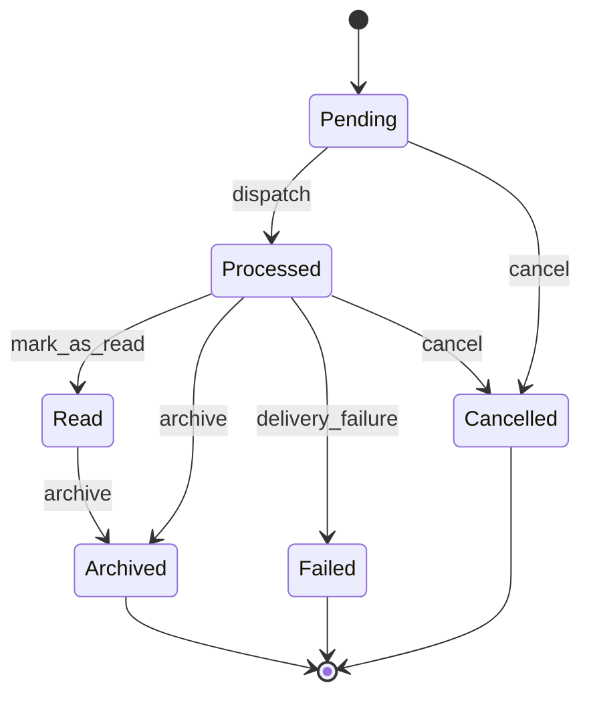

### Notification Delivery Channels

The module supports a provider-based delivery architecture.

Current providers include:

* **EmailProvider**
* **InAppProvider**

Providers implement a standardized interface responsible for:

* sending the notification payload
* returning a delivery identifier
* raising delivery exceptions when failures occur

This design allows future integration with additional channels such as:

* SMS
* push notifications
* third-party messaging services

### Domain Event System

The notifications module implements a lightweight event-driven architecture.

Components include:

* domain event classes
* in-memory event dispatcher
* handler registry executed at application startup
* structured event handlers for observability

Current domain events include:

* notification created
* notification dispatched
* notification delivered
* notification cancelled
* notification failed

Handlers can be extended for integrations such as:

* analytics pipelines
* external messaging services
* monitoring and alerting systems

### Structured Logging

The module includes a dedicated logging service:

* `NotificationLogService`

Structured logs are generated for:

* notification creation
* notification dispatch
* delivery success
* delivery failures
* notification cancellation
* invalid notification operations

Logs include structured metadata such as:

* notification ID
* recipient ID
* delivery channel
* delivery status
* provider identifier
* error metadata (when applicable)

### Caching Layer

A dedicated caching utility improves performance for notification retrieval operations:

* recipient notification list caching
* unread notification caching
* archived notification caching
* notification detail caching
* management notification list caching

All cache keys are versioned to allow safe invalidation strategies.

### Cache Invalidation Strategy

Cache consistency is maintained through automatic invalidation when:

* a notification is created
* notification status changes
* a notification is marked as read
* a notification is archived
* a notification is cancelled
* a notification delivery status changes

Cache invalidation is centralized in the `NotificationCacheService`.

### Filtering and Query Optimization

Notification queries support filtering by:

* notification status
* notification channel
* notification priority
* recipient ID
* creation date range
* read status
* archived status

Database queries are optimized using:

* indexed fields
* `select_related`
* efficient filtering patterns
* paginated query support

### Service Layer Architecture

The notifications module follows a service-oriented domain architecture:

* `NotificationCreationService`
* `NotificationStatusService`
* `NotificationCancellationService`
* `NotificationDeliveryService`
* `NotificationLogService`
* `NotificationCacheService`

This architecture ensures:

* separation of concerns
* transactional consistency
* centralized notification lifecycle rules
* easier testing and maintenance
* extensibility for new notification channels

---

## Analytics Module

The analytics module provides aggregated business intelligence metrics used by management dashboards and reporting tools.

Instead of recalculating heavy aggregates on every request, the system generates **analytics snapshots**, which store pre-computed metrics for specific periods.

Supported snapshot periods:

* Daily
* Weekly
* Monthly

Snapshots aggregate data across multiple operational domains, including:

* sales performance
* order lifecycle metrics
* payment processing statistics
* shipping performance
* product sales performance
* customer behavior
* user growth
* review analytics

### Analytics Architecture

The analytics module follows a **snapshot-based architecture** designed to reduce database load and improve query performance for analytical operations.

Analytics workflows operate as follows:

1. Operational data is collected from core domain models (orders, payments, shipping, users, etc).
2. Aggregated metrics are generated by specialized analytics services.
3. The metrics are stored inside **AnalyticsSnapshot** records.
4. Snapshots are cached and reused by dashboard services.
5. Domain events are emitted for snapshot lifecycle operations.

This architecture ensures that complex analytical queries do not impact the performance of operational workloads.

### Analytics Management

* Analytics generation through dedicated service layers
* Aggregation of cross-module business metrics
* Snapshot-based analytical data persistence
* Read-optimized metrics for dashboards and management views
* Cache-backed analytical queries for performance-sensitive operations
* Event-driven analytical recalculation support

### Analytics Components

Analytics is composed of multiple related entities:

* **AnalyticsSnapshot** – main aggregate root representing a generated analytics snapshot
* **AnalyticsSnapshotMetric** – metric entries associated with a generated snapshot
* **AnalyticsSnapshotLifecycle** – timestamps and lifecycle state tracking for analytics snapshots
* **AnalyticsEvent** – operational event log for analytics generation and refresh actions

This structure ensures traceability, historical consistency, and optimized read access for management analytics.

### Analytics Snapshot Lifecycle Management

Analytics snapshots follow a controlled lifecycle:

```text
PENDING
→ GENERATING
→ COMPLETED
```

Alternative transitions:

```text
PENDING → FAILED
GENERATING → FAILED
COMPLETED → ARCHIVED
```

Key rules enforced by the domain layer:

* Snapshots are created with status PENDING.
* Snapshot generation moves the snapshot to GENERATING.
* Successfully aggregated snapshots are stored as COMPLETED.
* Failed generation attempts move the snapshot to FAILED.
* Completed snapshots may later be archived for historical retention.

Lifecycle timestamps are tracked in the `AnalyticsSnapshotLifecycle` model.

### Analytics Snapshot Lifecycle Flow

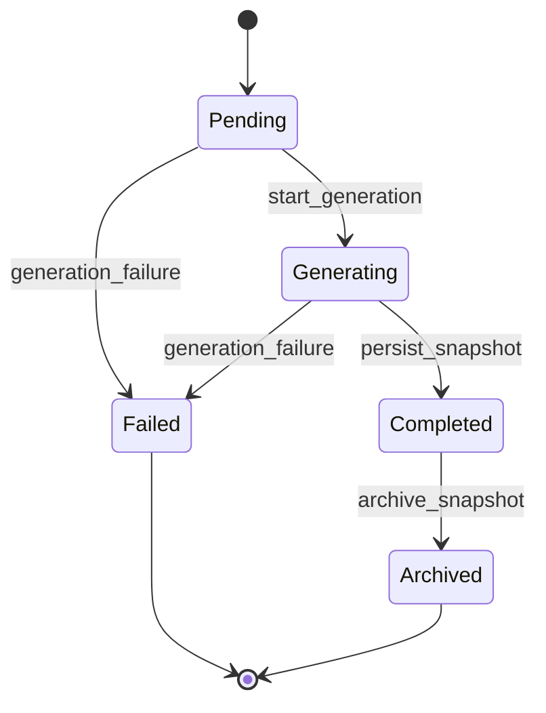

### Analytics Snapshot System

The analytics module is built around snapshot generation and aggregation.

Snapshots are responsible for storing read-optimized analytical data such as:

* sales metrics
* revenue metrics
* order funnel metrics
* payment overview metrics
* shipping overview metrics
* review overview metrics
* product performance metrics
* customer summary metrics
* dashboard summary metrics

This design allows the platform to serve management analytics efficiently without recalculating complex aggregates on every request.

### Operational Event Logging

Every important analytics operation generates an `AnalyticsEvent`, including:

* snapshot generation
* snapshot refresh
* snapshot completion
* generation failures
* dashboard metric recalculation

This ensures a complete operational audit trail for analytics workflows.

Structured application logging is handled separately through the `AnalyticsLogService`, allowing observability without coupling runtime logs to database event persistence.

### Structured Logging

The module includes a dedicated logging service:

* `AnalyticsLogService`

Structured logs are generated for:

* snapshot generation requests
* snapshot refresh operations
* snapshot completion
* generation failures
* metric recalculation flows
* dashboard summary builds

Logs include structured metadata such as:

* snapshot ID
* metric type
* generation status
* performer ID
* refresh context
* failure metadata (when applicable)

### Domain Event System

The analytics module implements a lightweight event-driven architecture.

Components include:

* domain event classes
* in-memory event dispatcher
* handler registry executed at application startup
* structured event handlers for observability

Current domain events include:

* analytics snapshot requested
* analytics snapshot generated
* analytics snapshot refreshed
* analytics snapshot failed

Handlers can be extended for integrations such as:

* external BI pipelines
* monitoring and alerting systems
* asynchronous reporting systems
* historical analytics exports

### Caching Layer

A dedicated caching utility improves performance for analytics retrieval operations:

* dashboard summary caching
* analytics snapshot detail caching
* analytics management list caching
* aggregated metric caching
* filtered analytics query caching

All cache keys are versioned to allow safe invalidation strategies.

### Cache Invalidation Strategy

Cache consistency is maintained through automatic invalidation when:

* a new snapshot is generated
* an existing snapshot is refreshed
* analytical metrics are recalculated
* snapshot generation fails and cached state must be replaced

Cache invalidation is centralized in the `AnalyticsCacheService`.

### Filtering and Query Optimization

Analytics queries support filtering by:

* snapshot status
* metric type
* date range
* generated by user
* snapshot creation date
* snapshot completion date

Database queries are optimized using:

* indexed fields
* `select_related`
* efficient aggregation strategies
* optimized selectors for read-heavy analytical queries
* paginated query support

### Service Layer Architecture

The analytics module follows a service-oriented domain architecture:

* `AnalyticsDashboardSummaryService`
* `AnalyticsSalesOverviewService`
* `AnalyticsUserOverviewService`
* `AnalyticsOrderFunnelService`
* `AnalyticsPaymentOverviewService`
* `AnalyticsShippingOverviewService`
* `AnalyticsReviewOverviewService`
* `AnalyticsProductPerformanceService`
* `AnalyticsCustomerSummaryService`
* `AnalyticsSnapshotGenerationService`
* `AnalyticsSnapshotRefreshService`
* `AnalyticsLogService`
* `AnalyticsCacheService`

This architecture ensures:

* clear separation of responsibilities
* centralized analytical aggregation rules
* transactional consistency
* easier testing and maintenance
* extensibility for future reporting and BI features

---

## Admin Dashboard Module

The admin dashboard module provides a centralized operational control panel for administrators.

Instead of accessing each subsystem independently, the dashboard aggregates operational information from multiple modules including:

* users
* products
* orders
* payments
* shipping
* reviews
* notifications

This module focuses on **real-time operational monitoring**, administrative oversight, and system health visibility.

---

### Dashboard Summary

The dashboard provides a high-level operational overview of the platform.

Aggregated metrics include:

* total orders
* total revenue
* total users
* total products
* total reviews

These metrics provide administrators with a quick snapshot of platform activity.

---

### Admin Dashboard Operational Flow

```mermaid
flowchart TD

    AdminUser[Admin User]

    AdminUser --> AdminAPI[Admin Dashboard API]

    AdminAPI --> SummaryService[AdminDashboardSummaryService]
    AdminAPI --> MetricsService[AdminDashboardOperationalMetricsService]
    AdminAPI --> ActivityService[AdminDashboardRecentActivityService]
    AdminAPI --> AlertsService[AdminDashboardAlertsService]
    AdminAPI --> BulkOrderService[AdminDashboardBulkOrderActionsService]
    AdminAPI --> BulkReviewService[AdminDashboardBulkReviewModerationService]
    AdminAPI --> BulkNotificationService[AdminDashboardBulkNotificationRetryService]

    SummaryService --> DashboardSelectors[Admin Dashboard Selectors]
    MetricsService --> DashboardSelectors
    ActivityService --> DashboardSelectors
    AlertsService --> DashboardSelectors

    DashboardSelectors --> UsersModule[Users Module]
    DashboardSelectors --> ProductsModule[Products Module]
    DashboardSelectors --> OrdersModule[Orders Module]
    DashboardSelectors --> PaymentsModule[Payments Module]
    DashboardSelectors --> ShippingModule[Shipping Module]
    DashboardSelectors --> ReviewsModule[Reviews Module]
    DashboardSelectors --> NotificationsModule[Notifications Module]

    SummaryService --> Cache[(Cache)]
    MetricsService --> Cache
    ActivityService --> Cache
    AlertsService --> Cache

    BulkOrderService --> OrdersModule
    BulkReviewService --> ReviewsModule
    BulkNotificationService --> NotificationsModule

    SummaryService --> LogService[AdminDashboardLogService]
    MetricsService --> LogService
    ActivityService --> LogService
    AlertsService --> LogService
    BulkOrderService --> LogService
    BulkReviewService --> LogService
    BulkNotificationService --> LogService

    LogService --> AdminEvents[AdminDashboardEvent / AdminDashboardLog]
    LogService --> DomainEvents[Domain Events]
```

---

### Operational Monitoring Metrics

The dashboard exposes operational monitoring metrics designed to highlight system issues that require administrative attention.

Examples include:

* pending orders
* failed payments
* delayed shipments
* flagged reviews
* failed notifications

These metrics allow administrators to quickly detect operational anomalies across the platform.

---

### Product Operational Monitoring

The dashboard also includes product catalog monitoring metrics, such as:

* products with low stock
* inactive products
* products missing images
* recently created products
* product catalog inconsistencies

These metrics allow administrators to monitor catalog health directly from the dashboard.

---

### Recent Activity Feed

The dashboard aggregates recent operational activity across the platform.

The activity feed includes events from:

* orders
* payments
* shipments
* reviews
* notifications
* administrative actions

This unified feed allows administrators to monitor platform activity in near real-time.

---

### Operational Alerts

The dashboard can generate alerts based on operational metrics.

Examples include:

* excessive failed payments
* high volume of delayed shipments
* unusually high number of flagged reviews
* notification delivery failures
* catalog inconsistencies

These alerts allow administrators to react quickly to operational problems.

---

### Administrative Bulk Operations

The dashboard includes administrative tools for performing bulk operational actions.

Supported operations include:

* bulk order actions
* bulk review moderation
* retrying failed notifications

These operations allow administrators to efficiently manage operational incidents.

---

### Caching Strategy

The admin dashboard is optimized for read-heavy workloads using a versioned caching strategy.

Cached components include:

* dashboard summary
* operational metrics
* recent activity feed
* operational alerts

Cache keys are versioned to allow deterministic invalidation without requiring wildcard cache deletion.

Cache management is centralized through the `AdminDashboardCacheService`.

---

### Structured Logging

The module includes a dedicated logging service:

* `AdminDashboardLogService`

Structured logs are generated for:

* dashboard access
* operational alert generation
* administrative bulk operations

These logs support operational observability and administrative auditing.

---

### Domain Event System

The admin dashboard implements a lightweight domain event architecture.

Components include:

* domain event classes
* in-memory event dispatcher
* handler registry executed at application startup
* structured event handlers for observability

Domain events allow the dashboard to react to operational state changes and support future integrations with monitoring systems.

---

### Service Layer Architecture

The admin dashboard module follows a service-oriented architecture.

Core services include:

* `AdminDashboardSummaryService`
* `AdminDashboardOperationalMetricsService`
* `AdminDashboardRecentActivityService`
* `AdminDashboardAlertsService`
* `AdminDashboardBulkOrderActionsService`
* `AdminDashboardBulkReviewModerationService`
* `AdminDashboardBulkNotificationRetryService`
* `AdminDashboardLogService`
* `AdminDashboardCacheService`

These services orchestrate cross-module data aggregation while maintaining separation between domain logic and the API layer.

This architecture ensures:

* centralized operational monitoring
* efficient cross-module aggregation
* consistent administrative workflows
* scalable dashboard performance

---

# API Endpoints

All write operations that create resources support the `Idempotency-Key` header.

Clients may safely retry requests using the same key to avoid duplicate resource creation.

Endpoints that support idempotency are explicitly marked in the API tables below.

## Users

| Method | Endpoint | Description |
|------|------|------|
| POST | `/api/v1/users/register/` | User registration (supports `Idempotency-Key`) |
| POST | `/api/v1/users/login/` | JWT authentication |
| POST | `/api/v1/users/token/refresh/` | Refresh access token |
| POST | `/api/v1/users/logout/` | Logout and invalidate refresh token |
| POST | `/api/v1/users/confirm-email/{token}/` | Email confirmation |
| GET | `/api/v1/users/me/` | Retrieve authenticated user session information |
| GET | `/api/v1/users/profile/` | Retrieve authenticated user profile |
| PATCH | `/api/v1/users/profile/` | Partially update authenticated user profile |
| POST | `/api/v1/users/password-reset/` | Request password reset |
| POST | `/api/v1/users/password-reset-confirm/` | Confirm password reset |

---

## Products

| Method | Endpoint | Description |
|------|------|------|
| POST | `/api/v1/products/` | Create product (supports `Idempotency-Key`) |
| GET | `/api/v1/products/list/` | List products (paginated) |
| GET | `/api/v1/products/{product_id}/` | Retrieve product details |
| POST | `/api/v1/products/{product_id}/images/` | Upload product images |
| PATCH | `/api/v1/products/{product_id}/` | Update product |
| DELETE | `/api/v1/products/{product_id}/` | Soft delete product |

---

## Orders (Customer)

| Method | Endpoint | Description |
|------|------|------|
| GET | `/api/v1/orders/` | List authenticated customer orders |
| POST | `/api/v1/orders/create/` | Create new order (supports `Idempotency-Key`) |
| GET | `/api/v1/orders/{order_id}/` | Retrieve order details |
| POST | `/api/v1/orders/{order_id}/cancel/` | Cancel order |

---

## Orders (Management)

| Method | Endpoint | Description |
|------|------|------|
| GET | `/api/v1/orders/management/` | List all orders (staff) |
| GET | `/api/v1/orders/management/{order_id}/` | Retrieve order details (staff) |
| POST | `/api/v1/orders/management/{order_id}/confirm/` | Confirm order |
| POST | `/api/v1/orders/management/{order_id}/start-processing/` | Start order processing |
| POST | `/api/v1/orders/management/{order_id}/ship/` | Ship order |
| POST | `/api/v1/orders/management/{order_id}/deliver/` | Mark order as delivered |
| POST | `/api/v1/orders/management/{order_id}/cancel/` | Cancel order (staff) |

---

## Payments (Customer)

| Method | Endpoint | Description |
|------|------|------|
| GET | `/api/v1/payments/` | List authenticated customer payments |
| POST | `/api/v1/payments/create/` | Create payment for an order (supports `Idempotency-Key`) |
| GET | `/api/v1/payments/{payment_id}/` | Retrieve payment details |
| GET | `/api/v1/payments/{payment_id}/transactions/` | List payment transactions |

---

## Payments (Management)

| Method | Endpoint | Description |
|------|------|------|
| GET | `/api/v1/payments/management/{payment_id}/` | Retrieve payment details (staff) |
| POST | `/api/v1/payments/{payment_id}/process/` | Execute payment processing action (authorize, capture, charge, fail) |
| POST | `/api/v1/payments/{payment_id}/cancel/` | Cancel payment |
| POST | `/api/v1/payments/{payment_id}/refund/` | Create refund request (supports `Idempotency-Key`) |
| POST | `/api/v1/payments/refund/{refund_id}/manage/` | Manage refund lifecycle (process, fail, cancel) |

---

## Shipping (Customer)

| Method | Endpoint | Description |
|------|------|------|
| GET | `/api/v1/shipping/` | List authenticated customer shipments |
| GET | `/api/v1/shipping/{shipment_id}/` | Retrieve shipment details |

---

## Shipping (Management)

| Method | Endpoint | Description |
|------|------|------|
| POST | `/api/v1/shipping/create/` | Create shipment for an order (supports `Idempotency-Key`) |
| PATCH | `/api/v1/shipping/{shipment_id}/` | Update shipment information |
| POST | `/api/v1/shipping/{shipment_id}/process/` | Perform shipment status transition |
| POST | `/api/v1/shipping/{shipment_id}/cancel/` | Cancel shipment |
| POST | `/api/v1/shipping/{shipment_id}/tracking/` | Register shipment tracking update |
| GET | `/api/v1/shipping/management/` | List all shipments (staff) |
| GET | `/api/v1/shipping/management/{shipment_id}/` | Retrieve shipment management details |

---

## Reviews (Customer)

| Method | Endpoint | Description |
|------|------|------|
| POST | `/api/v1/reviews/create/` | Create a new product review (supports `Idempotency-Key`) |
| GET | `/api/v1/reviews/` | List authenticated customer reviews |
| GET | `/api/v1/reviews/{review_id}/` | Retrieve review details |
| PATCH | `/api/v1/reviews/{review_id}/update/` | Update review content |
| POST | `/api/v1/reviews/{review_id}/cancel/` | Cancel review |

---

## Reviews (Public)

| Method | Endpoint | Description |
|------|------|------|
| GET | `/api/v1/reviews/product/{product_id}/` | List public reviews for a product |
| GET | `/api/v1/reviews/product/{product_id}/summary/` | Retrieve product review summary |

---

## Reviews (Management)

| Method | Endpoint | Description |
|------|------|------|
| POST | `/api/v1/reviews/{review_id}/moderate/` | Perform review moderation action |
| GET | `/api/v1/reviews/management/` | List all reviews (staff) |
| GET | `/api/v1/reviews/management/{review_id}/` | Retrieve review management details |

---

## Notifications

| Method | Endpoint | Description |
|------|------|------|
| GET | `/api/v1/notifications/` | Retrieve authenticated user notifications |
| GET | `/api/v1/notifications/{notification_id}/` | Retrieve notification details |
| POST | `/api/v1/notifications/{notification_id}/read/` | Mark notification as read |
| POST | `/api/v1/notifications/{notification_id}/archive/` | Archive notification |
| POST | `/api/v1/notifications/{notification_id}/dispatch/` | Dispatch notification (staff roles only) |
| POST | `/api/v1/notifications/{notification_id}/cancel/` | Cancel notification (staff roles only) |
| POST | `/api/v1/notifications/create/` | Create notification (management roles) (supports `Idempotency-Key`) |
| GET | `/api/v1/notifications/management/` | Management notification list (staff roles) |
| GET | `/api/v1/notifications/management/{notification_id}/` | Management notification detail |

---

## Analytics (Snapshot Endpoints)

| Method | Endpoint | Description |
|------|------|------|
| POST | `/api/v1/analytics/snapshots/generate/` | Generate analytics snapshot (supports `Idempotency-Key`) |
| GET | `/api/v1/analytics/snapshots/` | List analytics snapshots |
| GET | `/api/v1/analytics/snapshots/{snapshot_id}/` | Retrieve analytics snapshot details |
| POST | `/api/v1/analytics/snapshots/{snapshot_id}/refresh/` | Refresh an existing snapshot |

## Analytics (Dashboard Endpoints)

| Method | Endpoint | Description |
|------|------|------|
| GET | `/api/v1/analytics/dashboard/summary/` | Global dashboard metrics |
| GET | `/api/v1/analytics/dashboard/sales/` | Sales performance overview |
| GET | `/api/v1/analytics/dashboard/orders/` | Order funnel analytics |
| GET | `/api/v1/analytics/dashboard/payments/` | Payment processing analytics |
| GET | `/api/v1/analytics/dashboard/shipping/` | Shipping performance analytics |
| GET | `/api/v1/analytics/dashboard/products/` | Product performance analytics |
| GET | `/api/v1/analytics/dashboard/customers/` | Customer analytics summary |
| GET | `/api/v1/analytics/dashboard/users/` | User growth analytics |
| GET | `/api/v1/analytics/dashboard/reviews/` | Review moderation analytics |

---

## Admin Dashboard

| Method | Endpoint | Description |
|------|------|------|
| GET | `/api/v1/admin-dashboard/summary/` | Retrieve admin dashboard summary metrics |
| GET | `/api/v1/admin-dashboard/operational-metrics/` | Retrieve operational monitoring metrics |
| GET | `/api/v1/admin-dashboard/recent-activity/` | Retrieve recent operational activity feed |
| GET | `/api/v1/admin-dashboard/alerts/` | Retrieve operational alerts |
| POST | `/api/v1/admin-dashboard/orders/bulk-action/` | Perform bulk order management action |
| POST | `/api/v1/admin-dashboard/reviews/bulk-moderation/` | Perform bulk review moderation actions |
| POST | `/api/v1/admin-dashboard/notifications/bulk-retry/` | Retry failed notification deliveries |

---

# Automated Tests

The project includes an extensive automated test suite covering domain logic and API endpoints, using **pytest** and **Django REST Framework testing tools**.

---

## Testing Strategy

This project follows a layered testing strategy designed to validate both business rules and external API behavior.

### Domain Layer Tests

Domain tests focus on validating the internal business logic of each module. These tests cover:

* domain models and relationships
* service layer business rules
* selectors and query logic
* filters and pagination consistency
* domain exceptions and rule enforcement
* domain events and event dispatching
* caching behavior and cache invalidation
* idempotency protections for critical operations
* structured logging for lifecycle actions

These tests ensure that core business rules remain correct independently from the API layer.

### API Layer Tests

API tests validate the external contract of the system and integration with the domain layer. These tests cover:

* authentication and authorization
* permission enforcement
* request payload validation
* response structure and status codes
* pagination and filtering
* protected operations
* idempotent endpoints
* management and staff-only workflows

### Test Design Principles

The test suite follows several engineering principles:

* domain rules are validated primarily at the service/domain layer
* API tests focus on transport behavior and endpoint contracts
* edge cases and failure scenarios are explicitly tested
* cache-related behavior is validated where applicable
* critical flows include idempotency and concurrency protection

---

## Testing Suite

The testing approach follows a **Domain-First strategy**, ensuring that business rules are validated independently of the API layer.

| Module | Domain Tests | API Tests | Total Tests | Focus Area | Status |
| :--- | :---: | :---: | :---: | :--- | :--- |
| **Users** | 150 | 55 | 205 | Authentication, JWT, Permissions, Logging, Idempotency | ✔ Stable |
| **Products** | 169 | 27 | 196 | Inventory Management, Audit Logs, Caching, Logging, Idempotency | ✔ Stable |
| **Orders** | 261 | 87 | 348 | Order Lifecycle, Concurrency, Caching, Logging, Idempotency | ✔ Stable |
| **Payments** | 240 | 57 | 297 | Payment Lifecycle, Refund Logic, Transactions, Caching, Logging, Idempotency | ✔ Stable |
| **Shipping** | 219 | 69 | 288 | Logistics, Delivery Lifecycle, Tracking, Caching, Logging, Idempotency | ✔ Stable |
| **Reviews** | 157 | 88 | 245 | Review Moderation, Lifecycle, Domain Rules, Caching, Logging, Idempotency | ✔ Stable |
| **Notifications** | 210 | 62 | 272 | Notification lifecycle, delivery providers, logging, caching, idempotency | ✔ Stable |
| **Analytics** | 262 | 95 | 357 | Analytical snapshots, aggregated business metrics, dashboard queries, caching, event-driven analytics | ✔ Stable |
| **Admin Dashboard** | 215 | 66 | 281 | Operational monitoring, administrative actions, alerting system, caching, event-driven operations | ✔ Stable |
| **TOTAL** | **1883** | **606** | **2489** | Core Business Logic | ✔ Stable |

> Tests are executed using **pytest**.  
> Domain tests validate business rules and services, while API tests ensure endpoint correctness, security permissions, and response contracts.

---

## Detailed Test Coverage

The sections below summarize the main areas validated by the automated test suite.

<details>
<summary><strong>Users Module Tests</strong></summary>

### Users Domain Tests

#### Domain Models

* custom user creation and manager behavior
* email normalization and uniqueness validation
* role-based behavior and permissions flags (`is_staff`, `is_superuser`)
* corporate email enforcement for staff roles
* age validation boundaries (min/max)
* default field values (`is_active`, `email_confirmed`)
* model properties (`is_superadmin`, `can_create_staff`)
* string representation consistency
* idempotency key and request hash field behavior

#### User Token Model

* token creation and uniqueness
* expiration validation
* expired token rejection
* token usage tracking (`used` flag)
* token lifecycle methods (`is_expired`, `mark_as_used`)
* metadata field behavior

#### Domain Exceptions

* base domain exception behavior
* default vs custom message handling
* exception hierarchy validation
* authentication and token-related exceptions
* role and access-related exceptions
* idempotency conflict exception handling

#### Query Selectors

Tests validate database query behavior and filtering logic:

* retrieving user by ID
* retrieving user by email (case-insensitive)
* listing users by role
* listing active users
* listing staff users
* retrieving email confirmation tokens
* retrieving valid tokens (non-expired, unused, correct type)
* handling of invalid or missing records

#### Registration Service

* user registration workflow
* default role assignment
* duplicate email protection (domain-level validation)
* inactive and unconfirmed user initialization
* idempotency key persistence during registration
* request fingerprint persistence for idempotent registration
* idempotent replay protection for repeated registration requests
* idempotency conflict validation for mismatched payload reuse
* prevention of duplicate confirmation token generation on idempotent replay
* transaction-safe email scheduling (`on_commit`)
* email confirmation token generation
* replacement of existing confirmation tokens

#### Email Confirmation Service

* email confirmation flow
* activation and confirmation state updates
* invalid token handling
* expired token handling
* confirmation token invalidation after successful use

#### Password Reset Service

* password reset request workflow
* protection against user enumeration
* handling inactive or non-existent users
* reset token creation and replacement
* transaction-safe email scheduling
* password reset execution
* password update and hashing validation
* token invalidation and usage tracking
* invalid and expired token handling
* weak password rejection through password validators
* single-use reset token enforcement

#### User Update Service

* profile field update workflow
* partial update handling
* ignoring unsupported fields
* no-op behavior when no valid changes are provided
* role update permission validation
* corporate email validation for staff role assignment
* persistence of role-derived permission flags

#### User Logging Service

Tests validate security event logging behavior:

* user registration logging
* email confirmation logging
* profile update logging
* password change logging
* login success logging
* login failure logging
* structured payload validation

#### Users Domain Events

* base domain event behavior
* event payload serialization
* user registered event payload validation
* user email confirmed event payload validation
* password reset requested event payload validation
* password changed event payload validation
* login succeeded event payload validation
* login failed event payload validation
* invalid token event payload validation
* event handler registry validation
* dispatcher execution for registered handlers
* multiple handler dispatch execution
* safe dispatch when no handlers are registered
* structured handler logging behavior

---

### Users API Tests

#### Authentication & Access Control

* login with valid credentials
* authentication failure (invalid credentials)
* inactive account protection
* email confirmation requirement enforcement

#### Registration API

* successful user registration
* successful user registration with `Idempotency-Key`
* idempotent replay returning the same user
* duplicate prevention for repeated requests with the same idempotency key
* conflict response for mismatched payload reuse with the same idempotency key
* validation of required fields
* duplicate email protection
* response structure validation

#### Token Management

* JWT token refresh flow
* invalid and malformed token handling
* logout with invalid refresh token

#### Email Confirmation API

* successful email confirmation
* invalid token handling
* expired token handling

### Password Reset API

#### Request Password Reset

* valid email request handling
* non-existent email protection (no information leakage)
* inactive user handling

#### Confirm Password Reset

* successful password reset
* invalid token handling
* expired token handling
* payload validation

### Session API

#### Current Authenticated User (`/users/me/`)

* authenticated session retrieval
* rejection of unauthenticated access
* rejection of inactive users
* rejection of users with unconfirmed email

### Profile API

#### Profile Retrieval

* authenticated profile retrieval
* rejection of unauthenticated access
* rejection of unconfirmed users

#### Profile Update

* successful partial profile update
* update restricted to editable fields
* rejection of unauthenticated update attempts
* rejection of unconfirmed users
* invalid payload validation
* no-op update behavior with empty payload

#### Email Protection Tests

* access restrictions for unconfirmed users
* validation of protected endpoints
* enforcement of authentication and confirmation rules

</details>

---

<details>
<summary><strong>Products Module Tests</strong></summary>

### Products Domain Tests

#### Domain Models

* product creation and core field validation
* UUID primary key generation
* product type choices validation
* price and discount field behavior
* active/inactive state handling
* discount logic validation (`has_discount`)
* main image resolution logic
* inventory shortcut property behavior
* idempotency key field behavior
* request fingerprint field behavior
* model ordering by `created_at`
* string representations

#### Product Inventory Model

* one-to-one relationship with product
* default inventory value
* inventory updates and persistence
* uniqueness constraint enforcement
* string representation validation

#### Product Image Model

* image creation and relationship with product
* file upload path validation
* file extension validation (jpg, jpeg, png, webp)
* display order validation (`order >= 1`)
* unique constraint per product (`product + order`)
* ordering behavior by display order
* string representation validation

#### Product Event Log Model

* event creation and lifecycle tracking
* UUID primary key generation
* event type validation
* optional performer handling
* metadata storage behavior
* ordering by `created_at`
* string representation validation

#### Domain Exceptions

* base domain exception behavior
* default vs custom message handling
* permission error inheritance consistency
* idempotency conflict exception handling
* formatted message validation (min/max images)
* exception hierarchy consistency

#### Query Selectors

Tests validate query behavior and filtering logic:

* retrieving product by ID
* retrieving active product by ID
* listing all active products
* filtering products by type
* retrieving products with discount
* search by name and brand (case-insensitive)
* retrieving products created by user
* retrieving available products (inventory > 0)
* handling of non-existent records

#### Product Creation Service

* product creation workflow
* permission validation for allowed roles
* product type validation
* price validation (null, zero, negative)
* discount validation (negative, >= price)
* inventory validation (negative values)
* creation of inventory record
* handling of optional discount
* idempotency key persistence during product creation
* request fingerprint persistence for idempotent product creation
* idempotent replay protection for repeated product creation requests
* idempotency conflict validation for mismatched payload reuse
* event dispatch after successful product creation
* transactional rollback on failure

#### Product Update Service

* updating single field
* updating multiple fields
* updating text fields
* persistence of updated data
* return of updated product instance
* handling non-existent product
* no-op update (no fields provided)
* event dispatch after successful product update
* no event dispatch on no-op update

#### Product Delete Service

* soft delete behavior (`is_active=False`)
* persistence of state change
* record retention in database
* ensuring only active flag is modified
* handling non-existent product
* event dispatch after successful soft delete

#### Product Image Service

* adding single image
* adding multiple images
* empty upload handling
* maximum image limit enforcement
* sequential order assignment
* continuation of order after existing images
* bulk creation behavior
* handling non-existent product
* event dispatch after successful image upload

#### Product Image Validation

* minimum image requirement enforcement
* validation failure below minimum threshold
* validation success at minimum threshold
* validation success above minimum threshold
* validation failure when no images exist

#### Product Inventory Service

* decreasing inventory successfully
* exact inventory depletion (to zero)
* insufficient inventory protection
* persistence of inventory updates
* return of updated inventory instance
* cache invalidation after inventory mutation
* handling missing inventory record

#### Product Stock Service

* retrieving available stock
* reserving stock successfully
* exact stock reservation to zero
* insufficient stock protection
* releasing stock successfully
* cache invalidation after stock reservation
* cache invalidation after stock release
* handling missing inventory record

#### Product Logging Service

* audit log creation for product events
* default timestamp injection into metadata
* metadata merge behavior
* nullable performer handling
* multiple log persistence for the same product

#### Product Domain Events

Tests validate product domain event infrastructure and side effects:

* product created event payload validation
* product updated event payload validation
* product deleted event payload validation
* default deletion reason handling
* product image uploaded event payload validation
* frozen event immutability validation
* dispatcher handler registration
* dispatcher execution for registered handlers
* multiple handler dispatch execution
* safe dispatch when no handlers are registered
* dispatcher resilience when one handler raises an exception
* dispatcher clearing behavior
* registry-based handler registration
* registry reset before re-registration
* registry idempotency protection for repeated setup
* audit log creation through product event handlers
* cache invalidation through event handlers
* product detail cache refresh through event handlers
* integration dispatch execution for registered product handlers

#### Product Filters

Tests validate filtering behavior for product listing:

* filtering by minimum price (`price_min`)
* filtering by maximum price (`price_max`)
* filtering by price range
* filtering by brand (case-insensitive)
* filtering by product type
* combined filter queries
* empty result handling

---

### Products API Tests

#### Product Creation API

* successful product creation
* successful product creation with `Idempotency-Key`
* idempotent replay returning the same product
* duplicate prevention for repeated requests with the same idempotency key
* conflict response for mismatched payload reuse with the same idempotency key
* validation of required fields
* permission enforcement
* invalid payload handling

#### Product Listing API

* listing active products
* pagination behavior
* filtering integration
* response structure validation

#### Product Detail API

* retrieving product by ID
* nested related data (images, inventory)
* handling non-existent products
* response structure validation

#### Product Update API

* successful product update
* validation of invalid fields
* permission enforcement
* partial update behavior

#### Product Deletion API

* soft delete via API
* permission enforcement
* validation of non-existent product
* response structure validation

#### Product Image API

* image upload workflow
* multiple image upload handling
* maximum image limit enforcement
* response validation

</details>

---

<details>
<summary><strong>Orders Module Tests</strong></summary>

### Orders Domain Tests

#### Domain Models

* order creation and relationships
* order item associations
* order totals one-to-one integrity
* order lifecycle timestamps
* order events audit trail
* order notes relationships
* model ordering behavior
* string representations

#### Domain Exceptions

* order not found validation
* permission protection
* duplicate order protection
* invalid status transition handling
* cancellation rule validation
* inventory validation
* invalid payment and shipping state protections

#### Query Selectors

Tests validate query optimizations and retrieval logic:

* retrieving orders by ID
* retrieving orders with related entities
* listing orders by customer
* listing orders by status
* listing orders by payment status
* listing orders by shipping status
* listing recent orders
* management dashboard queries
* database locking for updates (`select_for_update`)

#### Order Creation Service

* order creation workflow
* product availability validation
* inventory validation
* snapshot product data creation
* totals calculation
* lifecycle initialization
* address snapshot creation
* order event registration
* idempotency key protection
* transactional rollback validation

#### Order Status Service

* order confirmation
* processing transition
* shipping transition
* delivery transition
* lifecycle timestamp updates
* audit event registration
* invalid status transition protection

#### Order Cancellation Service

* order cancellation workflow
* cancellation rule validation
* prevention of cancelling shipped/delivered orders
* prevention of cancelling already cancelled orders
* lifecycle cancellation timestamp update
* inventory restoration after cancellation
* cancellation event audit log

#### Order Totals Service

* totals recalculation from order items
* discount calculation
* subtotal and grand total consistency
* updating existing totals
* creating totals when missing
* recalculation after item changes
* zero totals when order has no items

#### Order Logging

Tests validate structured logging behavior for order operations:

* order creation logging
* order creation failure logging
* idempotency replay logging
* order confirmation logging
* processing start logging
* shipping transition logging
* delivery transition logging
* invalid status transition logging
* order cancellation logging
* cancellation rejection logging
* payment status update logging
* structured payload validation for operational context

#### Operational Filters

Tests validate filtering behavior for operational endpoints:

* filtering by order status
* filtering by payment status
* filtering by shipping status
* filtering by customer email
* filtering by customer name
* filtering by creation date range
* case-insensitive filtering behavior
* combined filter queries

#### Order Events Domains

* dispatch call registered
* dispatch for cancelled events

#### Order Caching

Tests validate caching behavior and consistency for order retrieval:

* caching of order detail by ID
* caching of management order detail
* cache hit returns consistent data
* caching of non-existent orders (None responses)
* stale data behavior before cache invalidation
* fresh data retrieval after cache invalidation
* cache isolation between tests (`cache.clear()` usage)

#### Cache Invalidation

Tests validate that domain services correctly invalidate cache:

* cache invalidation after order creation
* cache invalidation after order cancellation
* cache invalidation after order confirmation
* cache invalidation after processing transition
* cache invalidation after shipping transition
* cache invalidation after delivery transition
* fresh data retrieval after each mutation
* validation that cached data is replaced after state changes

---

### Orders API Tests

#### Authentication & Access Control

* JWT authentication enforcement
* unauthorized access protection (401)
* permission-based access control (403)
* customer vs staff access boundaries
* resource ownership validation (customers can only access their own orders)

#### Order Detail API

* retrieving order details by ID
* nested related data serialization (items, totals, lifecycle, address)
* UUID serialization consistency
* access restriction for non-owners
* handling non-existent orders (404)
* response structure validation

#### Customer Orders List API

* listing orders for authenticated customer
* ensuring only customer-owned orders are returned
* ordering by `created_at` (descending)
* pagination behavior
* empty state handling

#### Order Management List API (Staff)

* access restricted to staff roles
* listing all orders for management dashboard
* ordering by `created_at` (descending)
* pagination validation
* filtering integration with:
  * order status
  * payment status
  * shipping status
  * customer email
  * customer name
  * date range (created_after / created_before)
* combined filters behavior

#### Order Management Detail API (Staff)

* retrieving full order detail for staff
* nested entities validation (items, events, notes, lifecycle)
* timestamp fields validation (confirmed, shipped, delivered, etc.)
* handling non-existent orders
* permission enforcement

#### Order Creation API

* successful order creation
* validation of empty items payload
* product availability validation
* inventory validation
* address validation
* idempotency key behavior
* transactional consistency on failure
* response payload validation

### Order Status APIs

#### Confirm Order

* successful confirmation flow
* validation of invalid transitions
* lifecycle timestamp update (`confirmed_at`)
* response payload validation

#### Start Processing

* successful processing transition
* validation of invalid transitions
* lifecycle timestamp update (`processing_at`)
* response payload validation

#### Ship Order

* successful shipping transition
* validation of invalid transitions
* shipping status update
* lifecycle timestamp update (`shipped_at`)
* response payload validation

#### Deliver Order

* successful delivery transition
* validation of invalid transitions
* shipping status update
* lifecycle timestamp update (`delivered_at`)
* response payload validation

#### Order Cancellation API

* successful cancellation flow
* validation of cancellation rules
* prevention of invalid cancellations
* inventory restoration behavior
* lifecycle timestamp update (`cancelled_at`)
* cancellation event registration
* response payload validation
* handling service-level exceptions (400 responses)

#### Caching Behavior (API Layer)

* cache consistency after order mutations
* cache invalidation after:
  * order creation
  * order status transitions
  * order cancellation
* ensuring fresh data is returned after updates
* preventing stale responses in detail endpoints

#### Order Caching (API Layer)

Tests validate caching behavior through API endpoints:

* fresh data returned after order cancellation via API
* fresh data returned after order confirmation via API
* fresh data returned after processing transition via API
* fresh data returned after shipping transition via API
* fresh data returned after delivery transition via API
* repeated requests return consistent data (cache stability)
* prevention of stale data in order detail endpoints

</details>

---

<details>
<summary><strong>Payments Module Tests</strong></summary>

### Payments Domain Tests

#### Domain Models

* payment creation and core field validation
* UUID primary key generation
* payment status choices validation
* payment method choices validation
* payment reference uniqueness
* gateway identifiers handling
* refunded amount default behavior
* currency default value
* metadata storage behavior
* model ordering by `created_at`
* string representations

#### Payment Transaction Model

* transaction creation and relationships
* transaction type validation
* transaction status validation
* gateway transaction identifiers
* optional performer handling
* metadata storage behavior
* ordering by `created_at`
* string representation validation

#### Payment Refund Model

* refund creation and payment association
* refund status validation
* gateway refund identifiers
* requested_by and processed_by behavior
* refund processing timestamps
* metadata storage behavior
* ordering by `created_at`
* string representation validation

#### Payment Lifecycle Model

* lifecycle relationship integrity
* lifecycle timestamps handling
* timestamp persistence behavior
* string representation validation

#### Payment Event Model

* event creation and lifecycle tracking
* UUID primary key generation
* event type validation
* optional performer handling
* metadata storage behavior
* ordering by `created_at`
* string representation validation

#### Domain Exceptions

* base payment exception behavior
* default vs custom message handling
* exception inheritance hierarchy validation
* payment not found handling
* permission protection exceptions
* duplicate reference protection
* idempotency key reuse protection
* invalid payment status transition validation
* cancellation rule validation
* refund eligibility validation
* refund amount validation
* transaction-related exceptions
* refund lifecycle exceptions

#### Query Selectors

Tests validate query behavior and data retrieval logic:

* retrieving payment by ID
* retrieving payment by reference
* retrieving payment with full related entities
* retrieving payment restricted to customer ownership
* retrieving payment by order ID
* retrieving payment lifecycle object
* retrieving refund by ID
* listing payments for customer
* listing payments for management dashboards
* listing payments by status
* listing payments by method
* listing payment transactions
* listing payment refunds
* listing payment events
* listing pending payment refunds
* handling non-existent records

#### Payment Creation Service

* payment creation workflow
* validation of order eligibility
* prevention of payments for cancelled/refunded orders
* prevention of duplicate payments for same order
* idempotency key validation
* duplicate payment reference protection
* automatic payment reference generation
* creation of lifecycle record
* creation of initial payment event
* transactional rollback validation

#### Payment Status Service

* payment processing start transition
* payment authorization transition
* payment capture transition
* payment failure transition
* lifecycle timestamp updates
* creation of transaction records
* event dispatch for each transition
* validation of invalid state transitions
* protection against invalid payment states

#### Payment Processing Service

* payment cancellation workflow
* cancellation state validation
* prevention of invalid cancellation states
* lifecycle timestamp updates
* transaction record creation
* event dispatch after cancellation
* consistent payment state updates

#### Payment Refund Service

* refund request workflow
* refund amount validation
* prevention of refunds above available balance
* validation of refundable payment states
* partial refund handling
* full refund handling
* refund processing workflow
* refund failure handling
* refund cancellation workflow
* payment refunded amount updates
* lifecycle timestamp updates
* transaction record creation
* event dispatch for refund lifecycle

#### Payment Logging

Tests validate structured logging behavior for payment operations:

* payment creation logging
* processing start logging
* authorization logging
* capture logging
* failure logging
* cancellation logging
* refund request logging
* partial refund logging
* full refund logging
* refund failure logging
* refund cancellation logging
* default metadata handling
* persistent event creation across multiple log calls

#### Domain Events

Tests validate domain event infrastructure:

* domain event base class behavior
* event payload integrity validation
* event metadata defaults
* dispatcher handler registration
* prevention of duplicate handler registration
* event dispatch execution
* multiple handlers execution
* event type isolation
* dispatcher clearing behavior
* handler execution with structured logging
* registry handler registration
* registry idempotency protection

#### Payment Caching

Tests validate caching behavior and consistency:

* versioned cache key generation
* storing values in cache
* retrieving cached values
* deleting cached entries
* `get_or_set` cache pattern behavior
* payment detail caching
* payment lookup by reference caching
* customer payment list caching
* management payment list caching
* filtered payment list caching
* payment transactions caching
* payment refunds caching
* cache hit vs cache miss behavior

#### Cache Invalidation

Tests validate that payment services invalidate cache correctly:

* invalidation of payment detail cache
* invalidation of reference lookup cache
* invalidation of payment transaction cache
* invalidation of payment refund cache
* invalidation of customer payment lists
* invalidation of management payment lists
* invalidation of filtered payment caches (status)
* invalidation of filtered payment caches (method)
* aggregated payment cache invalidation
* partial invalidation behavior when optional fields are absent

#### Payment Filters

Tests validate filtering behavior for payment listings:

* filtering by payment status
* filtering by payment method
* filtering by customer ID
* filtering by order ID
* filtering by payment reference (case-insensitive)
* filtering by gateway payment ID
* filtering by minimum amount
* filtering by maximum amount
* filtering by refunded amount range
* filtering by creation date range
* filtering fully refunded payments
* filtering partially refunded payments
* combined filter queries
* empty result handling

---

### Payments API Tests

#### Authentication & Access Control

* JWT authentication enforcement
* unauthorized access protection (401)
* permission-based access control (403)
* customer vs staff access boundaries
* resource ownership validation for customer-facing endpoints

#### Payment Creation API

* successful payment creation
* validation of required fields
* order existence validation
* duplicate payment prevention for same order
* idempotency key behavior
* duplicate payment reference protection
* gateway fields payload handling
* metadata payload handling
* response persistence validation

#### Payment List API

* listing payments for authenticated customer
* ensuring only customer-owned payments are returned
* staff visibility across all payments
* pagination behavior
* filtering integration with:
  * payment method
  * payment status
  * fully refunded payments
  * partially refunded payments
* response structure validation

#### Payment Detail API

* retrieving payment details for owner
* access restriction for non-owners
* handling non-existent payments (404)
* response payload validation

#### Payment Management Detail API (Staff)

* access restricted to payment management roles
* retrieving full payment detail for staff
* handling non-existent payments
* permission enforcement
* response structure validation

#### Payment Transaction List API

* retrieving payment transactions for owner
* staff access to any payment transactions
* access restriction for non-owners
* handling non-existent payments
* ensuring only transactions for the requested payment are returned
* paginated response validation

#### Payment Processing API

* successful processing start flow
* successful authorization flow
* successful capture flow
* successful direct charge flow
* successful failure flow
* creation of corresponding transaction records
* payment status transition validation
* invalid action handling
* handling non-existent payments
* permission enforcement for staff-only actions

#### Payment Cancellation API

* successful payment cancellation flow
* cancellation transaction creation
* prevention of invalid cancellation states
* prevention of cancelling already cancelled payments
* handling non-existent payments
* permission enforcement for staff-only actions

### Payment Refund APIs

#### Refund Request API

* successful refund request creation
* validation of refundable payment states
* rejection of non-refundable payments
* handling non-existent payments
* permission enforcement for staff-only actions

#### Refund Management API

* successful refund processing flow
* successful refund failure flow
* successful refund cancellation flow
* partial refund payment updates
* transaction creation during refund processing
* payment refunded amount updates
* payment status updates after refund processing
* invalid refund action handling
* handling non-existent refunds
* permission enforcement for staff-only actions

</details>

---

<details>
<summary><strong>Shipping Module Tests</strong></summary>

### Shipping Domain Tests

#### Domain Models

* shipment creation and core field validation
* UUID primary key generation
* shipment status choices validation
* shipping method choices validation
* tracking code uniqueness enforcement
* external reference behavior
* shipment cost and currency field handling
* estimated delivery date behavior
* return-to-sender flag behavior
* model ordering by `created_at`
* string representations

#### Shipment Event Model

* shipment event creation and relationships
* event type validation
* optional performer handling
* metadata storage behavior
* ordering by `created_at`
* string representation validation

#### Shipment Tracking Update Model

* tracking update creation and shipment association
* tracking status validation
* optional location handling
* raw payload storage behavior
* event timestamp handling
* ordering by `event_at`
* string representation validation

#### Domain Exceptions

* base shipping exception behavior
* default vs custom message handling
* exception hierarchy validation
* shipment not found handling
* access control exceptions
* duplicate shipment protection
* invalid shipment status transition validation
* shipment cancellation rule validation
* invalid shipping address validation
* tracking event validation

#### Query Selectors

Tests validate query behavior and retrieval logic:

* retrieving shipment by ID
* retrieving shipment with related entities
* retrieving shipment restricted to customer ownership
* retrieving shipment by order ID
* listing shipments for customer
* listing shipments by status
* listing shipments by shipping method
* listing shipments by carrier name
* listing recent shipments
* handling non-existent records

#### Shipping Creation Service

* shipment creation workflow
* validation of order eligibility
* prevention of duplicate shipments for same order
* shipment status initialization
* optional metadata handling
* event dispatch after creation
* shipment creation logging
* transactional rollback validation
* idempotency key validation
* repeated request replay protection
* idempotency conflict validation for mismatched payloads
* concurrency-safe shipment creation behavior

#### Shipping Update Service

* shipment field updates
* partial update handling
* validation of restricted fields
* address update validation
* prevention of invalid updates after shipment processing
* validation of required address fields
* shipment update logging
* transactional rollback validation

#### Shipping Status Service

* shipment preparing transition
* ready-to-ship transition
* shipped transition
* in-transit transition
* out-for-delivery transition
* delivered transition
* failed transition
* returned transition
* status transition validation
* prevention of invalid transitions
* shipment lifecycle event creation
* shipment status logging

#### Shipping Cancellation Service

* shipment cancellation workflow
* cancellation rule validation
* prevention of cancelling delivered shipments
* prevention of cancelling already cancelled shipments
* prevention of cancelling returned shipments
* status transition to cancelled
* cancellation logging
* transactional rollback validation

#### Shipping Tracking Service

* tracking update registration workflow
* tracking event validation
* tracking description validation
* tracking timestamp validation
* invalid tracking status protection
* shipment tracking metadata updates
* prevention of unnecessary shipment saves
* shipment event creation for tracking updates
* optional shipment status synchronization
* tracking update logging

#### Domain Events

Tests validate domain event infrastructure:

* base domain event behavior
* event payload serialization
* shipment created event payload validation
* shipment status changed event payload validation
* handler registration in registry
* dispatcher handler execution
* multiple handler dispatch execution
* safe dispatch when no handlers are registered
* handler structured logging behavior

#### Operational Filters

Tests validate filtering behavior for shipment listings:

* filtering by shipment status
* filtering by shipping method
* filtering by carrier name (case-insensitive)
* filtering by tracking code
* filtering by creation date range
* filtering by estimated delivery date range
* management filters by customer ID
* management filters by order ID
* management filters by external reference
* combined filter queries
* empty result handling

#### Shipping Logging

Tests validate structured logging behavior for shipment operations:

* shipment creation logging
* shipment update logging
* shipment status transition logging
* shipment cancellation logging
* shipment tracking update logging
* performer identification logging
* structured payload validation
* consistent field serialization for identifiers

#### Shipping Caching

Tests validate caching behavior and consistency:

* versioned cache key generation
* storing values in cache
* retrieving cached values
* `get_or_set` cache pattern behavior
* shipment detail caching
* shipment lookup by order ID caching
* customer shipment list caching
* customer filtered shipment list caching
* management shipment list caching
* filtered shipment list caching (status, shipping method, carrier)
* delivery-due shipment caching
* tracking-enabled shipment list caching
* shipment search caching
* cache hit vs cache miss behavior

#### Cache Invalidation

Tests validate that shipment services invalidate cache correctly:

* invalidation of shipment detail cache
* invalidation of shipment lookup by order ID cache
* invalidation of customer shipment lists
* invalidation of customer filtered shipment lists
* invalidation of management shipment lists
* invalidation of filtered shipment caches
* invalidation after shipment creation
* invalidation after shipment update
* invalidation after shipment status transition
* invalidation after shipment cancellation
* invalidation after tracking update
* fresh data returned after post-mutation reads

---

### Shipping API Tests

#### Authentication & Access Control

* JWT authentication enforcement
* unauthorized access protection (401)
* permission-based access control (403)
* customer vs staff access boundaries
* role-based restrictions for operational endpoints
* validation of authenticated request context

#### Shipment Creation API

* successful shipment creation by authorized staff
* rejection of shipment creation for customer users
* validation of required payload fields
* order existence validation
* prevention of duplicate shipments for same order
* idempotent shipment creation behavior
* handling non-existent orders
* response payload validation
* transactional consistency on failure

#### Shipment List API (Customer)

* listing shipments for authenticated customer
* ensuring only customer-owned shipments are returned
* ordering by `created_at`
* pagination behavior
* filtering integration with:
  * shipment status
  * shipping method
  * carrier name
  * tracking code
* empty state handling
* response structure validation

#### Shipment Detail API (Customer)

* retrieving shipment details by ID
* nested related data serialization (address, lifecycle)
* UUID serialization consistency
* access restriction for non-owners
* handling non-existent shipments (404)
* response payload validation

#### Shipment Update API

* successful shipment update by authorized staff
* partial update behavior
* address snapshot update validation
* rejection of invalid payload fields
* prevention of updates when shipment status is locked
* handling non-existent shipments
* response payload validation

#### Shipment Processing API

* successful shipment status transition by staff
* validation of required `new_status` parameter
* validation of invalid status transitions
* prevention of transitions from terminal states
* lifecycle timestamp updates
* event dispatch after status transition
* response payload validation
* handling non-existent shipments

#### Shipment Cancellation API

* successful shipment cancellation by staff
* prevention of cancelling delivered shipments
* prevention of cancelling already cancelled shipments
* prevention of cancelling returned shipments
* status transition to cancelled
* response payload validation
* handling non-existent shipments

#### Shipment Tracking API

* successful tracking update registration
* shipment status synchronization through tracking updates
* tracking event creation validation
* validation of required tracking fields
* rejection of invalid tracking statuses
* response payload validation
* handling non-existent shipments
* permission enforcement for operational roles

#### Shipment Management List API (Staff)

* access restricted to operational staff roles
* listing all shipments for management dashboards
* pagination validation
* filtering integration with:
  * shipment status
  * shipping method
  * carrier name
  * tracking code
  * external reference
  * customer ID
  * order ID
* combined filter queries
* response structure validation

#### Shipment Management Detail API (Staff)

* retrieving full shipment detail for staff
* nested entities validation (address, lifecycle, tracking updates)
* timestamp field validation
* handling non-existent shipments
* permission enforcement
* response payload validation

</details>

---

<details>
<summary><strong>Reviews Module Tests</strong></summary>

### Reviews Domain Tests

#### Domain Models

* review creation and core field validation
* UUID primary key generation
* review status choices validation
* unique review constraint per customer and product
* idempotency key uniqueness enforcement
* verified purchase flag behavior
* moderation fields handling
* model ordering by `created_at`
* string representations

#### Review Lifecycle Model

* lifecycle relationship integrity
* moderation and cancellation timestamp handling
* timestamp persistence behavior
* string representation validation

#### Review Event Model

* event creation and review association
* event type persistence
* optional performer handling
* metadata storage behavior
* ordering by `created_at`
* string representation validation

#### Domain Exceptions

* base review exception behavior
* default vs custom message handling
* exception inheritance hierarchy validation
* review not found handling
* permission protection exceptions
* duplicate review protection
* invalid review rating validation
* invalid review status transition validation
* review cancellation rule validation
* invalid moderation action handling

#### Query Selectors

Tests validate query behavior and retrieval logic:

* retrieving review by ID
* retrieving review restricted to customer ownership
* retrieving review by idempotency key
* retrieving review by customer and product
* retrieving review lifecycle object
* listing reviews for customer
* listing reviews for management dashboards
* listing reviews by product
* listing public reviews by product
* listing reviews by status
* listing reviews by rating
* listing verified purchase reviews
* listing review events
* product review summary aggregation
* handling non-existent records

#### Review Filters

Tests validate filtering behavior for review listings:

* filtering by review status
* filtering by exact rating
* filtering by minimum rating
* filtering by maximum rating
* filtering by product ID
* filtering by customer ID
* filtering by verified purchase flag
* filtering by moderator ID
* filtering by creation date range
* ordering by newest
* ordering by oldest
* ordering by highest rating
* ordering by lowest rating
* invalid ordering fallback behavior
* combined filter queries
* empty result handling

#### Review Creation Service

* review creation workflow
* validation of rating boundaries
* prevention of duplicate reviews for same customer and product
* idempotency key replay protection
* creation of lifecycle record
* creation of initial review event
* structured logging on creation
* default optional field handling

#### Review Update Service

* review update workflow
* partial update handling
* validation of editable fields only
* invalid rating protection
* no-op update behavior when no valid fields are provided
* no-op update behavior when submitted values do not change
* review event creation on update
* structured logging on update

#### Review Status Service

* valid review status transitions
* invalid status transition protection
* lifecycle timestamp updates for approved, rejected, hidden and cancelled states
* moderation metadata updates
* review event creation for status changes
* structured logging on status transitions

#### Review Cancellation Service

* review cancellation workflow
* cancellation rule validation
* prevention of cancelling already cancelled reviews
* cancellation from allowed non-terminal states
* lifecycle timestamp update (`cancelled_at`)
* cancelled event registration

#### Review Moderation Service

* approve review workflow
* reject review workflow
* hide review workflow
* restore review workflow
* invalid moderation action protection
* moderation rule validation by current review status
* event creation through moderation status transitions
* structured logging through moderation flows

#### Domain Events

Tests validate review domain event infrastructure:

* base domain event behavior
* event metadata defaults
* event dispatcher handler registration
* prevention of duplicate handler registration
* event dispatch execution
* multiple handler execution
* dispatcher clearing behavior
* registry handler registration
* registry idempotency protection
* structured handler logging for all supported review events

#### Reviews Logging

Tests validate structured logging behavior for review operations:

* safe serialization of UUID values
* safe serialization of datetime values
* metadata serialization behavior
* structured payload generation
* review creation logging
* review update logging
* review status transition logging
* review cancellation logging
* review moderation logging

#### Reviews Caching

Tests validate caching behavior and consistency:

* versioned cache key generation
* storing values in cache
* retrieving cached values
* `get_or_set` cache pattern behavior
* review detail caching
* customer review list caching
* filtered customer review list caching
* public product review list caching
* product review summary caching
* management review list caching
* cache hit vs cache miss behavior

#### Cache Invalidation

Tests validate that review services invalidate cache correctly:

* invalidation of review detail cache
* invalidation of customer review lists
* invalidation of filtered customer review lists
* invalidation of management review lists
* invalidation of public product review lists
* invalidation of product review summary cache
* invalidation after review creation
* invalidation after review update
* invalidation after review status transition
* invalidation after review cancellation
* invalidation after moderation actions
* fresh data returned after post-mutation reads

---

### Reviews API Tests

#### Authentication & Access Control

* JWT authentication enforcement
* unauthorized access protection (401)
* permission-based access control (403)
* customer vs staff access boundaries
* owner-only access for customer review endpoints
* staff-only access for moderation and management endpoints

#### Review Creation API

* successful review creation
* validation of required payload fields
* product existence validation
* duplicate review protection for same customer and product
* idempotent review creation behavior
* invalid rating rejection
* response payload validation

#### Review List API (Customer)

* listing reviews for authenticated customer
* ensuring only customer-owned reviews are returned
* pagination behavior
* empty state handling
* response structure validation

#### Review Detail API (Customer)

* retrieving review details by ID
* access restriction for non-owners
* rejection of staff access on customer-only detail endpoint
* handling non-existent reviews (404)
* nested serializer response validation

#### Review Update API

* successful review update by owner
* partial update support
* invalid rating rejection
* no-op update behavior for unchanged values
* rejection of update by non-owners
* rejection of staff access on customer-only update endpoint
* handling non-existent reviews
* response payload validation

#### Review Cancellation API

* successful review cancellation by owner
* cancellation with optional reason
* prevention of cancelling already cancelled reviews
* rejection of cancellation by non-owners
* rejection of staff access on customer-only cancellation endpoint
* handling non-existent reviews
* response payload validation

#### Review Moderation API

* successful review approval by authorized staff
* successful review rejection by authorized staff
* successful review hiding by authorized staff
* successful hidden review restoration by authorized staff
* rejection of invalid moderation actions
* rejection of invalid moderation transitions
* rejection of moderation attempts by customer users
* handling non-existent reviews
* response payload validation

#### Public Product Reviews API

* public access without authentication
* listing only approved reviews for a product
* exclusion of pending reviews from public listing
* exclusion of hidden reviews from public listing
* pagination behavior
* empty state handling when no approved reviews exist
* handling non-existent products
* response payload validation

#### Product Review Summary API

* public access without authentication
* aggregation based only on approved reviews
* average rating calculation
* total reviews calculation
* verified reviews calculation
* rating distribution calculation
* zeroed summary behavior when no approved reviews exist
* handling non-existent products
* response payload validation

#### Review Management List API (Staff)

* access restricted to authorized review staff roles
* listing all reviews for management dashboards
* pagination validation
* filtering integration with:
  * review status
  * rating
  * product ID
  * customer ID
  * verified purchase flag
  * moderator ID
* combined filter queries
* response structure validation

#### Review Management Detail API (Staff)

* retrieving full review detail for staff
* nested entities validation (customer, product, lifecycle, events)
* timestamp field validation
* handling non-existent reviews
* permission enforcement
* response payload validation

</details>

---

<details>
<summary><strong>Notifications Module Tests</strong></summary>

### Notifications Domain Tests

#### Domain Models

* notification creation and core field validation
* UUID primary key generation
* notification status choices validation
* notification channel choices validation
* notification priority choices validation
* notification lifecycle one-to-one integrity
* notification delivery tracking relationships
* model ordering behavior
* string representations

#### Notification Lifecycle Model

* lifecycle relationship integrity
* dispatch timestamp handling
* delivery timestamp handling
* read timestamp handling
* archive timestamp handling
* cancellation timestamp handling
* failure timestamp handling
* timestamp persistence behavior
* string representation validation

#### Notification Event Model

* event creation and notification association
* event type validation
* optional performer handling
* metadata storage behavior
* ordering by `created_at`
* string representation validation

#### Domain Exceptions

* notification not found validation
* notification creation failure handling
* duplicate idempotency key protection
* permission protection for notification management
* already read validation
* already archived validation
* already cancelled validation
* already processed validation
* invalid notification state transition handling
* invalid notification operation protection
* notification dispatch failure validation
* notification delivery failure validation
* unsupported delivery channel protection
* provider failure handling

#### Query Selectors

Tests validate query optimizations and retrieval logic:

* retrieving notification by ID
* retrieving notification details with related lifecycle
* retrieving recipient notification lists
* retrieving notifications filtered by status
* retrieving notifications filtered by channel
* retrieving notifications filtered by priority
* retrieving unread notifications
* retrieving archived notifications
* management notification queries
* notification search queries
* database locking using `select_for_update`

#### Notification Filters

Tests validate filtering behavior for notification listings:

* filtering by notification status
* filtering by notification channel
* filtering by notification priority
* filtering by recipient ID
* filtering by unread notifications
* filtering by archived notifications
* filtering by creation date range
* ordering by newest
* ordering by oldest
* invalid ordering fallback behavior
* combined filter queries
* empty result handling

#### Notification Creation Service

* successful notification creation
* idempotent creation protection
* duplicate idempotency key detection
* lifecycle initialization
* event dispatch on creation

#### Notification Status Service

* marking notification as read
* preventing double read operations
* archiving notifications
* preventing invalid archive operations
* status transition validation
* lifecycle update behavior

#### Notification Cancellation Service

* successful notification cancellation
* preventing cancellation of already cancelled notifications
* preventing invalid cancellation states
* lifecycle update behavior

#### Notification Delivery Service

* successful in-app notification dispatch
* successful email notification dispatch
* provider invocation validation
* delivery lifecycle updates
* delivery failure handling
* invalid delivery state protection

#### Notification Log Service

* notification event creation
* event payload integrity validation
* lifecycle event tracking
* audit logging consistency

#### Providers

##### Email Provider

* successful email delivery flow
* provider response validation
* failure handling when email is missing
* provider exception handling

##### In-App Provider

* successful in-app delivery
* message identifier generation
* lifecycle integration
* payload validation

#### Domain Events

Tests validate the internal domain event system:

* event payload serialization
* event handler registry registration
* dispatcher invocation of registered handlers
* dispatch with multiple handlers
* safe dispatch when no handlers are registered
* notification created event handling
* notification status changed event handling
* structured event logging

#### Notifications Logging

Tests validate structured logging behavior for notification operations:

* safe serialization of UUID values
* safe serialization of datetime values
* metadata serialization behavior
* structured payload generation
* notification creation logging
* notification dispatch logging
* notification delivery logging
* notification failure logging
* notification cancellation logging
* notification status transition logging

#### Notifications Caching

Tests validate caching behavior and consistency:

* versioned cache key generation
* storing values in cache
* retrieving cached values
* `get_or_set` cache pattern behavior
* notification detail caching
* recipient notification list caching
* unread notification list caching
* archived notification list caching
* management notification list caching
* cache hit vs cache miss behavior

#### Cache Invalidation

Tests validate that notification services invalidate cache correctly:

* invalidation of notification detail cache
* invalidation of recipient notification lists
* invalidation of unread notification lists
* invalidation of archived notification lists
* invalidation of management notification lists
* invalidation after notification creation
* invalidation after notification status transition
* invalidation after notification cancellation
* invalidation after notification delivery updates
* fresh data returned after post-mutation reads

---

### Notifications API Tests

#### Notification Create API

* successful notification creation by management roles
* rejection of customer users
* idempotent creation protection
* validation of required fields
* validation of recipient existence
* unauthorized request protection

#### Notification List API

* retrieving notifications for authenticated users
* filtering by status
* filtering by channel
* pagination behavior validation
* response payload validation
* authentication enforcement

#### Notification Detail API

* retrieving notification details for owner
* staff access to any notification
* access restriction for non-owners
* handling non-existent notifications (404)
* response payload validation

#### Notification Mark Read API

* successful mark-as-read for notification owner
* staff override access
* rejection for non-owner customers
* idempotent behavior when notification is already read
* authentication enforcement
* handling non-existent notifications

#### Notification Archive API

* successful archive operation for owner
* staff override access
* rejection for non-owner customers
* idempotent archive behavior
* authentication enforcement
* handling non-existent notifications

#### Notification Dispatch API

* dispatch allowed for operational roles
* rejection for customer users
* idempotent dispatch behavior
* invocation of notification delivery service
* authentication enforcement
* handling non-existent notifications

#### Notification Cancel API

* successful notification cancellation by operational roles
* lifecycle update validation
* prevention of invalid cancellation states
* idempotent cancellation behavior
* authentication enforcement
* handling non-existent notifications

</details>

---

<details>
<summary><strong>Analytics Module Tests</strong></summary>

### Analytics Domain Tests

The analytics module focuses on **aggregated business intelligence**, snapshot-based reporting, and operational analytics queries across the platform.

#### Domain Models

Tests validate snapshot persistence and analytics event tracking:

* analytics snapshot creation and field persistence
* snapshot period validation (`period_start`, `period_end`)
* snapshot period type handling (`daily`, `weekly`, `monthly`)
* metric field persistence for all analytics domains
* snapshot status lifecycle validation
* generated-by user relationship
* timestamp consistency
* string representation behavior

#### Domain Exceptions

Analytics-specific exceptions ensure safe failure modes for analytical operations:

* analytics snapshot not found validation
* analytics snapshot generation failure handling
* analytics snapshot refresh failure handling
* unavailable analytics data protections
* dashboard metrics unavailable exception
* operational analytics unavailable exception hierarchy validation

#### Query Selectors

Selectors are responsible for retrieving analytical data efficiently and safely:

* retrieving analytics snapshot by ID
* retrieving latest snapshot by period type
* listing snapshots within a period range
* listing snapshots filtered by period type
* listing snapshots ordered by generation date
* retrieving snapshots for dashboard queries
* retrieving customers for analytics aggregation
* retrieving products for analytics aggregation
* retrieving orders for analytics aggregation
* retrieving payments for analytics aggregation
* retrieving shipping operations for analytics aggregation
* retrieving review data for analytics aggregation
* database query optimization validation
* handling empty analytical datasets safely

#### Cache Selectors

Tests validate the **analytics caching layer** used to avoid recalculating heavy aggregated queries:

* cache key generation for analytics queries
* snapshot cache retrieval
* snapshot list caching behavior
* cache versioning strategy validation
* cache invalidation on analytics updates
* dashboard cache reuse across identical queries
* cache rebuilding after invalidation
* idempotent cache writes
* safe handling of cache misses

#### Domain Events

The analytics module uses **event-driven observability** for snapshot lifecycle events.

Tests validate event dispatching and handler execution:

* analytics snapshot created event dispatch
* analytics snapshot refreshed event dispatch
* analytics snapshot failed event dispatch
* event handler registry mapping validation
* domain event serialization (`to_dict`)
* event dispatcher routing logic
* handler execution without side effects
* logging payload structure validation

#### Cache Invalidation

Tests validate the analytics cache invalidation strategy:

* invalidation of dashboard cache
* invalidation of sales overview cache
* invalidation of order funnel cache
* invalidation of payment overview cache
* invalidation of shipping overview cache
* invalidation of product performance cache
* invalidation of customer summary cache
* invalidation of user overview cache
* invalidation of review overview cache
* snapshot cache invalidation on generation
* snapshot cache invalidation on refresh

#### Analytics Snapshot Generation Service

Tests validate snapshot generation logic and safety:

* snapshot creation with aggregated business metrics
* snapshot generation for empty datasets
* correct metric mapping from operational data
* event dispatch after successful snapshot generation
* logging of generation operations
* idempotent snapshot generation behavior
* transaction safety during snapshot creation
* handling snapshot generation failures

#### Analytics Snapshot Refresh Service

Tests validate the refresh workflow for existing snapshots:

* refreshing existing analytics snapshots
* updating snapshot metrics safely
* event dispatch after refresh
* logging of refresh operations
* handling refresh failures
* failure event dispatch
* safe refresh with empty datasets

#### Dashboard Summary Service

Tests validate aggregated dashboard metrics:

* building dashboard summary from snapshots
* rebuilding dashboard metrics after cache invalidation
* dashboard cache reuse
* dashboard metric structure validation
* handling empty dashboard metrics safely
* validating period bounds consistency

#### Sales Overview Service

Tests validate revenue and sales metrics aggregation:

* retrieving sales overview from snapshots
* fallback to realtime aggregation when snapshot mismatch occurs
* cache reuse for identical requests
* cache rebuild after invalidation
* logging of sales analytics generation
* handling empty sales metrics safely

#### Order Funnel Service

Tests validate order lifecycle funnel analytics:

* retrieving funnel metrics from snapshots
* fallback to realtime funnel calculation
* conversion rate calculations
* handling zero-order scenarios safely
* validating funnel stage metrics
* cache reuse and rebuilding behavior

#### Payment Overview Service

Tests validate payment processing analytics:

* retrieving payment overview from snapshots
* realtime fallback when snapshots are unavailable
* payment metric aggregation
* cache reuse and invalidation
* safe handling of missing payment data
* exception handling for unavailable analytics data

#### Shipping Overview Service

Tests validate logistics and delivery analytics:

* retrieving shipping overview from snapshots
* realtime aggregation fallback
* shipping success and failure rate calculations
* cache reuse and rebuilding
* handling empty shipping metrics safely
* validation of snapshot metric mapping

#### Product Performance Service

Tests validate product-level analytics:

* retrieving product performance metrics from snapshots
* realtime fallback for operational data
* product sales ranking calculations
* product performance metric structure validation
* cache reuse and rebuild behavior
* handling empty product datasets safely

#### Customer Summary Service

Tests validate customer behavior analytics:

* retrieving customer summary metrics from snapshots
* realtime fallback when snapshots mismatch
* customer growth metrics validation
* returning customer calculations
* cache reuse and rebuilding behavior
* safe handling of empty customer datasets

#### User Overview Service

Tests validate platform user analytics:

* retrieving user overview metrics from snapshots
* realtime fallback for operational queries
* new user registration metrics
* total user count aggregation
* cache reuse and invalidation
* safe handling of empty user datasets

#### Review Overview Service

Tests validate review and rating analytics:

* retrieving review overview metrics from snapshots
* realtime fallback when snapshots mismatch
* average rating calculations
* review moderation metrics aggregation
* cache reuse and rebuilding behavior
* safe handling of empty review datasets

#### Analytics Log Service

Tests validate structured analytics logging behavior:

* analytics event logging for snapshot generation
* analytics event logging for snapshot refresh
* logging payload structure validation
* logging metadata consistency
* logging safety without breaking service execution

---

### Analytics API Tests

#### Analytics Snapshot List API

* retrieving analytics snapshots for authorized roles
* rejection of customer users
* filtering by period type
* filtering by generated user
* filtering by revenue thresholds
* filtering by rating thresholds
* pagination behavior validation
* authentication enforcement

#### Analytics Snapshot Detail API

* retrieving snapshot details for authorized roles
* validation of nested lifecycle data
* validation of snapshot event history
* rejection of customer users
* authentication enforcement
* handling non-existent snapshots (404)

#### Analytics Snapshot Refresh API

* successful snapshot refresh execution
* validation of refresh lifecycle state
* rejection of customer users
* validation of refresh failure handling
* authentication enforcement
* handling non-existent snapshots

#### Analytics Dashboard Summary API

* retrieving global analytics dashboard summary
* validation of aggregated metrics serialization
* rejection of customer users
* authentication enforcement
* handling unavailable analytics data

#### Analytics Sales Overview API

* retrieving sales performance metrics
* validation of revenue and order aggregates
* rejection of customer users
* authentication enforcement
* handling unavailable analytics data

#### Analytics Order Funnel API

* retrieving order lifecycle funnel metrics
* validation of funnel stage aggregation
* rejection of customer users
* authentication enforcement
* handling unavailable analytics data

#### Analytics Payment Overview API

* retrieving payment processing metrics
* validation of payment status aggregation
* rejection of customer users
* authentication enforcement
* handling unavailable analytics data

#### Analytics Shipping Overview API

* retrieving shipping performance metrics
* validation of shipping lifecycle aggregates
* rejection of customer users
* authentication enforcement
* handling unavailable analytics data

#### Analytics Product Performance API

* retrieving product performance metrics
* validation of product sales and rating aggregates
* rejection of customer users
* authentication enforcement
* handling unavailable analytics data

#### Analytics Customer Summary API

* retrieving customer behavior analytics
* validation of customer activity metrics
* rejection of customer users
* authentication enforcement
* handling unavailable analytics data

#### Analytics User Overview API

* retrieving user growth analytics
* validation of user activity metrics
* rejection of customer users
* authentication enforcement
* handling unavailable analytics data

#### Analytics Review Overview API

* retrieving review moderation analytics
* validation of review rating aggregates
* rejection of customer users
* authentication enforcement
* handling unavailable analytics data

</details>

---

<details>
<summary><strong>Admin Dashboard Module Tests</strong></summary>

### Admin Dashboard Domain Tests

The Admin Dashboard module provides **operational visibility and administrative controls** across the platform, aggregating real-time operational data and enabling safe management actions.

Tests validate monitoring capabilities, alerting logic, administrative actions, and cache-driven dashboard performance.

---

#### Domain Models

Tests validate persistence and structural integrity of dashboard operational records:

* admin dashboard event creation and field validation
* admin dashboard log creation and persistence behavior
* UUID primary key generation
* event type validation
* optional performer relationships
* metadata storage validation
* timestamp persistence behavior
* model ordering behavior
* string representation validation

---

#### Domain Exceptions

Tests validate safe failure handling for dashboard operations:

* dashboard summary unavailable exception
* operational metrics unavailable exception
* recent activity unavailable exception
* alerts unavailable exception
* bulk order action exception
* bulk review moderation exception
* bulk notification retry exception
* exception inheritance hierarchy validation

---

#### Query Selectors

Selectors aggregate operational data across multiple platform domains.

Tests validate retrieval logic and query correctness:

* retrieving order summary metrics
* retrieving payment summary metrics
* retrieving shipping summary metrics
* retrieving user summary metrics
* retrieving product summary metrics
* retrieving review summary metrics
* retrieving operational order metrics
* retrieving operational product metrics
* retrieving operational shipping metrics
* retrieving operational payment metrics
* retrieving recent order activity
* retrieving recent review activity
* retrieving recent notification activity
* handling empty operational datasets safely

---

#### Dashboard Filters

Tests validate filtering behavior for dashboard event and log listings:

* filtering logs by event type
* filtering logs by performer
* filtering logs by metadata attributes
* filtering logs by creation date range
* filtering events by event type
* filtering events by performer
* filtering events by related log entries
* filtering events by metadata attributes
* combined filter queries
* safe handling of empty results

---

#### Domain Events

The admin dashboard uses domain events to track administrative operations and operational monitoring activity.

Tests validate event dispatching and payload structure:

* dashboard viewed event dispatch
* dashboard summary fetched event dispatch
* operational metrics fetched event dispatch
* recent activity fetched event dispatch
* event payload serialization
* event dispatcher execution
* safe dispatch without registered handlers

---

#### Cache Selectors

The dashboard relies heavily on **cache-backed selectors** to avoid repeated heavy operational queries.

Tests validate caching behavior:

* dashboard cache key generation
* operational metrics cache key generation
* recent activity cache key generation
* alerts cache key generation
* retrieving cached dashboard summary
* retrieving cached operational metrics
* retrieving cached recent activity
* retrieving cached alerts
* cache reuse for identical queries
* cache rebuild after cache invalidation

---

#### Cache Invalidation

Tests validate that administrative operations invalidate dashboard caches safely:

* invalidation of dashboard summary cache
* invalidation of operational metrics cache
* invalidation of recent activity cache
* invalidation of alerts cache
* invalidation of all dashboard views
* version bump behavior
* returning fresh data after invalidation

---

#### Admin Dashboard Summary Service

Tests validate aggregation of cross-domain operational metrics:

* building dashboard summary payload
* retrieving metrics from multiple operational modules
* cache reuse for identical requests
* cache rebuild after invalidation
* logging dashboard access
* safe handling of empty metrics

---

#### Operational Metrics Service

Tests validate detailed operational monitoring metrics:

* retrieving operational metrics across modules
* cache-backed retrieval behavior
* rebuilding metrics after cache invalidation
* logging operational metrics access
* handling empty operational datasets safely

---

#### Recent Activity Service

Tests validate retrieval of recent operational events:

* retrieving recent system activity
* aggregation of cross-module activity events
* cache reuse for identical requests
* rebuilding activity feed after cache invalidation
* logging activity access
* handling empty activity feeds safely

---

#### Alerts Service

Tests validate operational alert generation:

* detecting payment failure thresholds
* detecting shipping failure thresholds
* detecting notification failure thresholds
* detecting low inventory alerts
* generating structured alert payloads
* cache reuse for alert queries
* rebuilding alerts after cache invalidation
* safe handling of no-alert scenarios

---

#### Bulk Order Actions Service

Tests validate safe execution of administrative order operations:

* bulk order cancellation execution
* bulk order status transition to processing
* rejection when no orders are found
* permission validation
* wrapping service execution failures
* logging bulk order operations
* safe exception handling

---

#### Bulk Review Moderation Service

Tests validate bulk moderation workflows for product reviews:

* bulk review approval execution
* bulk review rejection execution
* bulk review hiding execution
* rejection when no valid reviews are found
* moderation service invocation validation
* logging moderation actions
* exception wrapping behavior

---

#### Bulk Notification Retry Service

Tests validate retry operations for failed notifications:

* retrying failed notification deliveries
* skipping notifications not eligible for retry
* delivery service invocation validation
* logging retry operations
* exception wrapping for delivery failures
* safe handling of empty retry sets

---

#### Admin Dashboard Logging

Tests validate structured logging for administrative operations:

* dashboard access logging
* operational metrics logging
* activity feed logging
* alert retrieval logging
* bulk order action logging
* bulk review moderation logging
* notification retry logging
* safe serialization of UUID metadata
* structured log payload validation

---

### Admin Dashboard API Tests

The Admin Dashboard API exposes operational monitoring endpoints and administrative management actions.

API tests validate endpoint security, response structure, permission enforcement, and error handling.

---

#### Admin Dashboard Summary API

* retrieving global operational dashboard summary
* validation of aggregated metrics serialization
* access for authorized administrative roles
* rejection of customer users
* authentication enforcement
* handling unavailable dashboard data

---

#### Admin Dashboard Operational Metrics API

* retrieving detailed operational monitoring metrics
* validation of aggregated operational data structure
* access for authorized operational roles
* rejection of unauthorized users
* authentication enforcement
* handling unavailable operational metrics

---

#### Admin Dashboard Recent Activity API

* retrieving cross-module recent activity feed
* validation of aggregated activity payload
* pagination behavior validation
* access for authorized administrative roles
* rejection of unauthorized users
* authentication enforcement
* handling unavailable activity data

---

#### Admin Dashboard Alerts API

* retrieving operational alert notifications
* validation of alert payload structure
* pagination behavior validation
* access for authorized administrative roles
* rejection of unauthorized users
* authentication enforcement
* handling unavailable alert data

---

#### Admin Dashboard Bulk Order Actions API

* executing bulk order administrative actions
* validation of request payload structure
* permission enforcement for order operations roles
* rejection of unauthorized users
* validation of bulk operation limits
* handling service failures safely

---

#### Admin Dashboard Bulk Review Moderation API

* executing bulk review moderation actions
* validation of moderation request payload
* permission enforcement for review moderation roles
* rejection of unauthorized users
* validation of moderation limits
* handling moderation failures safely

---

#### Admin Dashboard Bulk Notification Retry API

* retrying failed notification deliveries
* validation of retry request payload
* permission enforcement for notification operational roles
* rejection of unauthorized users
* validation of retry limits
* handling delivery retry failures safely

---

#### Admin Dashboard Permissions API

* validation of role-based access control across endpoints
* rejection of unauthenticated requests
* rejection of customer users
* verification of allowed administrative roles
* enforcement of operation-specific permissions

</details>

---

Example test execution:

```bash

# Run full test suite

pytest -q


# Run module tests individually

pytest ech/users/tests/
pytest ech/users/api/tests/

pytest ech/products/tests/
pytest ech/products/api/tests/

pytest ech/orders/tests/
pytest ech/orders/api/tests/

pytest ech/payments/tests/
pytest ech/payments/api/tests/

pytest ech/shipping/tests/
pytest ech/shipping/api/tests/

pytest ech/reviews/tests/
pytest ech/reviews/api/tests/

pytest ech/notifications/tests/
pytest ech/notifications/api/tests/

pytest ech/analytics/tests/
pytest ech/analytics/api/tests/

pytest ech/admin_dashboard/tests/
pytest ech/admin_dashboard/api/tests/

```

---

# Running the Project

Clone the repository:

```bash
git clone https://github.com/RaphaelReggiani/ecommerce_hub
cd ecommerce_hub
```

Create a virtual environment:

```bash
python -m venv venv
```

Activate the environment:

Windows:

```bash
venv\Scripts\activate
```

Linux / Mac:

```bash
source venv/bin/activate
```

Install dependencies:

```bash
pip install -r requirements.txt
```

Run migrations:

```bash
python manage.py migrate
```

Start the development server:

```bash
python manage.py runserver
```

# Purpose of the Project

This project is part of my backend development portfolio and aims to demonstrate:

* REST API design
* authentication and security practices
* scalable Django architecture
* separation of concerns
* service-layer design
* automated testing
* production-oriented backend development

---

# Author

Raphael Regiani Silva

- LinkedIn: [Raphael Regiani Silva](https://www.linkedin.com/in/raphael-regiani-b1ba73a5/)
- GitHub: [RaphaelReggiani](https://github.com/RaphaelReggiani)
- Portfolio: [Raphael Regiani Portfolio](https://raphaelreggiani.github.io/portfolio/)
